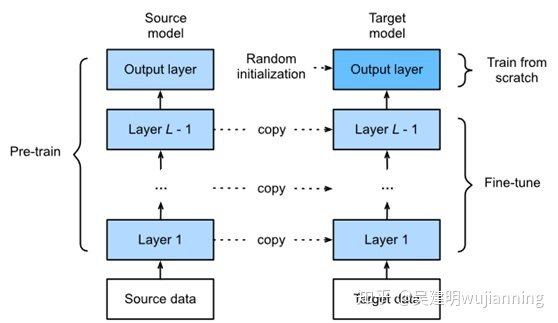

# <h1 align = "center">人工智能技术浅谈</h1>


<h2 align = "center">摘要</h2>	

​		近年来，人工智能技术 `AI` 发展日新月异。但是对于想要了解其技术的人来说，网络上纷繁复杂的教程，没有系统性的描述。一般教程的做法通常是教大家首先下载并读取`MINIST`数据集，然后建立一个全连接层，最后接一个`softmax`操作，输出结果。这相当于其他编程语言的`hello world`，但是对于没有任何行业相关知识，还是难以有直观的理解。就像没有编程知识，去理解`hello world`一样。因为 `AI` 本身就很复杂，所以可以把 `AI` 当作一门全新的编程语言来学习，但是这门“语言”又要比其他语言复杂的多。它包含了太多的技术细节，以及数学知识，所以我们试着通过去除一些枝叶去理解 `AI` 的骨架网络，帮助建立一个相对全面的知识体系图谱。


## 一	前言

​		人工智能技术 `AI` 一般分为传统机器学习和深度学习。传统机器学习一般由数据工程师使用算法对数据进行特征提取，再把特征数据输入到模型中完成任务。深度学习依赖大量数据，让模型自动学习特征表示，最后经过分类器操作，完成诸如回归、分类等问题。传统机器学习在只有少量数据时，仍然可以工作，但是深度学习则不行。一般认为，`AI`学习过程可以看作是学习数据的分布（通常是正太分布），并将分布拟合到真实数据，减小真实分布和学习到分布之间的差（或损失值），通常这个步骤叫做最小化损失 `minimize`。把新的数据（准备做预测的数据）使用学习到的模型进行计算输出，就是模型对数据的泛化。这一步我们可以看做是模型做预测 `predict`，通常是在测试集或者验证集上应用。如果预测结果与真实情况接近（或一致），则认为泛化性好，反之则泛化性差。整个`AI`包含许多基础性的知识和技术，只有当对这些知识有一定的了解，才能更好的理解每一步在做什么事情。


## 二	基础知识

- `Linear` 线性层（全连接层）、隐藏层

- `Convolution` 卷积层

- `Pooling` 池化层（汇聚层）

- `Tensor` 张量

- `Activition` 激活函数（`relu,sigmoid,tanh,softmax` 等）

- `Optimizition` 优化算法（`Adam,SGD` 等）

- `loss/cost function` 损失函数（`CrossEntropyLoss,MSE` 等）

- `Overfitting` 过拟合、`Underfitting` 欠拟合

- `Dropout,L1,L2` 正则化

- `BatchNorm,LayerNorm` 归一化

- `Training` 训练集、`Test` 测试集、`Validition` 验证集

- `Learning Rate` 学习率、`Epoch` 训练轮次

- `python` 语言基础

  


## 三	Hello world

### 1、加载数据
```python
#coding=utf8

import torch
import torch.nn as nn
from torch.utils.data import Dataset
from torch.utils.data.dataloader import DataLoader
from torchvision import datasets
from torchvision import transforms
from torchvision.transforms import ToTensor
import matplotlib.pyplot as plt

# 训练数据集
training_data = datasets.FashionMNIST(
    root='./data',
    train=True,
    download=True,
    transform=ToTensor()
)

# 测试数据集
test_data = datasets.FashionMNIST(
    root='./data',
    train=False,
    download=True,
    transform=ToTensor()
)

# 标签分类
labels_map = {
    0: "T-Shirt",
    1: "Trouser",
    2: "Pullover",
    3: "Dress",
    4: "Coat",
    5: "Sandal",
    6: "Shirt",
    7: "Sneaker",
    8: "Bag",
    9: "Ankle Boot",
}

figure = plt.figure(figsize=(8,8))
cols,rows = 3,3
for i in range(1, cols*rows+1):
    sample_idx = torch.randint(len(training_data), size=(1,)).item()
    img, label = training_data[sample_idx]
    figure.add_subplot(rows, cols, i)
    plt.title(labels_map[label])
    plt.axis('off')
    plt.imshow(img.squeeze(), cmap='gray')
plt.show()
```


### 2、模型定义

  ```python
  class NeturalNetwork(nn.Module):
      def __init__(self):
          super(NeturalNetwork, self).__init__()
          self.flattern = nn.Flatten()
          self.liner_relu_stack = nn.Sequential(
              nn.Linear(28*28, 512),
              nn.ReLU(),
              nn.Linear(512, 512),
              nn.ReLU(),
              nn.Linear(512, 10)
          )
  
      def forward(self, x):
          x = self.flattern(x)
          logits = self.liner_relu_stack(x)
          return logits
  
  model = NeturalNetwork()
  print(model)
  ```


### 3、模型训练

  ```python
  # 学习率
  learning_rate = 1e-3
  # 批量大小
  batch_size = 64
  
  # Initialize the loss function
  loss_fn = nn.CrossEntropyLoss()
  optimizer = torch.optim.SGD(model.parameters(), lr=learning_rate)
  
  # train model
  def train_loop(dataloader, model, loss_fn, optimizer):
      size = len(dataloader.dataset)
      num_batches = len(dataloader)
      train_loss, train_acc = 0.0,0.0
      model.train()
      for batch, (X,y) in enumerate(dataloader):
          # Compute prediction and loss
          pred = model(X)
          loss = loss_fn(pred, y)
  
          # Backpropagation
          optimizer.zero_grad()
          loss.backward()
          optimizer.step()
  
          train_loss += loss.item()
          train_acc += (pred.argmax(1) == y).float().mean()
  
          if batch % 100 == 0:
              loss, current = loss.item(), batch*len(X)
              print(f'loss: {loss:>7f} [{current:>5d}/{size:>5d}]')
  
      train_loss /= num_batches
      train_acc /= size
  
      print(f"Train Error: \n Accuracy: {(100*train_acc):>0.1f}%, Avg loss: {train_loss:>8f} \n")
      return train_loss,train_acc
  
  # test model
  def test_loop(dataloader, model, loss_fn):
      size = len(dataloader.dataset)
      num_batches = len(dataloader)
      test_loss, test_acc = 0,0
  
      model.eval()
      with torch.no_grad():
          for X,y in dataloader:
              pred = model(X)
              loss = loss_fn(pred, y)
              test_loss += loss.item()
              test_acc += (pred.argmax(1) == y).type(torch.float).sum().item()
  
      test_loss /= num_batches
      test_acc /= size
  
      print(f"Test Error: \n Accuracy: {(100*test_acc):>0.1f}%, Avg loss: {test_loss:>8f} \n")
      return test_loss, test_acc
  
  train_dataloader = DataLoader(training_data)
  test_dataloader = DataLoader(test_data)
  
  # 训练
  num_epochs = 10
  for t in range(num_epochs):
      print(f"Epoch {t+1}\n-------------------------------")
      train_loop(train_dataloader, model, loss_fn, optimizer)
      test_loop(test_dataloader, model, loss_fn)
  print("Done!")
  
  # 训练完成，需要对模型存档，方便下次使用
  # 第一种方式：模型&参数
  torch.save(model, 'model.pth')
  # 使用模型（第三方调用者）
  # model = torch.load('model.pth')
  
  # 第二种方式：模型参数
  # torch.save(model.state_dict(), 'model_weights.pth')
  # 通过模型参数使用模型
  # model = NeturalNetwork(pretrained=True)
  # model.load_state_dict(torch.load('model_weights.pth'))
  ```

  

### 4、使用模型

  ```python
  import torch
  import torchvision.transforms as transforms
  from PIL import Image
  
  transform = transforms.Compose(
          [transforms.Resize((28, 28)),
           transforms.ToTensor(),
           transforms.Normalize((0.5, 0.5, 0.5), (0.5, 0.5, 0.5))])
  
  labels_map = {
      0: "T-Shirt",
      1: "Trouser",
      2: "Pullover",
      3: "Dress",
      4: "Coat",
      5: "Sandal",
      6: "Shirt",
      7: "Sneaker",
      8: "Bag",
      9: "Ankle Boot",
  }
  
  # 加载模型
  model = torch.load('model.pth')
  
  im = Image.open('1.jpg')
  im = transform(im)  # [C, H, W]
  im = torch.unsqueeze(im, dim=0)  # [N, C, H, W]
  
  with torch.no_grad():
      outputs = model(im)
      predict = torch.max(outputs, dim=1)[1].numpy()
  print(labels_map[int(predict)])
  ```


## 四	微调（Fine-tuning技术）

使用在其他数据集（如`ImageNet`）上预训练好的模型，通过修改最后的全连接层，并冻结除最后一层之外的所有权重，使之可以适配到新的任务上来。训练好一个模型之后，可以迁移到同类型的任务上去，而且有着不错的精确度。

- CV 微调

- NLP 微调

  

```python
# fine-tune之后的resnet模型
def resnet_model(num_classes, use_pretrained=True):
    model_ft = models.resnet34(pretrained=use_pretrained)
    num_ftrs = model_ft.fc.in_features
    model_ft.fc = nn.Sequential(nn.Linear(num_ftrs, num_classes))
    
    return model_ft
```


## 五	最近10年有重大贡献的技术

- 2012 `AlexNet `
- 2015 `ResNet`
- 2017 `Transformer `
- 2018 `BERT`
- 2021 `Vision Transformer`


## 六	数学知识

整个数学知识体系都可以参考B站（**宋浩老师官方**）视频教程进行学习，主要学习以下核心知识。

- 矩阵等核心知识

- 概率统计知识（正太分布、均匀分布等）

- 积分&微分

- **方向传播算法（链式求导法则）**
  $$
  \frac{\partial J}{\partial W} = \frac{\partial J}{\partial f}\frac{\partial f}{\partial z} \frac{\partial z}{\partial w}
  $$


## 七	应用

- **cv** 计算机视觉（自动驾驶，图像分类，视频分类，图像分割，语义分割，风格迁移等）
- **nlp** 自然语言处理 （文本分类，完形填空，语言理解等）
- 强化学习（alphaGo，游戏对战等）


## 八	库、包简介

- `numpy` 数学计算库
- `pandas` 表格类数据处理库
- `sklearn` 算法实现库
- `keras` 深度学习框架，被google收购合并
- `matplotlib,seaborn` 绘图相关


## 九	深度学习框架

- `pytorch`
- `tensorflow`


## 十	学习建议

- 完整阅读1-2本相关书籍。

<center class="half">
    
    
    
    
</center>


- 《动手学深度学习》一书可以结合原书作者 **李沐** 老师在B站的视频讲解配合学习。

<center class="half">
    
</center>


- tensorflow可以在github上搜索 `eat_tensorflow2_in_30_days` 项目学习。

- 参与kaggle竞赛项目实践，学习别人分享的竞赛代码。

  

参考资料：

[pytorch官方教程](https://pytorch.org/tutorials/)
[WZMIAOMIAO](https://github.com/WZMIAOMIAO/deep-learning-for-image-processing/)

[跟李沐学AI](https://space.bilibili.com/1567748478)