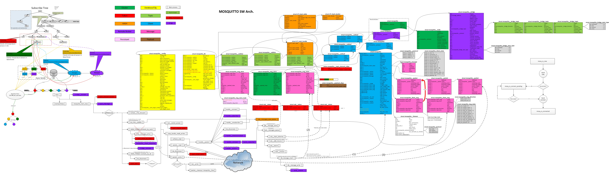

# mosquitto使用

## 1. mqtt服务器broker使用的一些注意事项

- 服务启动：`mosquitto.exe -c mosquitto.conf`

- 订阅`$SYS/broker`主题的服务状态不能正常收到数据；

  ```sh
  # mosquitto.conf/sys_interval已经配置了刷新频率，但是订阅主题仍然收不到数据
  # 原因：启用了aclfile.txt访问控制权限限制，里面配置了通用主题，但未配置$SYS/broker主题，该主题是特殊的，不在统配符#下
  
  user buerjia
  topic #
  topic $SYS/#     --- 新加行 ---
  ```

  

- 服务的状态可以使用[`mqtt.fx-1.7.1`](https://cloud.tencent.com/developer/article/1662831)工具订阅，发布消息等和查询broker的状态；

- MQTTAsync_createWithOptions接口的clientId需要保持**全局唯一**，否则被挤掉线时，不会被MQTTAsync_connectionLost感知；


## 2. 主题通配符说明

[Mosquitto 手册页 |Eclipse](https://mosquitto.org/man/mosquitto-8.html)

以主题`a/b/c/d`为例，描述通配符 `+、#`;

- 使用`#`订阅所有主题

  ```sh
  # 订阅所有主题
  mosquitto_sub -t \#
  ```

- 通配符 `+`：

  - 以下订阅将匹配：
    - `a/b/c/d`
    - `+/b/c/d`
    - `a/+/c/d`
    - `a/+/+/d`
    - `+/+/+/+`
  - 以下订阅将不匹配：
    - `a/b/c`
    - `b/+/c/d`
    - `+/+/+`

- 通配符 `#`：

  - 以下订阅将匹配：
    - `a/b/c/d`
    - `#`
    - `a/#`
    - `a/b/#`
    - `a/b/c/#`
    - `+/b/c/#`

**请注意，通配符只能单独使用，因此`a/b+/c`订阅不是对通配符的有效使用。`#`字符只能用作订阅的最后一个字符。**


## 3. 话题设计参考

**发布：**
   `{发送组}/{发送者}/{接收组}/{接收者}/{话题}`
   `{发送组}/{发送者}/{接收组}/{接收者}/{话题}/version`

**订阅：**
   `+/+/{接收组}/{接收者}/{话题}/#`
   `+/+/{接收组}/{接收者}/{话题}/version/#`

**请求（发布）：**
   `{发送组}/{发送者}/{接收组}/{接收者}/{话题_req}`
   `{发送组}/{发送者}/{接收组}/{接收者}/{话题_req}/version`

**回复（订阅）：**
   `+/+/{接收组}/{接收者}/{话题_rsp}/#`
   `+/+/{接收组}/{接收者}/{话题_rsp}/version/#`

**@Note：**

1. 发布/订阅话题时，如果接收组为空，则使用通配符 `+` 表示任意接收组；
2. 请求和回复只在消息主题上做一层特殊的封装处理；
   - 请求方：发布请求 `*_req`，并且订阅回复 `*_rsp`;
   - 回复方：订阅请求 `*_req`，并且发布回复 `*_rsp`;
   - 请求/回复的接口应该有唯一编号，以此来作为请求和回复的关联，回复时，需要使用请求的编号作为响应的唯一编号；
   
     ```c++
     // request示例：
     Client cli(senderGroupName, senderName);
     cli.request(seqNo, topic, message, receieveGroupName, receieverName, [](int code, string response) {
         // async callback request's result code and response data.
     });
     
     // 作为响应的服务方处理请求，并回复数据，seqNo与请求的一致
     cli.response(seqNo, topic, message, receieveGroupName, receieverName);
     ```
   
     

## 4. mosquitto源码分析图

[mosquitto源码分析图来源](https://github.com/hui6075/mosquitto-cluster/blob/master/benchmark/mosquitto_code_analyze.jpg)

