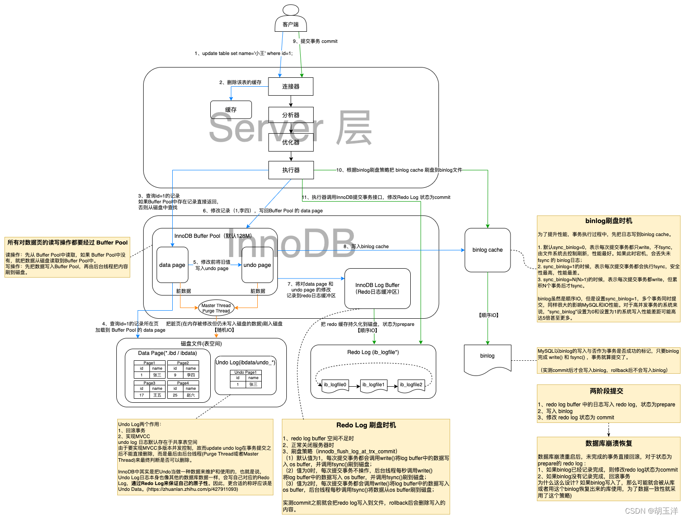

# mysql总结



## 1. mysql基础

ref: [参考](https://blog.csdn.net/mysnsds/article/details/125313346)

### 1.1 sql语句执行顺序

```sql
（8）Select
（9）distinct 字段名1,字段名2，
（6）[func(字段名)]  
（1）from 表1
（3）<join类型>join 表2 
（2）on <join条件> 
（4）where <where条件> 
（5）group by <字段> 
（7）having <having条件> 
（10）order by <排序字段> 
（11）limit <起始偏移量,行数>
```


### 1.2 mysql游标

**注意：**

1. 变量的声明必须在游标声明之前；
2. 处理程序的声明必须在游标声明之后；


- 不能定义多个*相同*处理程序；

  ```mysql
  DECLARE done1 INT DEFAULT FALSE;
  DECLARE done2 INT DEFAULT FALSE;
  
  -- 声明第一个游标
  DECLARE cursor1 CURSOR FOR SELECT column_name FROM table1;
  
  -- 声明第二个游标
  DECLARE cursor2 CURSOR FOR SELECT column_name FROM table2;
  
  -- 声明处理程序(**这样多个处理程序的处理方式是不正确的**)
  DECLARE CONTINUE HANDLER FOR NOT FOUND SET done1 = TRUE;
  DECLARE CONTINUE HANDLER FOR NOT FOUND SET done2 = TRUE;
  
  -- 声明统一处理程序
  DECLARE CONTINUE HANDLER FOR NOT FOUND 
  BEGIN
      IF current_cursor = 1 THEN
          SET done1 = TRUE; 
      ELSE
          SET done2 = TRUE; 
      END IF;
  END;
  ```

  

- 定义不同的处理程序；

  ```mysql
  DECLARE done1 INT DEFAULT FALSE;
  DECLARE done2 INT DEFAULT FALSE;
  
  -- 声明第一个游标
  DECLARE cursor1 CURSOR FOR SELECT column_name FROM table1;
  
  -- 声明第二个游标
  DECLARE cursor2 CURSOR FOR SELECT column_name FROM table2;
  
  -- 第一个处理程序
  DECLARE CONTINUE HANDLER FOR NOT FOUND SET done1 = TRUE;
  
  -- 第二个处理程序：处理某个特定错误代码（例如：1062，重复键错误）
  DECLARE CONTINUE HANDLER FOR SQLEXCEPTION 
  BEGIN
      SET done2 = 1;  -- 处理错误
  END;
  ```

  

- 在一个存储过程中使用多个游标的完整示例；

  ```mysql
  DELIMITER ;;
  
  CREATE PROCEDURE example_procedure()
  BEGIN
      DECLARE done1 INT DEFAULT FALSE;
      DECLARE done2 INT DEFAULT FALSE;
      DECLARE current_cursor INT DEFAULT 1; -- 用于跟踪当前游标
  
      -- 声明第一个游标
      DECLARE cursor1 CURSOR FOR SELECT column_name FROM table1;
      
      -- 声明第二个游标
      DECLARE cursor2 CURSOR FOR SELECT column_name FROM table2;
  
      -- 声明统一处理程序
      DECLARE CONTINUE HANDLER FOR NOT FOUND 
      BEGIN
          IF current_cursor = 1 THEN
              SET done1 = TRUE; 
          ELSE
              SET done2 = TRUE; 
          END IF;
      END;
  
      OPEN cursor1;
  
      -- 游标循环
      fetch_loop1: LOOP
          FETCH cursor1 INTO ...; -- 替换为实际的列名（可以是多个数据列）
          IF done1 THEN
              LEAVE fetch_loop1;
          END IF;
  
          -- 处理数据逻辑
      END LOOP fetch_loop1;
  
      CLOSE cursor1;
  
      -- 切换到第二个游标
      SET current_cursor = 2;
  
      OPEN cursor2;
  
      -- 游标循环
      fetch_loop2: LOOP
          FETCH cursor2 INTO ...; -- 替换为实际的列名（可以是多个数据列）
          IF done2 THEN
              LEAVE fetch_loop2;
          END IF;
  
          -- 处理数据逻辑
      END LOOP fetch_loop2;
  
      CLOSE cursor2;
  END ;;
  
  DELIMITER ;
  ```

### 1.3 mysql导入数据

1. 导入数据量大时，需要增加max_allowed_packet选项，否则容易失败;
2. 如果db.sql存在二进制数据，在navicat工具中导入数据可能会出错；

```sh
mysql -uroot -p123456 -h127.0.0.1 --max_allowed_packet=512M source_db < db.sql
```


## 2. mysql优化建议（技巧）

**扩展**：参考https://www.cnblogs.com/jajian/p/9758192.html

- 整型定义中无需定义显示宽度，比如：使用INT，而不是INT(4)。

- 建议字段定义为`NOT NULL`。

- 对于非Index索引字段作为where条件时，如果确认结果只有一个，可以使用limit 1来提高查询速度。

- 索引中的字段数建议不超过5个。

- 单张表的索引个数控制在5个以内。

- InnoDB表一般都建议有主键列（必须）。

- 建立复合索引时，优先将选择性高的字段放在前面。

- `UPDATE、DELETE`语句需要根据`WHERE`条件添加索引。

- 不建议使用%前缀模糊查询，例如`LIKE “%weibo”`，无法用到索引，会导致全表扫描（但可使用`“weibo%”`）。

- 避免在索引字段上使用函数，否则会导致查询时索引失效。（`select xxx from tab1 where day(DateTime) > 15`）

- 考虑*使用limit N，少用limit M，N*，特别是大表或M比较大的时候。

- SQL语句中IN包含的值不应过多。

- WHERE条件中的字段值需要符合该字段的数据类型，避免MySQL进行隐式类型转化。

- SELECT、INSERT语句必须显式的指明字段名称，禁止使用`SELECT *` 或是`INSERT INTO table_name values()`。

- SQL中尽可能避免反连接，避免半连接，这是优化器做得薄弱的一方面，什么是反连接，半连接？其实比较好理解，举个例子，not in ,not exists就是反连接，in,exists就是半连接，在千万级大表中出现这种问题，性能是几个数量级的差异。

- 尽可能避免或者杜绝多表复杂关联，大表关联是大表处理的噩梦，一旦打开了这个口子，越来越多的需求需要关联，性能优化就没有回头路了，更何况大表关联是MySQL的弱项，尽管Hash Join才推出，不要像掌握了绝对大杀器一样，在商业数据库中早就存在，问题照样层出不穷。

- 尽可能杜绝范围数据的查询，范围扫描在千万级大表情况下还是尽可能减少。

- 不要对字段建立多个索引。

- 使用`explain/desc select`来分析SQL语句执行前的执行计划。

- 使用缓存：避免在查询条件中使用不确定的值。（像now(),datetime()之类的）

**注意**：在查询时，MYSQL只能使用一个索引，如果建立的是多个单列的普通索引，在查询时会根据查询的索引字段，从中选择一个限制最严格的单例索引进行查询。别的索引都不会生效。


### 2.1 MySQL建表的时候有哪些优化手段？

- **合理选择数据类型**：根据实际存储的数据范围选择合适的数值类型，避免使用过大的数据类型造成空间浪费。例如，如果存储的整数范围在 0 - 255 之间，使用 `TINYINT` 即可，而不是 `INT`。对于固定长度的字符串，使用 `CHAR` 类型；对于可变长度的字符串，使用 `VARCHAR` 类型。同时，根据实际存储的字符串长度合理设置字段长度。
- **控制字段数量**：避免创建过多不必要的字段，过多的字段会增加表的复杂度和存储开销，同时也会影响查询性能。可以将一些不常用的字段单独存储在其他表中，通过关联查询获取数据。
- **反范式化设计**：可以适当引入一些数据冗余，将相关联的数据存储在同一个表中，减少表之间的关联查询。需要在范式化和反范式化之间找到一个平衡点。
- **合理创建索引**：在经常用于 `WHERE` 子句、`JOIN` 子句和 `ORDER BY` 子句的字段上创建索引，以提高查询效率。避免在重复值较多的字段上创建索引，因为这样的索引效果不佳。例如，在一个性别字段上创建索引可能没有太大意义。当然，过多的索引会增加存储开销和写操作的性能开销，因此要根据实际查询需求合理创建索引，避免创建过多不必要的索引。