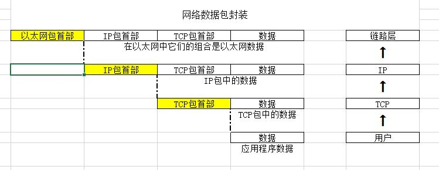

1、以太网数据封包详情

 

2、以太网协议头部中的类型分为IP数据类型（0800）和ARP类型（0806）。

3、IP是逻辑地址，只有IP是不能进行通信的。ARP通过IP地址解析MAC地址，有了MAC地址，2台主机才能进行通信。

3、网络封包内容长度有46-1500的限制，如果封包长度不足46，需要补齐；超过1500，出口（通常指路由器）会对封包进行分片，而分片被组装只会发生在目的地址上。

4、数据包在发出时才查询MTU，而不是写入时查询，路径MTU是指整个链路上的最小MTU。

