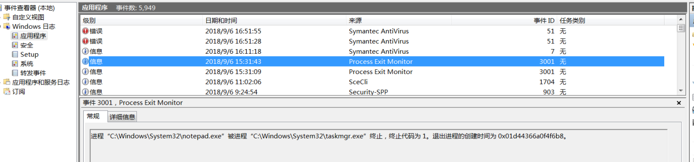

- windows程序异常堆栈跟踪

  - [1. 启动程序时设置dump机制](#1. 启动程序时设置dump机制)
  - [2. 利用WER生成dump文件](#2. 利用WER生成dump文件)
  - [3. 使用gflags全局定位问题](#3. 使用gflags全局定位问题)
  - [4.总结](#4.总结)

  

# windows程序异常堆栈跟踪

## 1. 启动程序时设置dump机制

```c++
#include <Windows.h>
#include <ImageHlp.h>
#include <atlstr.h>

#pragma comment(lib, "DbgHelp.lib")

static std::string Time2String(time_t ts)
{
    struct tm* t = std::localtime(&ts);
    if (!t) return "unknown";

    char buff[64];
    snprintf(buff, sizeof(buff),
        "%d-%02d-%02d-%02d-%02d-%02d",
        t->tm_year + 1900, t->tm_mon + 1,
        t->tm_mday, t->tm_hour,
        t->tm_min, t->tm_sec);

    return buff;
}

std::wstring ToWstring(std::string orig)
{
    std::wstring result;
    result.resize(orig.length() - 1, 0);

    size_t origsize = orig.length() + 1;
    size_t convertedChars = 0;

    mbstowcs_s(&convertedChars, (wchar_t*)result.data(),
        origsize, orig.c_str(), _TRUNCATE);

    return result;
}

long __stdcall CrashHandler(_EXCEPTION_POINTERS* excp)
{
    auto now_ts = std::chrono::duration_cast<std::chrono::seconds>(
        std::chrono::system_clock::now().time_since_epoch()).count();
    auto dump_time = Time2String(now_ts);

#ifdef UNICODE
    auto dump_filename = ToWstring(dump_time + ".dmp");
#else
    auto dump_filename = dump_time + ".dmp";
#endif

    HANDLE dump_file = CreateFile(dump_filename.c_str(),
        GENERIC_WRITE, 0, NULL,
        CREATE_ALWAYS, FILE_ATTRIBUTE_NORMAL, NULL);

    if (!dump_file)
    {
        return EXCEPTION_CONTINUE_SEARCH; // 失败时，让下一个异常处理器继续处理
    }

    MINIDUMP_EXCEPTION_INFORMATION loExceptionInfo;
    loExceptionInfo.ExceptionPointers = excp;
    loExceptionInfo.ThreadId = GetCurrentThreadId();
    loExceptionInfo.ClientPointers = TRUE;

    if (!MiniDumpWriteDump(GetCurrentProcess(),
        GetCurrentProcessId(), dump_file,
        MiniDumpNormal, &loExceptionInfo, NULL, NULL))
    {
        CloseHandle(dump_file);
        return EXCEPTION_CONTINUE_SEARCH; // 失败时，让下一个异常处理器继续处理
    }

    CloseHandle(dump_file);
    return EXCEPTION_EXECUTE_HANDLER;
}

int main(int argc, char** argv)
{
    SetUnhandledExceptionFilter(CrashHandler);
    return 0;
}
```


## 2. 利用WER生成dump文件

参考：https://blog.csdn.net/lele604413545/article/details/72518140

在注册表内写入对应的应用程序：`HKEY_LOCAL_MACHINE\SOFTWARE\Microsoft\Windows\Windows Error Reporting\LocalDumps\`

- 打开注册表：`HKEY_LOCAL_MACHINE\SOFTWARE\Microsoft\Windows\Windows Error Reporting\LocalDumps\`（没有LocalDumps则添加）

- 对应程序下添加属性字段：

  - 值：`DumpType`, 类型：REG_DWORD - Dump类型，0：Custom dump， 1： Mini dump, 2： Full dump. 默认值为1
  - 值：`DumpFolder`, 类型：REG_EXPAND_SZ - 顾名思义，就是存储dump的位置
  - 值：`DumpCount`, 类型：REG_DWORD - 最大保留的dump个数，默认为10.

- 启动Windows Error Reporting Server服务：服务中找到它，并设置为自动启动（也可手动启动）


服务启动后如果相应程序出现了崩溃的情况，WER就会自动将Crash Dump保存到指定的目录。


## 3. 使用gflags全局定位问题

注意：这个不是google的gflags库，而是微软的gobal flags系统工具。

参考：https://developer.aliyun.com/article/765827

- [下载SDK](https://developer.microsoft.com/zh-cn/windows/downloads/sdk-archive)，用户可根据自己操作系统的版本进行选择（建议选择低版本的，兼容范围更广）

  

- 安装的时候只选择debugging tools：


- 安装完成后，找到` "C:\ProgramFiles (x86)\Windows Kits\8.0\Debuggers\x64 `，右击gflags.exe选择“以管理员身份运行”，选择“SilentProcess Exit”

  在image 填写想要监控的进程，之后勾选如下
  在dump folder location 填写存放dump 的路径

  点击确定后重启机器生效。

  

- 之后如果进程被终止，会在应用程序日志中有如下记录（事件查看器/Windows日志）：

  
  
  刚才设置的dump 路径也会生成以进程命名的dump 文件：
  
  


## 4.总结

| 方式                                                    | 优点                                                         | 缺点                                   |
| ------------------------------------------------------- | ------------------------------------------------------------ | -------------------------------------- |
| [1. 启动程序时设置dump机制](#1. 启动程序时设置dump机制) | 速度快，无需系统配置介入                                     | 如果处理失败，产生的dump文件可能是空的 |
| [2. 利用WER生成dump文件](#2. 利用WER生成dump文件)       | 1. 可以捕获第1种方式未能正确捕获的堆栈信息<br>2.无需程序介入，对于程序来说是无感的，不对性能产生影响 | 速度较慢，需要服务、注册表项等配置     |
| [3. 使用gflags全局定位问题](#3. 使用gflags全局定位问题) | 可以捕获像exit等退出机制产生的异常                           | 需要安装sdk，配置会更为麻烦            |

- 对于一般的程序异常，我们采用第1种方式即可；
- 如果程序崩溃但是未能按照预期产生dump文件，则配合第2种机制；
- 如果上述办法仍然不能捕获dump，再使用第3种方式；