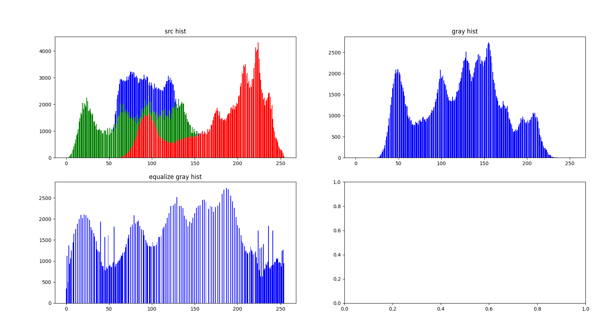

## 图像基础

- 图像的直方图（质量分布图）

  - 图像直方图，是指对整个图像在灰度范围内的像素值（0~255）统计出现频率次数，据此生成的直方图。直方图反映了图像灰度的分布情况，是图像的统计学特征。

  - 意义/作用

    - 图像中像素强度分布的图形表达方式；

    - 它统计了每一个强度值所具有的像素个数。

  - 直方图均衡化，是通过拉伸像素强度分布范围来增强图像对比度的一种方法（参考equalize gray hist图像与gray hist图像的区别）

  - 代码示例

    ```python
    import cv2
    import numpy as np
    from matplotlib import pyplot as plt
    
    def plotHist(title, image, ax):
        #plt.ioff()
        ax.set_title(title)
        colors = ('b', 'g', 'r')
        channel = image.ndim if image.ndim == 3 else 1
        for i in range(channel):
            hist = cv2.calcHist([image], [i], None, histSize=[256], ranges=[0,255])
            #ax.hist(hist, bins=256, color=colors[i])
            #ax.hist不能指定y值
            ax.bar(range(256), hist.squeeze((-1)), color=colors[i])
        #plt.show()
    
    def testHist():
        fig = plt.figure(figsize=(10,5))
        axes = fig.subplots(2,2)
    
        img = cv2.imread(r'.\img\lean.jpg')
        cv2.imshow('src', img)
        plotHist('src hist', img, axes[0][0])
    
        gray = cv2.cvtColor(img, cv2.COLOR_BGR2GRAY)
        plotHist('gray hist', gray, axes[0][1])
        cv2.imshow('gray', gray)
    
        hist = cv2.equalizeHist(gray)
        plotHist('equalize gray hist', hist, axes[1][0])
        cv2.imshow('hist', hist)
    
        plt.show()
        cv2.waitKey()
    
    testHist()
    ```

  - 结果如图所示

    

