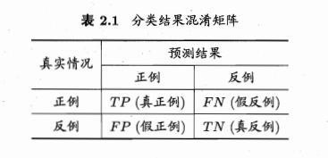
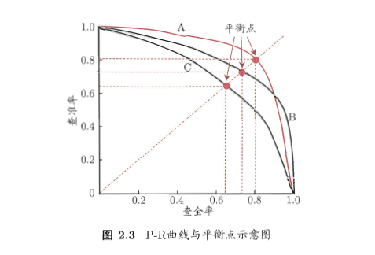

# 机器学习性能度量指标

- 参考书籍：周志华—机器学习

- 错误率：分类错误的样本数占样本总数的比例

- 准确率：分类正确的样本数占样本总数的比例

- 二分类问题混淆矩阵（`TP、FN、FP、TN`含义）

  - TP ( True Positive )：表示把正样本预测为正样本；
  - FP ( False Positive )：表示把负样本预测为正样本；
  - TN ( True Negative )：表示把负样本预测为负样本；
  - FN ( False Negative )：表示把正样本预测为负样本；

  

- 查准率（precision）
  $$
  P = \frac{TP}{TP+FP}
  $$

- 查全率（recall）
  $$
  R = \frac{TP}{TP+FN}
  $$
  

- 查准率和查全率是一对矛盾的度量。一般来说，查准率高时，查全率往往偏低；而查全率高时，查准率往往偏低。例如，若希望将好瓜尽可能多的选出来，则可通过增加选瓜的数量来实现，如果将所有的瓜都选上，那么所有的好瓜也必然都被选上了，但这样查准率就会较低；若希望选出的瓜中好瓜的比例尽可能高，则可只挑选最有把握的瓜，但这样就难免会漏掉不少好瓜，使得查全率较低。通常只有在一些简单的任务中，才可能使查全率和查准率都很高。

- P-R曲线：在很多情行下，我们可根据学习器的预测结果对样例进行排序，排在前面的时学习器认为“最可能”是正例的样本，排在最后的则是学习器认为“最不可能”是正例的样本。按照此顺序逐个把样本作为正例进行预测，则每次可以计算出当前的查全率、查准率。以查准率为纵轴、查全率为横轴作图，就得到了查准率-查全率曲线，简称“P-R曲线”，显示该曲线的图称为“P-R图”。

  

- **F1**度量（综合查全率）：精确率precision和召回率recall的调和平均数，**1最好，0最差**
  $$
  F1 = \frac{2\times P\times R}{P+R} = \frac{2\times P\times R}{样例总数+TP-TN}
  $$

- ROC曲线：和P-R曲线相似，我们根据学习器的预测结果对样例进行排序，按此排序逐个把样本作为正例进行预测，每次计算出两个重要量的值，分别以它们为横、纵坐标作图，就得到了“ROC曲线”。与P-R曲线使用查准率、查全率为纵、横轴不同，ROC曲线的纵轴是“真正例率”（True Positive Rate，简称TPR），横轴是“假正例率”（False Positive Rate，简称FPR），两者定义如下：（TPR叫做命中率；FPR叫做误报率）
  $$
  TPR = \frac{TP}{TP+FN} \\
  FPR = \frac{FP}{TN+FP}
  $$

- AUC：ROC曲线下的面积

