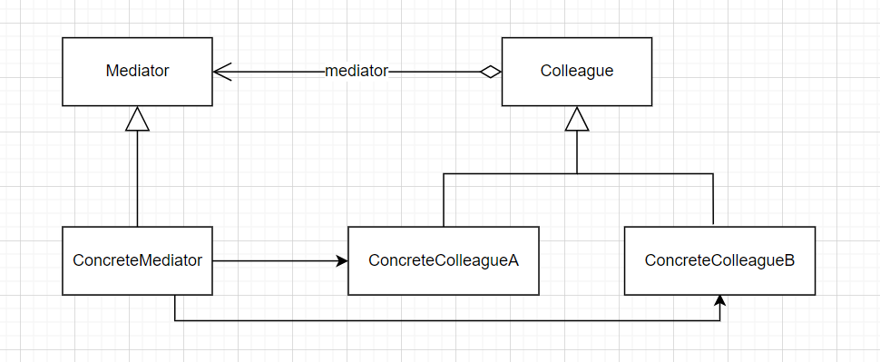
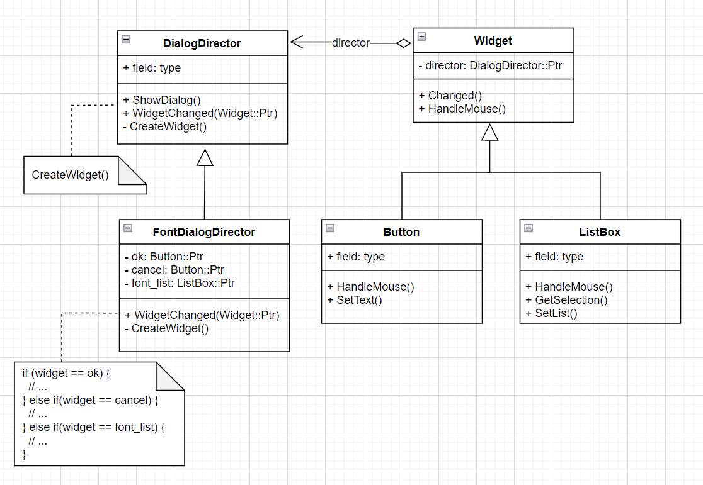

# Mediator-中介者模式

- 意图

  用一个中介对象来封装一系列的对象交互。中介者使各对象不需要显示地相互引用，从而使其耦合松散，而且可以独立地改变它们之间的交互

- 优点

  - 减少子类生成：Mediator将原本分布于多个对象间的行为集中在一起。改变这些行为只需生成Mediator的子类即可。这样各个Colleague类和Mediator类；
  - 它将各Colleague解耦：Mediator有利于各Colleague间的松耦合。你可以独立的改变和复用各Colleague类和Mediator类；
  - 它简化了对象协议：用Mediator和各个Colleague间的一对多的交互来替代多对多的交互。一对多的关系更易于理解、维护和扩展；
  - 它对对象如何写作进行了抽象：将中介座位一个独立的概念并将其封装在一个对象中，使你将注意力从对象各自本身的行为转移到它们之间的交互上来。这有助于弄清楚一个系统中的对象是如何交互的。
  - 它使控制集中化：中介者模式将交互的复杂性变为中介者的复杂性。因为中介者封装了协议，它可能变得比任何一个Colleague都复杂。这可能使得中介者自身成为一个难以维护的庞然大物（见示例`FontDialogDirector::WidgetChaned`）。
  
- 相关模式

  - Facade与中介者的不同之处在于它是对一个对象子系统进行抽象，从而提供了一个更为方便的接口。它的协议是单向的，即Facade对象对这个子系统类提出请求，但反之则不行。相反，Mediator提供了各Colleague对象不支持或不能支持的协作行为，而且协议是多向的。
  - Colleague可使用Observer模式与Mediator通信。

- `UML`图

  
  
  
  
- 代码示例

  ```c++
  class Widget;
  
  class DialogDirector {
  public:
    virtual ~DialogDirector() { }
    CLASS_PTR(DialogDirector);
  
    virtual void ShowDialog() { CreateWidgets(); }
    virtual void WidgetChanged(std::shared_ptr<Widget> wiget) = 0;
  
  protected:
    DialogDirector() { }
    virtual void CreateWidgets() = 0;
  };
  
  class Widget : public std::enable_shared_from_this<Widget> {
  public:
    Widget(DialogDirector::Ptr director) {
      director_ = director;
    }
    virtual ~Widget() {}
    CLASS_PTR(Widget);
  
    virtual void Changed() {
      director_->WidgetChanged(shared_from_this());
    }
    virtual void HandleMouse() { }
  
  protected:
    DialogDirector::Ptr director_;
  };
  
  class ListBox : public Widget {
  public:
    ListBox(DialogDirector::Ptr director) : Widget(director) {
    }
    CLASS_PTR(ListBox);
  
    virtual const char* GetSelection() {
      return "test";
    }
    virtual void SetList(std::list<char*>& items) {
    }
  
    void HandleMouse() override {
      Changed();
    }
  };
  
  class Button : public Widget {
  public:
    Button(DialogDirector::Ptr director) : Widget(director) {
    }
    CLASS_PTR(Button);
  
    virtual void SetText(std::string text) {
    }
  
    void HandleMouse() override {
      Changed();
    }
  };
  
  class FontDialogDirector
    : public DialogDirector,
      public std::enable_shared_from_this<FontDialogDirector> {
  public:
    FontDialogDirector() { }
    ~FontDialogDirector() { }
  
    // 该函数的复杂度随对话框的增加而增加；在实践中，大的对话框并不受欢迎，其原因是
    // 多方面的，其中一个重要的原因是中介者的复杂性可能会抵消该模式在其他方面逮来的好处
    void WidgetChanged(Widget::Ptr widget) override {
      if (widget == ok_) {
        // TODO: ...
      } else if (widget == cancel_) {
        // TODO: ...
      } else if (widget == font_list_) {
        // TODO: ...
      }
    }
  
  protected:
    void CreateWidgets() override {
      ok_ = std::make_shared<Button>(shared_from_this());
      cancel_ = std::make_shared<Button>(shared_from_this());
      font_list_ = std::make_shared<ListBox>(shared_from_this());
    }
  
  private:
    Button::Ptr ok_;
    Button::Ptr cancel_;
    ListBox::Ptr font_list_;
  };
  
  
  void test() {
    LOG("\n\n mediator pattern.");
  
    //std::shared_ptr<DialogDirector> director = std::make_shared<FontDialogDirector>();
    auto director = std::make_shared<FontDialogDirector>();
    director->ShowDialog();
  
    LOG("director is drived by widgets.");
    LOG("if the widgets changed, the director will receive the signal.");
    // director is drived by widgets.
    // if the widgets changed, the director will receive the signal.
  }
  ```

