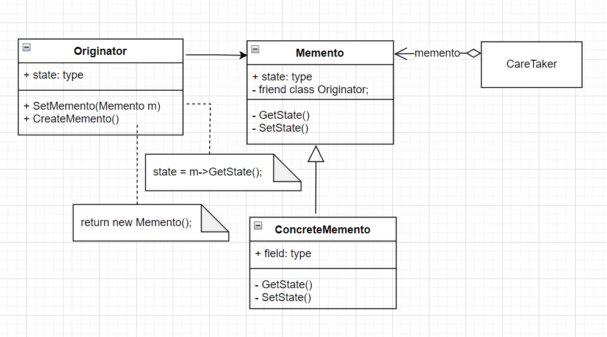

# Memento-备忘录模式

- 意图

  在不破坏封装性的前提下，捕获一个对象的内部状态，并在该对象之外保存这个状态。这样以后就可将该对象恢复到原先保存的状态。

- 优点&缺点

  - 保持封装边界：使用备忘录可以避免暴露一些只应由原发器管理却又必须存储在原发器之外的信息。该模式把可能很复杂的**Originator**内部信息对其他对象屏蔽起来，从而保持了封装边界。
  - 它简化了原发器：在其他的保持封装性的设计中，**Originator**负责保持客户请求过的内部状态版本。这就把所有存储管理的重任交给了**Originator**。让客户管理它们请求的状态将会简化**Originator**，并且使得客户工作结束时无需通知原发器。
  - 使用备忘录可能代价很高：如果原发器在生成备忘录时必须拷贝并存储大量的信息，或者客户非常频繁地创建备忘录和恢复原发器状态，可能会导致非常大的开销。除非封装和恢复**Originator**状态的开销不大，否则该模式可能并不适合。（**存储增量式改变可以作为一种改进方法**）
  - 定义窄接口和宽接口：在一些语言中可能很难保证只有原发器可访问备忘录的状态。
  - 维护备忘录的潜在代价：管理器负责删除它所维护的备忘录。然而，管理器不知道备忘录中有多少各状态。因此当存储备忘录时，一个本来很小的管理器，可能会产生大量的存储开销。
  
- 相关模式

  - Command-命令模式：命令可使用备忘录来为可撤销的操作维护状态。
  - Iterator-迭代器模式：备忘录可用于迭代。

- `UML`图

  
  
- 代码示例

  ```c++
  class Memento {
  public:
    Memento(std::string state) {
      state_ = state;
    }
    virtual ~Memento() { }
    CLASS_PTR(Memento);
  
    const std::string& state() {
      return state_;
    }
  
  private:
    std::string state_;
  };
  
  class CareTaker {
  public:
    ~CareTaker() {
      hist_memento_.clear();
    }
  
    void Add(Memento::Ptr mt) {
      hist_memento_.push_back(mt);
    }
  
    Memento::Ptr Get(size_t index) {
      return index < hist_memento_.size() ? hist_memento_[index] : nullptr;
    }
  
  private:
    std::vector<Memento::Ptr> hist_memento_;
  };
  
  class Originator {
  public:
    Originator() {
      state_ = "default";
    }
  
    void SetState(std::string state) {
      state_ = state;
      LOG("originator cur state: " << state_);
    }
  
    const std::string& GetState() {
      return state_;
    }
  
    Memento::Ptr CreateMemento() {
      return std::make_shared<Memento>(state_);
    }
  
    void Reset(Memento::Ptr memento) {
      SetState(memento->state());
    }
  
  private:
    std::string state_;
  };
  
  void test() {
    LOG("\n\n memento pattern.");
  
    Originator originator;
    CareTaker care_taker;
  
    originator.SetState("state #0");
    care_taker.Add(originator.CreateMemento());
  
    originator.SetState("state #1");
    care_taker.Add(originator.CreateMemento());
  
    originator.SetState("state #2");
    care_taker.Add(originator.CreateMemento());
  
    originator.SetState("state #3");
    care_taker.Add(originator.CreateMemento());
  
    auto memento0 = care_taker.Get(0);
    LOG("memnto0 state: " << memento0->state());
  
    originator.Reset(memento0);
    LOG("originator recover to state: " << originator.GetState());
  }
  
  ```

