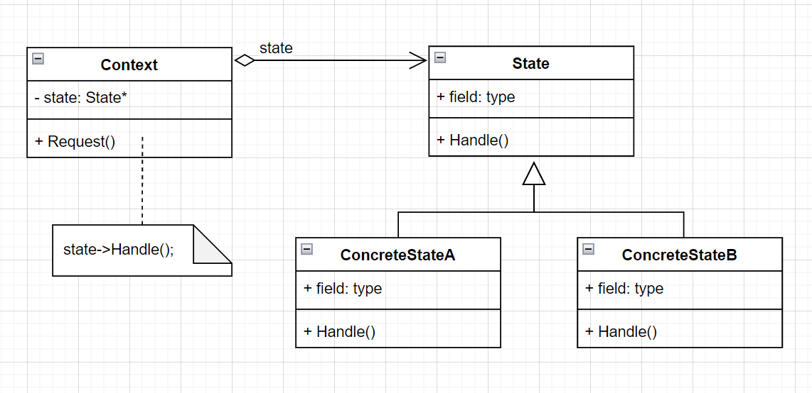

# State-状态模式

- 意图

  允许一个对象在其内部状态改变时改变它的行为。对象看起来似乎修改了它的类。

- 优缺点

  - 它将与特定状态相关的行为局部化，并且将不同状态的行为分割开来：State模式将所有与一个特定的状态相关的行为都放入一个对象中。因为所有与状态相关的代码都存在于某一个State子类中，所以通过定义新的子类可以很容易的增加新的状态和转换。
  - 它使得状态转换显示化：当一个对象仅以内部数据值来定义当前状态时，其状态仅表现为对一些变量的赋值，这不够明确。为不同的状态引入独立的对象使得装欢变得更加明确。而且，State对象可保证Context不会发现内部状态不一致的情况，因为从Context的角度看，状态转换是原子的——只需要重新绑定一个变量（即Context的State对象变量），而无需为多个变量赋值。
  - State对象可被共享：如果State对象没有实例变量——即它们表示的状态完全以它们的类型来编码——那么各Context对象可以共享一个State对象。当状态以这种方式被共享时，它们必然是没有内部状态，只有行为的轻量级对象（参考Flyweight和Singleton，**注意**：示例代码没有使用这种共享的方式）

- `UML`图（**注意**：和策略模式的UML图一样的，但要明白这两种模式的用途）

  

- 代码示例

  ```c++
  class TcpContext;
  class TcpState {
  public:
    virtual ~TcpState() { }
    CLASS_PTR(TcpState);
  
    virtual void Enter(TcpContext& ctx) = 0;
    virtual void Update(TcpContext& ctx) = 0;
    virtual void Exit(TcpContext& ctx) = 0;
  };
  
  class TcpContext {
  public:
    TcpContext() {
      frame_ = 0;
      tcp_state_ = nullptr;
    }
  
    TcpState::Ptr GetState() {
      return tcp_state_;
    }
  
    void SetState(TcpState::Ptr tcp_state) {
      tcp_state_ = tcp_state;
    }
  
    // 实现在tcp状态定义之后
    void Update();
  
  private:
    int32_t frame_;
    TcpState::Ptr tcp_state_;
  };
  
  class TcpEstablished
    : public TcpState,
      public std::enable_shared_from_this<TcpEstablished> {
  public:
    void Enter(TcpContext& ctx) override {
      LOG(__FUNCTION__);
      ctx.SetState(shared_from_this());
    }
  
    void Update(TcpContext& ctx) override {
    }
  
    void Exit(TcpContext& ctx) override {
      ctx.SetState(nullptr);
    }
  };
  
  class TcpRun
    : public TcpState,
      public std::enable_shared_from_this<TcpRun> {
  public:
    void Enter(TcpContext& ctx) override {
      LOG(__FUNCTION__);
      ctx.SetState(shared_from_this());
    }
  
    void Update(TcpContext& ctx) override {
    }
  
    void Exit(TcpContext& ctx) override {
      ctx.SetState(nullptr);
    }
  };
  
  class TcpReconnect
    : public TcpState,
      public std::enable_shared_from_this<TcpReconnect> {
  public:
    void Enter(TcpContext& ctx) override {
      LOG(__FUNCTION__);
      ctx.SetState(shared_from_this());
    }
  
    void Update(TcpContext& ctx) override {
    }
  
    void Exit(TcpContext& ctx) override {
      ctx.SetState(nullptr);
    }
  };
  
  class TcpClose
    : public TcpState,
      public std::enable_shared_from_this<TcpClose> {
  public:
    void Enter(TcpContext& ctx) override {
      LOG(__FUNCTION__);
      ctx.SetState(shared_from_this());
    }
  
    void Update(TcpContext& ctx) override {
    }
  
    void Exit(TcpContext& ctx) override {
      ctx.SetState(nullptr);
    }
  };
  
  void TcpContext::Update() {
    int loop = 0;
  
    while (loop++ < 100) {
      ++frame_;
  
      if (tcp_state_) {
        if (frame_ % 100 != 0) {
          tcp_state_->Update(*this);
        }
        else {
          tcp_state_->Exit(*this);
        }
      }
  
      SleepMs(10);
    }
  }
  
  void test() {
    TcpContext ctx;
  
    auto s1 = std::make_shared<TcpEstablished>();
    s1->Enter(ctx);
  
    //ctx.Update();
  
    auto s2 = std::make_shared<TcpRun>();
    s2->Enter(ctx);
  
    //ctx.Update();
  
    auto s3 = std::make_shared<TcpReconnect>();
    s3->Enter(ctx);
  
    //ctx.Update();
  
    auto s4 = std::make_shared<TcpClose>();
    s4->Enter(ctx);
  
    //ctx.Update();
  }
  ```

