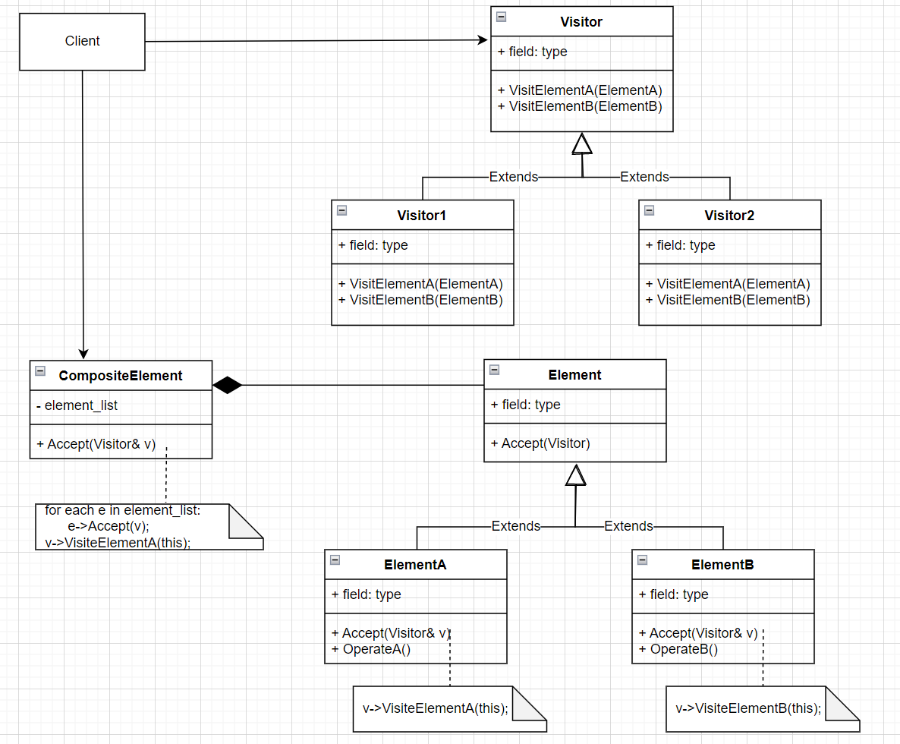

# Visitor访问者模式

- 意图

  表示一个作用于某对象中的各元素的操作。它使你可以在不改变各元素的类的前提下定义作用于这些元素的新操作。

- 优缺点

  - 访问者模式使得易于增加新的操作：访问者使得增加依赖于复杂对象结构的构件的操作变得容易了。仅需增加一个新的访问者即可在一个对象结构上定义一个新的操作。相反，如果每个功能都分散在多个类之上的话，定义新的操作时必须修改每一个类。

  - 访问者集中相关的操作而分离无关的操作：相关的行为不是分布在定义该对象结构的各个类上，而是集中在一个访问者中。无关行为却被分别放在它们各自的访问者子类中。这就既简化了这些元素的类，特简化了在这些访问者中定义的算法。所有与它的算法相关的数据结构都可以被隐藏在访问者中。

  - **缺点**：增加新的`ConcreteElement`类很困难：Visitor模式使得难以增加新的Element子类。每添加一个新的`ConcreteElement`都要在Visitor中添加一个新的抽象操作，并在每一个`ConcreteVisitor`类中实现相应的操作。有时可以在Visitor中提供一个缺省的实现，这一实现可以被大多数的`ConcreteVisitor`继承，但这与其说时一个规律还不如说是一种例外。

    所以在应用访问者模式时考虑关键的问题时系统的哪个部分会经常变化，是作用于对象结构上的算法呢还是构成该结构的各个对象的类。如果老是有新的`ConcreteElement`类加入进来的话，Visitor类层次将变得难以维护。在这种情况下，直接在构成该结构的类中定义这些操作可能更容易一些。如果Element类层次是稳定的，而你不断地增加操作或修改算法，访问者模式可以帮助你管理这些改动。

  - 累计状态：当访问者访问对象结构中的每一个元素时，它可能会累计状态。如果没有访问者，这一状态将作为额外的参数传递给进行遍历的操作，或者定义为全局变量。

  - **缺点**：破坏封装，访问者方法假定`ConcreteElement`接口的功能足够强，足以让访问者进行它们的工作。结果是，该模式常常迫使你提供访问元素内部状态的公共操作，这可能会破坏它的封装新。

- UML图

  

- 代码示例

  ```c++
  class Keyboard;
  class Mouse;
  class Monitor;
  class Computer;
  
  class ComputerPartVisiter {
  public:
    void Visit(Keyboard* keyboard) {
      std::cout << "keyboard display." << std::endl;
    }
  
    void Visit(Mouse* mouse) {
      std::cout << "mouse display." << std::endl;
    }
  
    void Visit(Monitor* monitor) {
      std::cout << "monitor display." << std::endl;
    }
  
    void Visit(Computer* computer) {
      std::cout << "computer display." << std::endl;
    }
  };
  
  class ComputerPart {
  public:
    virtual ~ComputerPart() { }
    CLASS_PTR(ComputerPart);
  
    virtual void Accept(ComputerPartVisiter& visitor) = 0;
  };
  
  class Keyboard : public ComputerPart {
  public:
    void Accept(ComputerPartVisiter& visitor) override {
      visitor.Visit(this);
    }
  };
  
  class Mouse : public ComputerPart
  {
  public:
    void Accept(ComputerPartVisiter& visitor) override {
      visitor.Visit(this);
    }
  };
  
  class Monitor : public ComputerPart
  {
  public:
    void Accept(ComputerPartVisiter& visitor) override {
      visitor.Visit(this);
    }
  };
  
  class Computer : public ComputerPart {
  public:
    Computer() {
      parts_.push_back(std::make_shared<Keyboard>());
      parts_.push_back(std::make_shared<Monitor>());
      parts_.push_back(std::make_shared<Mouse>());
    }
  
    ~Computer() {
    }
  
    void Accept(ComputerPartVisiter& visitor) override {
      for (auto& ele : parts_) {
        ele->Accept(visitor);
      }
      visitor.Visit(this);
    }
  
  private:
    std::list<ComputerPart::Ptr> parts_;
  };
  
  void test() {
    std::cout << "\n\n visitor pattern." << std::endl;
  
    ComputerPartVisiter visitor;
    Computer computer;
  
    computer.Accept(visitor);
  }
  ```

  