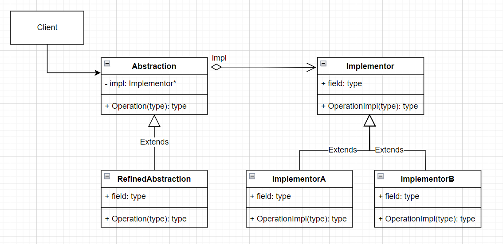
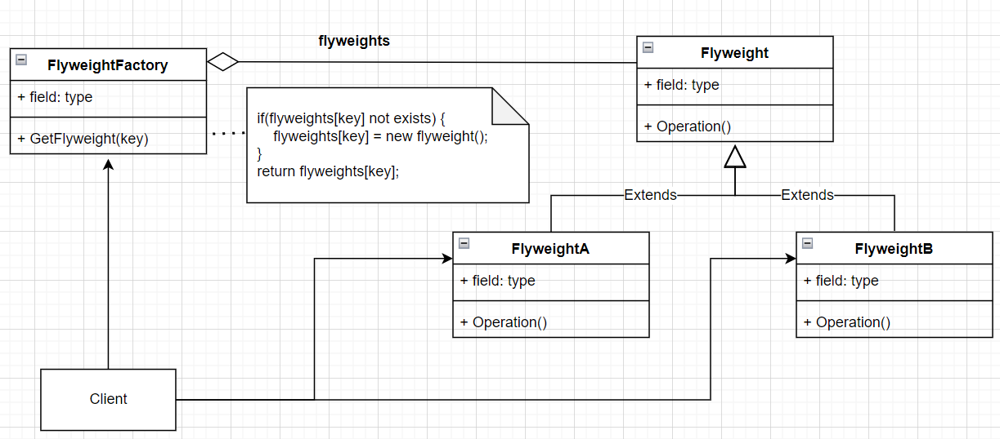

[TOC]


# 设计模式

## 一、创建型模式

- 完整代码可参考 `gof/Factory/maze.h`

- **Abstract Factory & Builder & Factory Method  & Prototype** 简单比较

| 模式名                           | 实例                   | 侧重点                               | 构建结果     |
| -------------------------------- | ---------------------- | ------------------------------------ | ------------ |
| Abstract Factory（抽象工厂模式） | MazeFactory            | 构建**多个**产品对象                 | 产品立刻返回 |
| Builder（建造者/生成器模式）     | MazeBuilder            | **一步一步**构建**一个**复杂产品对象 | 最后返回产品 |
| Factory Method（工厂方法）       | MazeGameV2、InviteCode | 抽象工厂通常使用工厂方法实现         | 产品立刻返回 |
| Prototype（原型模式）            | MazePrototypeFactory   | 每个产品都需要**Clone**接口实现      | 产品立刻返回 |


### 1.1 **Abstract Factory**

- 优缺点

  - 分离了具体的类
  - 易于交换产品系列（带魔法的迷宫或者带炸弹的迷宫等）

  - 有利于产品的一致性（见`MazeGame.CreateMaze(MazeFactory& factory)`）
  - 缺点：每个子对象的构建都需要定义一个子类工厂
  - 缺点：扩展新的产品时，需要修改父类以及所有的子类

- UML 图
  
  
 - 代码示例

   ```c++
   Maze::Ptr CreateMaze(MazeFactory& factory) {
       auto maze = factory.MakeMaze();
   
       auto r1 = factory.MakeRoom(1);
       auto r2 = factory.MakeRoom(2);
       auto door = factory.MakeDoor(r1, r2);
   
       maze->AddRoom(r1);
       maze->AddRoom(r2);
   
       r1->SetSide(North, factory.MakeWall());
       r1->SetSide(East, door);
       r1->SetSide(South, factory.MakeWall());
       r1->SetSide(West, factory.MakeWall());
   
       r2->SetSide(North, factory.MakeWall());
       r2->SetSide(East, factory.MakeWall());
       r2->SetSide(South, factory.MakeWall());
       r2->SetSide(West, door);
   
       return maze;
   }
   
   void factoryTest() {
       MazeGame game;
   
       // 硬编码创建maze；不能适应新的游戏玩法，
       // 新增带魔法或者bomb的的类型数据，需要修改创建maze的规则
       auto maze1 = game.CreateMaze();
   
       // 抽象工厂创建普通的maze
       MazeFactory factory;
       auto maze2 = game.CreateMaze(factory);
   
       // 抽象工厂创建带spell的maze
       EnchantedMazeFactory enchanted_factory;
       auto maze3 = game.CreateMaze(enchanted_factory);
   
       // 抽象工厂创建带bomb的maze
       BombedMazeFactory bombed_factory;
       auto maze4 = game.CreateMaze(bombed_factory);
   
       // 设计模式不是不允许修改代码，而是把经常变化的那部分进行封装、抽象；
       // 这里经常变化的可能就是属性的玩法，而maze的创建过程一般不会发生变化。
       // 隔离变化：通常就是为了维持代码的不变。
   
       /*
           抽象工厂模式的优点：
           1、分离了具体的类
           2、使得易于交换产品系列（带魔法的迷宫或者带炸弹的迷宫等）
           3、有利于产品的一致性
   
           缺点：
           1、难以支持新种类的产品（新增产品需要修改Factory基类和所有子类）
   
           相关模式：
           1、AbstractFactory抽象工厂类通常用工厂方法（Factory Method）实现，但它们也可以用Prototype实现。
           2、一个具体的工厂通常是一个单件（Singleton）。
       */
   }
   ```


### 1.2 **Builder**

   - 优缺点
     - 构建复杂对象，内部各个部分构建完成后，组合成复杂对象
     - 用户只需要关心我最后实际使用的复杂对象，而不必关心中间的构建过程

   - UML 图
     
     

   - 代码示例

     ```c++
     // 建造者/生成器模式
     class MazeBuilder {
     public:
         virtual void BuildMaze() {}
         virtual void BuildRoom(int32_t num) {}
         virtual void BuildDoor(int32_t room_from, int32_t room_to) {}
         virtual Maze::Ptr GetMaze() { return nullptr; }
     
     protected:
         MazeBuilder() {}
     };
     
     class StandardBuilder : public MazeBuilder {
       ...  
     };
     
     class CountingBuilder : public MazeBuilder {
       ...
     };
     
     Maze::Ptr CreateMaze(MazeBuilder& builder) {
         builder.BuildMaze();
     
         builder.BuildRoom(1);
         builder.BuildRoom(2);
         builder.BuildDoor(1, 2);
     
         return builder.GetMaze();
     }
     
     void builderTest() {
         MazeGame game;
         StandardMazeBuilder builder;
     
         auto maze1 = game.CreateMaze(builder);
     
         CountingMazeBuilder counting_builder;
         auto maze2 = game.CreateMaze(counting_builder);
     
         int32_t rooms, doors;
         counting_builder.GetCounts(rooms, doors);
     
         std::cout << "The maze has "
             << rooms << " rooms and "
             << doors << " doors" << std::endl;
     
         // builder和factory比较
         // 1、builder着重于一步步构建一个复杂的对象
     }
     ```


### 1.3 **Factory Method** 工厂方法

  - 优缺点
    - 上层可以只定义默认操作过程，方法实现可以延迟到子类中进行（可以参见 `InviteCode.Exchange` 的使用）
    - Abstract Factory 通常用工厂方法实现

  - UML 图

    
    
  - 代码示例1（迷宫游戏创建）
  ```c++
  class MazeGameV2 {
  public:
      Maze::Ptr CreateMaze() {
          auto maze = MakeMaze();
  
          auto r1 = MakeRoom(1);
          auto r2 = MakeRoom(2);
  
          maze->AddRoom(r1);
          maze->AddRoom(r2);
  
          auto door = MakeDoor(r1, r2);
  
          r1->SetSide(North, MakeWall());
          r1->SetSide(East, door);
          r1->SetSide(South, MakeWall());
          r1->SetSide(West, MakeWall());
  
          r2->SetSide(North, MakeWall());
          r2->SetSide(East, MakeWall());
          r2->SetSide(South, MakeWall());
          r2->SetSide(West, door);
  
          return maze;
      }
  
      // factory method:
      virtual Maze::Ptr MakeMaze() {
          return std::make_shared<Maze>();
      }
      virtual Room::Ptr MakeRoom(int32_t n) {
          return std::make_shared<Room>(n);
      }
      virtual Wall::Ptr MakeWall() {
          return std::make_shared<Wall>();
      }
      virtual Door::Ptr MakeDoor(Room::Ptr r1, Room::Ptr r2) {
          return std::make_shared<Door>(r1, r2);
      }
  };
  
  class BombedMazeGame : public MazeGameV2 {
  public:
      Wall::Ptr MakeWall() override {
          return std::make_shared<BombedWall>();
      }
      Room::Ptr MakeRoom(int32_t n) override {
          return std::make_shared<RoomWithABomb>(n);
      }
  };
  
  // 测试用例
  void factoryMethodTest() {
      MazeGameV2 game;
      auto maze1 = game.CreateMaze();
  
      BombedMazeGame game2;
      auto maze2 = game2.CreateMaze();
  }
  
  ```
  - 代码示例2（邀请码使用）
  ```c++
  class InviteCode {
  public:
      virtual ~InviteCode() {}
  
      bool Exchange() {
          if (!CheckCode())
              return false;
          if (!CheckValid())
              return false;
          if (!GiveReward())
              return false;
          Record();
          return true;
      }
  
      CLASS_PTR(InviteCode);
  
  protected:
      virtual bool CheckCode() {
          return true;
      }
  
      virtual bool CheckValid() {
          return true;
      }
  
      virtual bool GiveReward() {
          return true;
      }
  
      virtual void Record() {
      }
  };
  
  class ErrorCode : public InviteCode {
  protected:
      bool CheckCode() override {
          return false;
      }
  };
  
  class OnceCode : public InviteCode {
  protected:
      bool CheckValid() override {
          // TODO：检查玩家是否已经领取过同类型的邀请码
          return true;
      }
  
      void Record() override {
          // TODO：记录领取过该类型的邀请码，以后不允许再领取该类型
      }
  };
  
  class ActivityCode : public InviteCode {
  protected:
      bool CheckValid() override {
          // TODO：检查玩家是否已经领取过同类型的邀请码
          return true;
      }
  
      void Record() override {
          // TODO：记录领取过该类型的邀请码，以后不允许再领取该类型
      }
  };
  
  // 模板工厂
  class InviteCodeFactory {
  public:
      template<class TYPE>
      static TYPE::Ptr Create() {
          return std::make_shared<TYPE>();
      }
  };
  
  void factoryMethodTest() {
      ...
  
      // 其他示例：邀请码使用
      auto invite_code = InviteCodeFactory::Create<OnceCode>();
      invite_code->Exchange();
  
      invite_code = InviteCodeFactory::Create<ActivityCode>();
      invite_code->Exchange();
  }
  ```


### 1.4 **Prototype** 原型模式

  - 优缺点
    - 原型不需要再创建工厂实例（像`BombedFactory & EnchantedFactory`等）
    - 缺点：该模式最大的缺点就是每一个Product类都需要实现Clone接口，该接口可能存在实现困难的情况

  - UML 图

    

  - 代码示例

    ```c++
    class MazePrototypeFactory : public MazeFactory {
    public:
        MazePrototypeFactory(Maze::Ptr prototype_maze,
            Wall::Ptr prototype_wall, Room::Ptr prototype_room,
            Door::Ptr prototype_door) {
            prototype_maze_ = prototype_maze;
            prototype_wall_ = prototype_wall;
            prototype_room_ = prototype_room;
            prototype_door_ = prototype_door;
        }
    
        Maze::Ptr MakeMaze() override {
            return prototype_maze_->Clone();
        }
        Wall::Ptr MakeWall() override {
            return prototype_wall_->Clone();
        }
        Room::Ptr MakeRoom(int num) override {
            auto room = prototype_room_->Clone();
            room->Initilize(num);
            return room;
        }
        Door::Ptr MakeDoor(Room::Ptr r1, Room::Ptr r2) override {
            auto door = prototype_door_->Clone();
            door->Initialize(r1, r2);
            return door;
        }
    
    private:
        Maze::Ptr prototype_maze_;
        Wall::Ptr prototype_wall_;
        Room::Ptr prototype_room_;
        Door::Ptr prototype_door_;
    };
    
    void prototypeTest() {
        MazeGame game;
    
        auto prototype_maze = std::make_shared<Maze>();
        auto prototype_wall = std::make_shared<Wall>();
        auto prototype_room = std::make_shared<Room>(0);
        auto prototype_door = std::make_shared<Door>(
            std::make_shared<Room>(1), std::make_shared<Room>(2));
    
        MazePrototypeFactory simpleMazeFactory(
            prototype_maze,
            prototype_wall,
            prototype_room,
            prototype_door);
    
        auto simple_maze = game.CreateMaze(simpleMazeFactory);
    
        auto bombed_wall = std::make_shared<BombedWall>();
        MazePrototypeFactory bombedMazeFactory(
            prototype_maze,
            bombed_wall,
            prototype_room,
            prototype_door);
    
        auto bombed_maze = game.CreateMaze(bombedMazeFactory);
    
        /* 
            原型模式和抽象工厂的比较：
            1、原型不需要再创建工厂实例（像BombedFactory&EnchantedFactory等）
            2、使用抽象工厂时，不需要为每一个Product对象实现Clone方法，特别是Clone存在困难时
        */
    }
    
    ```


### 1.5 **创建型模式总结**

  - 使用**Abstract Factory、Prototype或Builder**的设计甚至比使用**Factory Method**的那些设计更灵活，但它们也更加复杂。
  - 通常，设计以使用**Factory Method**开始，并且当设计者发现需要更大的灵活性时，设计便会向其他创建型模式演化。
  - 当你在设计标准之间进行权衡的时候，了解多个模式可以给你提供更多的选择余地。


## 二、结构型模式

- 结构型模式比较

  | 模式名            | 实例                    | 侧重点                                                       |
  | ----------------- | ----------------------- | ------------------------------------------------------------ |
  | Adapter适配器模式 | `Adapter/mediaplayer.h` | 改变一个已有对象的接口                                       |
  | Bridge桥接模式    | `Bridge/shape.h`        | 将接口和实现分离                                             |
  | Decorator装饰模式 | `Decorator/shape.h`     | 改变对象的职责而不改变它的接口（接口一致性）                 |
  | Proxy代理模式     | `Proxy/image.h`         | 控制对对象的访问                                             |
  | Composite组合模式 | `Composite/equipment.h` | 旨在构造类，使对各相关的对象能够以统一方式处理，而多重对象可以被当作一个对象来处理，它的重点不在于修饰，而在于**表示** |
  | Facade外观模式    | `Facade/shapemaker.h`   | 提供一个一致的对外接口                                       |
  | Flyweight享元模式 | `Flyweight/glyph.h`     | 共享对象                                                     |

  

### 2.1 **Adapter**适配器模式

  - 意图

    将一个类的接口转换成客户希望的另外一个接口。Adapter模式使得原本由于接口不兼容而不能一起工作的那些类可以一起工作

  - 优缺点

    - 兼容老的接口，适配新接口，让它们可以一起工作
    - 改变一个已有对象的接口
  - UML 图


  

  - 代码示例
  
    ```c++
    class AdvancedMediaPlayer {
    public:
        CLASS_PTR(AdvancedMediaPlayer);
        virtual ~AdvancedMediaPlayer() { }
        virtual void play(const std::string& file) = 0;
    };
    
    class VlcPlayer : public AdvancedMediaPlayer {
    public:
        ~VlcPlayer() { }
        void play(const std::string& file) override {
            std::cout << "vlc play: " << file << std::endl;
        }
    };
    
    class Mp4Player : public AdvancedMediaPlayer {
    public:
        ~Mp4Player() { }
        void play(const std::string& file) override {
            std::cout << "mp4 play: " << file << std::endl;
        }
    };
    
    class MediaPlayer {
    public:
    	virtual ~MediaPlayer() { }
    	virtual void play(const std::string& audioType, const std::string& file) = 0;
    };
    
    class MediaAdapter : public MediaPlayer {
    public:
        MediaAdapter(AdvancedMediaPlayer::Ptr player) {
            advanced_player_ = player;
        }
    	~MediaAdapter() override { }
    
    	void play(const std::string& audioType, const std::string& file) override {
    		if (advanced_player_) {
    			advanced_player_->play(file);
    		}
    	}
    
    private:
    	AdvancedMediaPlayer::Ptr advanced_player_;
    };
    
    class AudioPlayer : public MediaPlayer {
    public:
    	AudioPlayer(AdvancedMediaPlayer::Ptr vlc_player,
                AdvancedMediaPlayer::Ptr mp4_player) {
            vlc_player_ = vlc_player;
            mp4_player_ = mp4_player;
    	}
    	~AudioPlayer() override { }
    
    	void play(const std::string& audioType, const std::string& file) override {
    		if (audioType == "mp3") {
    			std::cout << "player mp3: " << file << std::endl;
    		} else if (audioType == "vlc" && vlc_player_) {
                vlc_player_->play(file);
            }
            else if (audioType == "mp4" && mp4_player_) {
                mp4_player_->play(file);
            }
    	}
    
    private:
    	AdvancedMediaPlayer::Ptr vlc_player_;
        AdvancedMediaPlayer::Ptr mp4_player_;
    };
    
    void test() {
        std::cout << "\n\n adapter pattern." << std::endl;
    
        auto vlc_player = std::make_shared<VlcPlayer>();
        auto mp4_player = std::make_shared<Mp4Player>();
    
        auto vlc_media_adapter = std::make_shared<MediaAdapter>(vlc_player);
        auto mp4_media_adapter = std::make_shared<MediaAdapter>(mp4_player);
        vlc_media_adapter->play("vlc", "as long as you love me.vlc");
        mp4_media_adapter->play("mp4", "sexlove.mp4");
    
        auto audio_player = std::make_shared<AudioPlayer>(vlc_player, mp4_player);
        audio_player->play("mp3", "my love.mp3");
        audio_player->play("vlc", "as long as you love me.vlc");
        audio_player->play("mp4", "sexlove.mp4");
    }
    ```


### 2.2 **Decorator**装饰者模式

  - 意图
  
    动态地给一个对象添加一些额外的职责。就新增功能来说，Decorator模式相比生成子类更为灵活。
  
  - 优缺点
  
    - 比静态继承更灵活
    - 避免在层次结构高层的类有太多的特征
    - 产生许多小对象（缺点）
  
  - UML图
  
    
    
  
  - 代码示例
  
    ```c++
    class Shape {
    public:
        virtual~Shape() { }
        CLASS_PTR(Shape);
    
        virtual void draw() = 0;
    };
    
    class Circle : public Shape {
    public:
        ~Circle() { }
    
        void draw() override {
            std::cout << "circle draw." << std::endl;
        }
    };
    
    class Square : public Shape {
    public:
        ~Square() { }
    
        void draw() override {
            std::cout << "square draw." << std::endl;
        }
    };
    
    class Rectangle : public Shape {
    public:
        ~Rectangle() { }
    
        void draw() override {
            std::cout << "rectangle draw." << std::endl;
        }
    };
    
    class ShapeDecorator : public Shape {
    public:
        ShapeDecorator(Shape::Ptr& shape) {
            shape_ = shape;
        }
    
    protected:
        Shape::Ptr shape_;
    };
    
    class RedShapeDecorator : public ShapeDecorator
    {
    public:
        RedShapeDecorator(Shape::Ptr shape) : ShapeDecorator(shape) { }
    
        void draw() override {
            shape_->draw();
            std::cout << "red:" << std::endl;
        }
    };
    
    void test() {
        std::cout << "\n\n decorator pattern." << std::endl;
    
        auto sd1 = std::make_shared<RedShapeDecorator>(
            std::make_shared<Circle>());
        sd1->draw();
    
        auto sd2 = std::make_shared<RedShapeDecorator>(
            std::make_shared<Rectangle>());
        sd2->draw();
    
        auto sd3 = std::make_shared<RedShapeDecorator>(sd2);
        sd3->draw();
    }
    ```
    


  ### 2.3 **Bridge**桥接模式

  - 意图
  
    将抽象部分与它的实现部分分离，使它们都可以独立地变化。
  
  - 优点
  
    - 分离接口及其实现部分
    - 提高可扩充性
    - 实现细节对客户透明
  
  - UML图





### 2.4 **Proxy**代理模式

- 意图

  为其他对象提供一种代理以**控制**对这个对象的访问。

- 优点

  - 可以隐藏对象的实现细节。
  - 如果RealSubject和Subject接口相同，代理可以引用Subject。（变成了和Decorator的UML结构类似，但是它们的目的不同）

- UML图

  
  

- 代码示例

  ```c++
  class Image {
  public:
  	virtual ~Image() { }
      CLASS_PTR(Image);
  
  	virtual void display() = 0;
  };
  
  class RealImage : public Image {
  public:
  	RealImage(std::string& file) {
  		filename_ = file;
  		loadFromDisk();
  	}
  
  	void display() override {
  		std::cout << "display real image." << std::endl;
  	}
  
  private:
  	void loadFromDisk() {
  		std::cout << "load " << filename_ << " from disk." << std::endl;
  	}
  
  private:
  	std::string filename_;
  };
  
  class ProxyImage : public Image {
  public:
  	ProxyImage(std::string filename) {
          filename_ = filename;
  	}
  
  	void display() override {
          // 延迟实例化
          if (!real_img_) {
              real_img_ = std::make_shared<RealImage>(filename_);
          }
          real_img_->display();
  	}
  
  private:
      std::string filename_;
  	Image::Ptr real_img_;
  };
  
  void test() {
      std::cout << "\n\n proxy pattern." << std::endl;
  
      auto image = std::make_shared<ProxyImage>("beautiful.jpg");
      image->display();
  }
  ```


### 2.5 **Composite**组合模式

- 意图

  将对象组合成树形结构以表示“部分-整体”的层次结构。Composite模式使得用户对单个对象和组合对象的使用具有一致性。

- 优点

  - 定义了包含基本对象和组合对象的类层次结构。基本对象可以被组合成更复杂的组合对象，而这个组合对象又可以被组合，这样不断的递归下去。客户代码中，任何用到基本对象的地方都可以使用组合对象。

  - 简化客户代码，客户可以一致地使用组个结构和单个对象
  - 更容易增加新类型的组件
  - （缺点）使你的设计更加一般化，容易增加新组件也会产生一些问题，那就是很难限制组合中的组件。有时你希望一个组合只能有某些特定的组件。使用Composite时，你不能依赖类型系统施加这些约束，而必须在运行时刻进行检查
  - （缺点）基础接口组件会暴露Composite组件的接口，但是Composite接口（如Add,Remove,GetChild等）又不是其他非Composite组件接口所必须的，一个可能的办法是在公共基础组件中增加GetComposite接口，用于获取Composite组件，默认的公共接口Component提供缺省的默认实现返回空对象。参见UML图-Composite-Equipment

- UML图
  
  
  
  

- 代码示例

  ```c++
  class CompositeEquipment;
  
  class Equipment {
  public:
    Equipment(std::string name) { name_ = name; }
    virtual ~Equipment() { }
    CLASS_PTR(Equipment);
  
    // 这个接口为了屏蔽Composite类的接口Add&Remove;减少公共类中不需要的接口
    virtual std::shared_ptr<CompositeEquipment> GetComposite() { return nullptr; }
    virtual std::string toString() { return name_; }

    // 其他公共类接口定义...
  private:
    std::string name_;
    // other member...
};
  
  class CompositeEquipment : public Equipment,
                    public std::enable_shared_from_this<CompositeEquipment> {
  public:
    CompositeEquipment(std::string name);
    ~CompositeEquipment();
    CLASS_PTR(CompositeEquipment);
  
    void Add(Equipment::Ptr&& p);
    void Remove(Equipment::Ptr&& p);
      
    CompositeEquipment::Ptr GetComposite() override;
    std::string toString() override;
  
  private:
    std::list<Equipment::Ptr> composites_;
};
  
  class FloppyDisk : public Equipment {
  public:
    FloppyDisk(std::string name) : Equipment(name) { }
};
  
  // TODO：实现需要放到cpp中
  void test() {
    std::cout << "\n\n Composite Pattern." << std::endl;
  
    Equipment::Ptr equipment = std::make_shared<CompositeEquipment>("CE");
    auto composite = equipment->GetComposite();
    if (composite) {
      composite->Add(std::make_shared<FloppyDisk>("FloppyDisk1"));
      composite->Add(std::make_shared<FloppyDisk>("FloppyDisk2"));
      composite->Add(std::make_shared<FloppyDisk>("FloppyDisk3"));
    }
      
    std::cout << equipment->toString() << std::endl;
  }
  
  ```


### 2.6 **Facade**外观模式

- 意图

  为子系统中的一组接口（Shape）提供一个一致的界面，Facade模式定义了一个高层接口，这个接口使得这一子系统可以更加容易使用。

- 优点

  - 对客户屏蔽子系统组件，有利于降低系统的复杂性。
  - 实现了子系统与客户程序之间的松耦合关系，而子系统内部的功能组件是紧耦合的。
  - 使用Facade的客户程序不需要直接访问子系统对象，可以消除复杂的循环依赖关系，这一点在客户程序和子系统分别实现的时候尤为重要。
  - 如果应用需要，它并不限制它们使用子系统类。因此你可以在系统易用性和通用性之间加以选择。

- UML图

  

- 代码示例

  ```c++
  class Shape {
  public:
      virtual ~Shape() { }
      CLASS_PTR(Shape);
  
      virtual void draw() = 0;
  };
  
  class Circle : public Shape {
  public:
      ~Circle() { }
  
      void draw() override {
          std::cout << "circle draw." << std::endl;
      }
  };
  
  class Square : public Shape {
  public:
      ~Square() { }
      void draw() override {
          std::cout << "square draw." << std::endl;
      }
  };
  
  class Rectangle : public Shape
  {
  public:
      ~Rectangle() { }
  
      void draw() override {
          std::cout << "rectangle draw." << std::endl;
      }
  };
  
  class ShapeFacade {
  public:
  	ShapeFacade() {
  		circle_ = std::make_shared<Circle>();
  		square_ = std::make_shared<Square>();
  		rectangle_ = std::make_shared<Rectangle>();
  	}
  
  	~ShapeFacade() {
  	}
  
  	void drawCircle() {
  		circle_->draw();
  	}
  
  	void drawSquare() {
  		square_->draw();
  	}
  
  	void drawRectangle() {
  		rectangle_->draw();
  	}
  
  private:
      std::shared_ptr<Shape> circle_;
      std::shared_ptr<Shape> square_;
      std::shared_ptr<Shape> rectangle_;
  };
  
  void test() {
  	std::cout << "\n\n facade pattern." << std::endl;
  
  	auto sm = std::make_shared<ShapeFacade>();
  	sm->drawCircle();
  	sm->drawSquare();
  	sm->drawRectangle();
  }
  
  ```

  

### 2.7 **Flyweight**享元模式

- 意图

  运用共享技术有效地支持大量细粒度的对象

- 优点

  - 运用Flyweight可以减少大量的对象，从而节约空间。
  - 共享的flyweight对象越多，节省的空间越大。
  - 缺点：使用flyweight时，传输、查找、计算外部状态都会产生运行时开销，尤其当flyweight原先被存储为内部状态时。

- UML图

  

- 代码示例（以下代码只展示结构效果，编译会出现错误）

  ```c++
  class Window;
  class GlyphContext;
  class Font;
  
  // flyweight模式一般和组合模式一起使用
  class Glyph {
  public:
      virtual ~Glyph() { }
      CLASS_PTR(Glyph);
  
      virtual void Draw(Window*, GlyphContext&);
      virtual void SetFont(Font*, GlyphContext&);
      virtual Font* GetFont(GlyphContext&);
      virtual void First(GlyphContext&);
      virtual void Next(GlyphContext&);
      virtual bool IsDone(GlyphContext&);
      virtual Glyph::Ptr Current(GlyphContext&);
  
      // Composite模式接口
      virtual void Insert(Glyph::Ptr, GlyphContext&);
      virtual void Remove(GlyphContext&);
  };
  
  class Character : public Glyph {
  public:
      Character(char ch);
      CLASS_PTR(Character);
  
      void Draw(Window*, GlyphContext&) override;
  
  private:
      char ch_;
  };
  
  class Row : public Glyph {
  public:
      Row();
      CLASS_PTR(Row);
  
      void Draw(Window*, GlyphContext&) override;
  
      void Insert(Glyph::Ptr, GlyphContext&) override;
      void Remove(GlyphContext&) override;
  
  private:
      std::list<Glyph::Ptr> glyphs_;
  };
  
  class Column : public Glyph {
  public:
      Column();
      CLASS_PTR(Column);
  
      void Draw(Window*, GlyphContext&) override;
  
      void Insert(Glyph::Ptr, GlyphContext&) override;
      void Remove(GlyphContext&) override;
  
  private:
      std::list<Glyph::Ptr> glyphs_;
  };
  
  class GlyphContext {
  public:
      GlyphContext();
      virtual ~GlyphContext();
  
      virtual void Next(int32_t step = 1);
      virtual void Insert(int32_t quantity = 1);
  
      virtual Font* GetFont();
      virtual void SetFont(Font*, int32_t span = 1);
  
  private:
      int32_t index_;
      std::unordered_map<int32_t, Font*> font_dict_;
  };
  
  class GlyphFactory {
  public:
      GlyphFactory();
      virtual ~GlyphFactory();
  
      // flyweight应用
      virtual Character::Ptr CreateCharacter(char ch) {
          if (!characters_[ch]) {
              characters_[ch] = std::make_shared<Character>(ch);
          }
          return characters_[ch];
      }
  
      virtual Row::Ptr CreateRow() {
          return std::make_shared<Row>();
      }
      virtual Column::Ptr CreateColumn() {
          return std::make_shared<Column>();
      }
  
  private:
      // flyweights
      Character::Ptr characters_[128];
  };
  ```


## 三、行为模式

行为模式总览比较

| 模式名                                | 实例                          | 侧重点 |
| ------------------------------------- | ----------------------------- | ------ |
| Chain Of Responsibility（职责链模式） | `Chain/logger.h`              |        |
| Command（命令模式）                   | `Command/order.h`             |        |
| Observer（观察者模式）                | Observer/observer.h&subject.h |        |
|                                       |                               |        |
|                                       |                               |        |
|                                       |                               |        |
|                                       |                               |        |


### 3.1 **Chain Of Responsibility**（职责链）

  - 意图

    使多个对象都有机会处理请求，从而避免请求的发送者和接收者之间的耦合关系。将这些对象形成一条链，并沿着这条链传递该请求指导有一个对象处理它为止。

  - 优缺点
  
    - 降低耦合度：该模式使得一个对象无需知道使其他哪一个对象处理其请求。
    
    - 增强了给对象指派职责的灵活性：你可以通过在运行时刻对该链进行动态的增加或修改来增加或改变处理一个请求的那些职责。你可以将这种机制与静态的特例化处理对象的继承机制结合起来使用。
    
    - 不保证被接受（缺点）：既然一个请求没有明确的接收者，那么就不能保证它一定会被处理——该请求可能一直到链的末端都得不到处理。一个请求也可能因该链没有被正确配置而得不到处理。
  
  - UML图
    
    

  - 代码示例
  
    ```c++
    constexpr int INFO  = 1;
    constexpr int DEBUG = 2;
    constexpr int ERROR = 3;
    
    class AbstractLogger {
    public:
        virtual ~AbstractLogger() { }
        CLASS_PTR(AbstractLogger);
    
        void setNextLogger(AbstractLogger::Ptr nextLogger) {
            next_logger_ = nextLogger;
        }
    
        void logMessage(int level, std::string message) {
            if (level_ <= level) {
                write(message);
            }
    
            if (next_logger_) {
                next_logger_->logMessage(level, message);
            }
        }
    
    private:
        virtual void write(std::string& message) = 0;
    
    protected:
        int32_t level_;
        AbstractLogger::Ptr next_logger_ = nullptr;
    };
    
    class ConsoleLogger : public AbstractLogger {
    public:
        ConsoleLogger() {
            level_ = INFO;
        }
    
        ~ConsoleLogger() { }
    
    private:
        void write(std::string& message) {
            std::cout << "INFO: " << message << std::endl;
        }
    };
    
    class DebugLogger : public AbstractLogger {
    public:
        DebugLogger() {
            level_ = DEBUG;
        }
    
        ~DebugLogger() { }
    
    private:
        void write(std::string& message) {
            std::cout << "DEBUG: " << message << std::endl;
        }
    };
    
    class ErrorLogger : public AbstractLogger {
    public:
        ErrorLogger() {
            level_ = ERROR;
        }
    
        ~ErrorLogger() { }
    
    private:
        void write(std::string& message) {
            std::cout << "ERROR: " << message << std::endl;
        }
    };
    
    void test() {
        std::cout << "\n\n chain of responsibility pattern." << std::endl;
    
        auto infoLogger = std::make_shared<ConsoleLogger>();
        auto debugLogger = std::make_shared<DebugLogger>();
        auto errorLogger = std::make_shared<ErrorLogger>();
    
        errorLogger->setNextLogger(debugLogger);
        debugLogger->setNextLogger(infoLogger);
    
        errorLogger->logMessage(ERROR, "failed to find a");
        errorLogger->logMessage(DEBUG, "failed to find b");
        errorLogger->logMessage(INFO,  "failed to find c");
    }
    
    ```
    
    

### 3.2 **Command**（命令）

- 意图

  将一个请求封装为一个对象，从而使你可用不同的请求对客户进行参数化；对请求排队或者记录日志请求，以及支持可撤销的操作。

- 优缺点

  - Command模式将调用操作的对象与知道如何实现该操作的对象解耦。
- Command是头等的对象。它们可像其他的对象一样被操纵和扩展。
  
  - 你可以将多个命令装配成一个复合命令。
- 增加新的Command很容易，因此这无需改变已有的类。
  
- UML图


- 代码示例

  ```c++
  class Stock {
    public:
    Stock(std::string name, int amount) {
      name_ = name;
      amount_ = amount;
    }
    ~Stock() { }
    CLASS_PTR(Stock);
  
    void buy() {
      std::cout << "buy stock[name: " << name_
        << ", amount: " << amount_ << "]" << std::endl;
    }
  
    void sell() {
      std::cout << "sell stock[name: " << name_
        << ", amount: " << amount_ << "]" << std::endl;
    }
  
  private:
    std::string name_;
    int32_t amount_;
  };
  
  // command接口
  class Order {
  public:
    virtual ~Order() { }
    CLASS_PTR(Order);
    virtual void execute() = 0;
    };
  
  class BuyStock : public Order {
  public:
    BuyStock(Stock::Ptr stock) {
      stock_ = stock;
    }
  
    void execute() {
      stock_->buy();
    }
  
  private:
      Stock::Ptr stock_;
  };
  
  class SellStock : public Order {
  public:
    SellStock(Stock::Ptr stock) {
      stock_ = stock;
    }
  
    void execute() {
      stock_->sell();
    }
  
  private:
    Stock::Ptr stock_;
  };
  
  class Broker {
  public:
    Broker() { }
  
    ~Broker() {
      orderList_.clear();
    }
  
    void takeOrder(Order::Ptr order) {
      orderList_.emplace_back(order);
    }
  
    void placeOrders() {
      for (auto& it : orderList_) {
        it->execute();
      }
    }
  
  private:
    std::list<Order::Ptr> orderList_;
  };
  
  void test() {
    std::cout << "\n\n command pattern." << std::endl;
  
    Stock::Ptr qq = std::make_shared<Stock>("qq", 100);
    Stock::Ptr alibaba = std::make_shared<Stock>("alibaba", 400);
  
    auto broker = std::make_shared<Broker>();
    broker->takeOrder(std::make_shared<BuyStock>(qq));
    broker->takeOrder(std::make_shared<SellStock>(qq));
  
    broker->takeOrder(std::make_shared<BuyStock>(alibaba));
    broker->takeOrder(std::make_shared<SellStock>(alibaba));
  
    broker->placeOrders();
  }
  ```

  

### 3.3 **Observer**（观察者模式）

- 意图

  定义对象间的一种一对多的依赖关系，当一个对象的状态发生改变时，所有依赖于它的对象都得到通知并被自动更新。

- 别名

  依赖（Dependents），发布-订阅（Publish-Subscribe）

- 优缺点

  - Observer模式允许你独立的改变目标（Subject）和观察者（Observer）；
  - 目标和观察者间的抽象耦合：一个目标所知道的仅仅是它有一系列观察者，每个都符合抽象的Observer类的简单接口。目标不知道任何一个观察者属于哪一个具体的类。这样目标和观察者之间的耦合是抽象的和最小的。
  - 支持广播通信：不像通常的请求，目标发送的通知不需要指定它的接收者。通知被自动广播给所有已向该目标对象登记的有关对象。目标对象并不关心到底有多少对象对自己感兴趣；它唯一的职责就是通知它的各观察者。这给了你在任何时刻增加和删除观察者的自由。处理还是忽略一个通知取决于观察者。
  - 意外的更新（缺点）：因为一个观察者并不知道其他观察者的存在，它可能对改变目标的最终代价一无所知。在目标上一个看似无害的操作可能会引起一系列对观察者以及依赖这些观察者的那些对象的更新。此外，如果依赖准则的定义或维护不当，常常会引起错误的更新，这种错误通常很难捕捉。简单的更新协议不提供具体细节说明目标中什么被改变了，这就使得上述问题变得更加严重。如果没有其他协议帮助观察者发现什么发生了改变，它们可能会被迫尽力减少改变。

- UML图

  
  

- 代码示例

  ```c++
  // observer.h
  class Subject;
  class Observer {
  public:
    virtual ~Observer() { }
    CLASS_PTR(Observer);
  
    virtual void Update(std::shared_ptr<Subject> subject) = 0;
  };
  
  class BinaryObserver : public Observer {
  public:
    void Update(std::shared_ptr<Subject> subject) override {
      std::cout << "BinaryObserver update." << std::endl;
    }
  };
  
  class OctalObserver : public Observer {
  public:
    void Update(std::shared_ptr<Subject> subject) override {
      std::cout << "OctalObserver update." << std::endl;
    }
  };
  
  class HexaObserver : public Observer {
  public:
    void Update(std::shared_ptr<Subject> subject) override {
      std::cout << "HexaObserver update." << std::endl;
    }
  };
  
  // subject.h
  class Subject : std::enable_shared_from_this<Subject> {
  public:
    Subject() {
      state_ = 0;
    }
    CLASS_PTR(Subject);
  
    int GetState() {
      return state_;
    }
  
    void SetState(int state) {
      state_ = state;
      NotifyAll();
    }
  
    void Attach(Observer::Ptr observer) {
      observers_.push_back(observer);
    }
  
    void NotifyAll() {
      auto this_sub = shared_from_this();
      for (auto& it : observers_) {
        it->Update(this_sub);
      }
    }
  
  private:
    int32_t state_;
    std::list<Observer::Ptr> observers_;
  };
  
  void test() {
    std::cout << "\n\n observer pattern." << std::endl;
  
    auto subject = std::make_shared<Subject>();
    auto observer1 = std::make_shared<BinaryObserver>();
    auto observer2 = std::make_shared<OctalObserver>();
    auto observer3 = std::make_shared<HexaObserver>();
  
    subject->Attach(observer1);
    subject->Attach(observer2);
    subject->Attach(observer3);
  
    subject->SetState(1);
  }
  ```

  