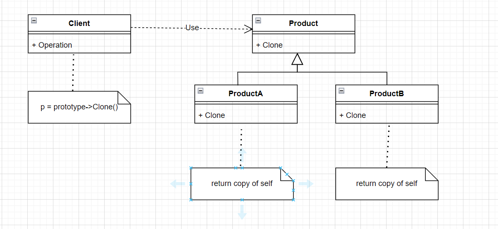

# 设计模式

## 一、创建型模式

- 完整代码可参考 `gof/Factory/maze.h`

- **Abstract Factory & Builder & Factory Method  & Prototype** 简单比较

| 模式名                           | 实例                   | 侧重点                               | 构建结果     |
| -------------------------------- | ---------------------- | ------------------------------------ | ------------ |
| Abstract Factory（抽象工厂模式） | MazeFactory            | 构建**多个**产品对象                 | 产品立刻返回 |
| Builder（建造者/生成器模式）     | MazeBuilder            | **一步一步**构建**一个**复杂产品对象 | 最后返回产品 |
| Factory Method（工厂方法）       | MazeGameV2、InviteCode | 抽象工厂通常使用工厂方法实现         | 产品立刻返回 |
| Prototype（原型模式）            | MazePrototypeFactory   | 每个产品都需要**Clone**接口实现      | 产品立刻返回 |

- **Abstract Factory**
  - 优缺点
  
    - 分离了具体的类
    - 易于交换产品系列（带魔法的迷宫或者带炸弹的迷宫等）
  
    - 有利于产品的一致性（见`MazeGame.CreateMaze(MazeFactory& factory)`）
    - 缺点：每个子对象的构建都需要定义一个子类工厂
    - 缺点：扩展新的产品时，需要修改父类以及所有的子类
  
  - UML 图
    
   -  代码示例
```c++
Maze::Ptr CreateMaze(MazeFactory& factory) {
    auto maze = factory.MakeMaze();

    auto r1 = factory.MakeRoom(1);
    auto r2 = factory.MakeRoom(2);
    auto door = factory.MakeDoor(r1, r2);

    maze->AddRoom(r1);
    maze->AddRoom(r2);

    r1->SetSide(North, factory.MakeWall());
    r1->SetSide(East, door);
    r1->SetSide(South, factory.MakeWall());
    r1->SetSide(West, factory.MakeWall());

    r2->SetSide(North, factory.MakeWall());
    r2->SetSide(East, factory.MakeWall());
    r2->SetSide(South, factory.MakeWall());
    r2->SetSide(West, door);

    return maze;
}

void factoryTest() {
    MazeGame game;

    // 硬编码创建maze；不能适应新的游戏玩法，
    // 新增带魔法或者bomb的的类型数据，需要修改创建maze的规则
    auto maze1 = game.CreateMaze();

    // 抽象工厂创建普通的maze
    MazeFactory factory;
    auto maze2 = game.CreateMaze(factory);

    // 抽象工厂创建带spell的maze
    EnchantedMazeFactory enchanted_factory;
    auto maze3 = game.CreateMaze(enchanted_factory);

    // 抽象工厂创建带bomb的maze
    BombedMazeFactory bombed_factory;
    auto maze4 = game.CreateMaze(bombed_factory);

    // 设计模式不是不允许修改代码，而是把经常变化的那部分进行封装、抽象；
    // 这里经常变化的可能就是属性的玩法，而maze的创建过程一般不会发生变化。
    // 隔离变化：通常就是为了维持代码的不变。

    /*
        抽象工厂模式的优点：
        1、分离了具体的类
        2、使得易于交换产品系列（带魔法的迷宫或者带炸弹的迷宫等）
        3、有利于产品的一致性

        缺点：
        1、难以支持新种类的产品（新增产品需要修改Factory基类和所有子类）

        相关模式：
        1、AbstractFactory抽象工厂类通常用工厂方法（Factory Method）实现，但它们也可以用Prototype实现。
        2、一个具体的工厂通常是一个单件（Singleton）。
    */
}
```

  - **Builder**
    - 优缺点
      - 构建复杂对象，内部各个部分构建完成后，组合成复杂对象
      - 用户只需要关心我最后实际使用的复杂对象，而不必关心中间的构建过程
    
    - UML 图
    
    
    - 代码示例
```c++
// 建造者/生成器模式
class MazeBuilder {
public:
    virtual void BuildMaze() {}
    virtual void BuildRoom(int32_t num) {}
    virtual void BuildDoor(int32_t room_from, int32_t room_to) {}
    virtual Maze::Ptr GetMaze() { return nullptr; }

protected:
    MazeBuilder() {}
};

class StandardBuilder : public MazeBuilder {
  ...  
};

class CountingBuilder : public MazeBuilder {
  ...
};

Maze::Ptr CreateMaze(MazeBuilder& builder) {
    builder.BuildMaze();

    builder.BuildRoom(1);
    builder.BuildRoom(2);
    builder.BuildDoor(1, 2);

    return builder.GetMaze();
}

void builderTest() {
    MazeGame game;
    StandardMazeBuilder builder;

    auto maze1 = game.CreateMaze(builder);

    CountingMazeBuilder counting_builder;
    auto maze2 = game.CreateMaze(counting_builder);

    int32_t rooms, doors;
    counting_builder.GetCounts(rooms, doors);

    std::cout << "The maze has "
        << rooms << " rooms and "
        << doors << " doors" << std::endl;

    // builder和factory比较
    // 1、builder着重于一步步构建一个复杂的对象
}
```

- **Factory Method** 工厂方法

  - 优缺点
    - 上层可以只定义默认操作过程，方法实现可以延迟到子类中进行（可以参见 `InviteCode.Exchange` 的使用）
    - Abstract Factory 通常用工厂方法实现

  - UML 图

    
    
  - 代码示例1（迷宫游戏创建）
  ```c++
  class MazeGameV2 {
  public:
      Maze::Ptr CreateMaze() {
          auto maze = MakeMaze();
  
          auto r1 = MakeRoom(1);
          auto r2 = MakeRoom(2);
  
          maze->AddRoom(r1);
          maze->AddRoom(r2);
  
          auto door = MakeDoor(r1, r2);
  
          r1->SetSide(North, MakeWall());
          r1->SetSide(East, door);
          r1->SetSide(South, MakeWall());
          r1->SetSide(West, MakeWall());
  
          r2->SetSide(North, MakeWall());
          r2->SetSide(East, MakeWall());
          r2->SetSide(South, MakeWall());
          r2->SetSide(West, door);
  
          return maze;
      }
  
      // factory method:
      virtual Maze::Ptr MakeMaze() {
          return std::make_shared<Maze>();
      }
      virtual Room::Ptr MakeRoom(int32_t n) {
          return std::make_shared<Room>(n);
      }
      virtual Wall::Ptr MakeWall() {
          return std::make_shared<Wall>();
      }
      virtual Door::Ptr MakeDoor(Room::Ptr r1, Room::Ptr r2) {
          return std::make_shared<Door>(r1, r2);
      }
  };
  
  class BombedMazeGame : public MazeGameV2 {
  public:
      Wall::Ptr MakeWall() override {
          return std::make_shared<BombedWall>();
      }
      Room::Ptr MakeRoom(int32_t n) override {
          return std::make_shared<RoomWithABomb>(n);
      }
  };
  
  // 测试用例
  void factoryMethodTest() {
      MazeGameV2 game;
      auto maze1 = game.CreateMaze();
  
      BombedMazeGame game2;
      auto maze2 = game2.CreateMaze();
  }
  
  ```
  - 代码示例2（邀请码使用）
  ```c++
  class InviteCode {
  public:
      virtual ~InviteCode() {}
  
      bool Exchange() {
          if (!CheckCode())
              return false;
          if (!CheckValid())
              return false;
          if (!GiveReward())
              return false;
          Record();
          return true;
      }
  
      CLASS_PTR(InviteCode);
  
  protected:
      virtual bool CheckCode() {
          return true;
      }
  
      virtual bool CheckValid() {
          return true;
      }
  
      virtual bool GiveReward() {
          return true;
      }
  
      virtual void Record() {
      }
  };
  
  class ErrorCode : public InviteCode {
  protected:
      bool CheckCode() override {
          return false;
      }
  };
  
  class OnceCode : public InviteCode {
  protected:
      bool CheckValid() override {
          // TODO：检查玩家是否已经领取过同类型的邀请码
          return true;
      }
  
      void Record() override {
          // TODO：记录领取过该类型的邀请码，以后不允许再领取该类型
      }
  };
  
  class ActivityCode : public InviteCode {
  protected:
      bool CheckValid() override {
          // TODO：检查玩家是否已经领取过同类型的邀请码
          return true;
      }
  
      void Record() override {
          // TODO：记录领取过该类型的邀请码，以后不允许再领取该类型
      }
  };
  
  // 模板工厂
  class InviteCodeFactory {
  public:
      template<class TYPE>
      static TYPE::Ptr Create() {
          return std::make_shared<TYPE>();
      }
  };
  
  void factoryMethodTest() {
      ...
  
      // 其他示例：邀请码使用
      auto invite_code = InviteCodeFactory::Create<OnceCode>();
      invite_code->Exchange();
  
      invite_code = InviteCodeFactory::Create<ActivityCode>();
      invite_code->Exchange();
  }
  ```

- **Prototype** 原型模式

  - 优缺点
    - 原型不需要再创建工厂实例（像`BombedFactory & EnchantedFactory`等）
    - 缺点：该模式最大的缺点就是每一个Product类都需要实现Clone接口，该接口可能存在实现困难的情况

  - UML 图

    

  - 代码示例

    ```c++
    class MazePrototypeFactory : public MazeFactory {
    public:
        MazePrototypeFactory(Maze::Ptr prototype_maze,
            Wall::Ptr prototype_wall, Room::Ptr prototype_room,
            Door::Ptr prototype_door) {
            prototype_maze_ = prototype_maze;
            prototype_wall_ = prototype_wall;
            prototype_room_ = prototype_room;
            prototype_door_ = prototype_door;
        }
    
        Maze::Ptr MakeMaze() override {
            return prototype_maze_->Clone();
        }
        Wall::Ptr MakeWall() override {
            return prototype_wall_->Clone();
        }
        Room::Ptr MakeRoom(int num) override {
            auto room = prototype_room_->Clone();
            room->Initilize(num);
            return room;
        }
        Door::Ptr MakeDoor(Room::Ptr r1, Room::Ptr r2) override {
            auto door = prototype_door_->Clone();
            door->Initialize(r1, r2);
            return door;
        }
    
    private:
        Maze::Ptr prototype_maze_;
        Wall::Ptr prototype_wall_;
        Room::Ptr prototype_room_;
        Door::Ptr prototype_door_;
    };
    
    void prototypeTest() {
        MazeGame game;
    
        auto prototype_maze = std::make_shared<Maze>();
        auto prototype_wall = std::make_shared<Wall>();
        auto prototype_room = std::make_shared<Room>(0);
        auto prototype_door = std::make_shared<Door>(
            std::make_shared<Room>(1), std::make_shared<Room>(2));
    
        MazePrototypeFactory simpleMazeFactory(
            prototype_maze,
            prototype_wall,
            prototype_room,
            prototype_door);
    
        auto simple_maze = game.CreateMaze(simpleMazeFactory);
    
        auto bombed_wall = std::make_shared<BombedWall>();
        MazePrototypeFactory bombedMazeFactory(
            prototype_maze,
            bombed_wall,
            prototype_room,
            prototype_door);
    
        auto bombed_maze = game.CreateMaze(bombedMazeFactory);
    
        /* 
            原型模式和抽象工厂的比较：
            1、原型不需要再创建工厂实例（像BombedFactory&EnchantedFactory等）
            2、使用抽象工厂时，不需要为每一个Product对象实现Clone方法，特别是Clone存在困难时
        */
    }
    
    ```

- **创建型模式总结**

  - 使用**Abstract Factory、Prototype或Builder**的设计甚至比使用**Factory Method**的那些设计更灵活，但它们也更加复杂。
  - 通常，设计以使用**Factory Method**开始，并且当设计者发现需要更大的灵活性时，设计便会向其他创建型模式演化。
  - 当你在设计标准之间进行权衡的时候，了解多个模式可以给你提供更多的选择余地。