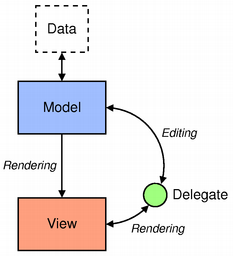

# QT

## 1. QT基础知识或使用方式总结。


- 可拖拽窗口基类：`base_moveable_window.h`

  ```c++
  // 使用示例
  class MyMainWindow : public base_movable_window<QMainWindow>
  {
      Q_OBJECT
  
  public:
      MyMainWindow(QWidget* parent=nullptr)
          : base_movable_window<QMainWindow>(100, moveable_area_dir::kDirY, parent) { }
      
      ...
  };
  ```

  

- 设置窗口无边框：`base_ui_util.h:set_window_style`;

- 设置窗口居中显示：`base_ui_util.h:set_window_center`;

- 计算文本在字体font下显示需要占用的宽度：`base_ui_util.h:calc_text_width`;
- 按钮根据文本内容自适应：`base_ui_util.h:adjust_btn_width`，不止可应用于Button;


## 2. Model/View

[devbean博客参考](https://www.devbean.net/2013/01/qt-study-road-2-model-view/)

[](https://www.devbean.net/2013/02/qt-study-road-2-model/)


