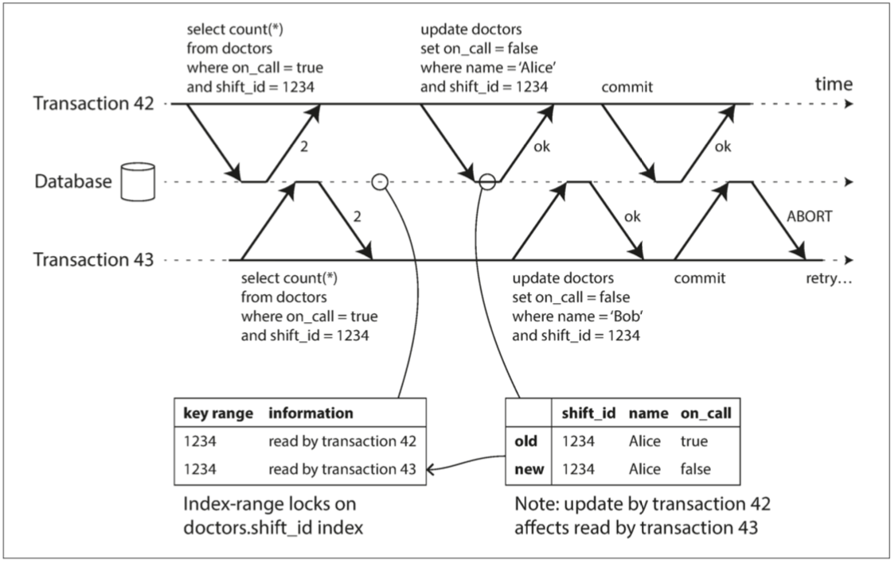

[TOC]

# 事务

在一个苛刻的数据存储环境中，会有许多可能出错的情况，例如：

- 数据库软件或硬件可能会随时失效（包括正在执行写操作的过程中）。
- 应用程序可能随时崩溃（包括一系列操作执行道中间某一步）。
- 应用与数据节点之间的链接可能随时会中断，数据库节点之间也存在同样问题。
- 多个客户端可能同时写入数据库，导致数据覆盖。
- 客户端可能读到一些无意义的、部分更新的数据。
- 客户端之间由于边界条件竞争所引入的各种奇怪问题。

为了提高系统高可靠的目标，我们必须处理好上述问题，万一发生类似情况确保不会导致系统级的失效。然而，完善的容错机制需要大量的工作，要仔细考虑各种可能出错的情况，并进行充分的测试才能确保方案切实可靠。


## 深入理解事务

### ACID的含义

事务所提供的安全保证即大家所熟知的ACID，分别代表原子性（Atomicity），一致性（Consistency），隔离性（Isolation）与持久性（Durability）。然而各家数据库所实现的ACID并不尽相同，当听到一个系统声称自己“兼容ACID”时，其实你无法确信它究竟能提供了什么样的保证，现在的ACID更像是一个市场营销用词。

#### 原子性

通常，原子是指不可分解为更小粒度的东西。这个属于在计算机的不同领域有着相似却微妙的差异。例如，多线程编程中，如果某线程执行一个原子操作，这意味着其他线程是无法看到该操作的中间结果。它只能处于操作之前或操作之后的状态，而不是两者之间的状态。

而ACID中的原子性并不关于多个操作的并发性，它并没有描述多个线程试图访问相同的数据会发生什么情况，后者是由ACID的隔离性所定义。

ACID的原子性其实描述了客户端发起一个包含多个写操作的请求时可能发生的情况，例如在完成了一部分写入之后，系统发生了故障，包括进程崩溃，网络中断，磁盘变满或违反了某种完整性约束等；把多个写操作纳入到一个原子事务，万一出现了上述故障而导致没法完成最终提交时，则事务会中止，并且数据库须丢弃或撤销那些局部完成的更改。

假如没有原子性保证，当多个更新操作中间发生了错误，就需要知道哪些更改已经生效，哪些没有生效，这个寻找过程会非常麻烦。或许应用程序可以重试，但情况类似，并且可能导致重复更新或者不正确的结果。原子性大大简化了这个问题：如果事务已经中止，应用程序可以确定没有实质发生任何更改，所以可以安全的重试。

因此ACID中的原子性所定义的特征是：**在出错时中止事务，并将部分完成的写入丢弃**。

#### 一致性

一致性非常重要，但它在不同场景有着不同的具体含义，例如：

- [第5章 数据复制](第5章 数据复制.md) 中讨论副本一致性以及异步复制模型时，引出了最终一致性问题（参见第5章 “复制滞后问题”）。
- 一致性hash则是某些系统用于动态分区再平衡的方法（参见第6章 “一致性hash”）。
- CAP理论中，一致性一词用来表示线性化（参见第9章 “可线性化”）。
- *而在ACID中一致性主要指数据库处于应用程序所期待的“预期状态”*。

可以看出，同一个词至少有四种不同的含义。

**ACID中的一致性主要是指对数据有特定的预期状态，任何数据更改必须满足这些状态约束（或者恒等条件）**。例如，对于一个账单系统，账户的贷款余额应和借款余额保持平衡。如果某事务从一个有效的状态开始，并且事务中任何更新操作都没有违背约束，那么最后的结果依然符合有效状态。

这种一致性本质上要求应用层来维护状态一致（或者恒等等），应用程序有责任正确地定义事务来保持一致性。这不是数据库可以保证的事情：即如果提供的数据修改违背了恒等条件，数据库很难检测进而阻止该操作（数据库可以完成针对某些特定类型的恒等约束检查，例如使用外键约束或唯一性约束。但通常主要靠应用程序来定义数据的有效/无效状态，数据库主要负责存储）。

*原子性，隔离性和持久性是数据库自身的属性，而ACID中的一致性更多的是应用层的属性。应用程序可以借助数据库提供的原子性和隔离性，以达到一致性，但一致性本身并不源于数据库*。

#### 隔离性

大多数数据库都支持多个客户端同时访问。如果读取和写入的是不同数据，这肯定没有什么问题，但如果访问相同的记录，则可能会遇到并发问题（即带来竞争条件）。

一个简单的例子：同时递增一个计数器产生竞争条件。

假如有2个客户端同时增加数据库中的一个计数器。每个客户首先读取当前值，再+1，然后写回新值（这里假设数据库尚不支持自增操作）。图7-1中，由于2次相加，计数器应该由42增加到44，但实际上由于竞争条件最终结果确实43。

*ACID语义中的隔离性意味着并发执行的多个事务相互隔离，它们不能相互交叉*。经典数据库教材把隔离定义为可串行化，这意味着可以假装它是数据库上运行的唯一事务。虽然实际上它们可能同时运行，但数据库系统要确保当事务提交时，其结果与串行执行（一个接一个执行）完全相同。然而实践中，由于性能问题很少使用串行化隔离。


**图7-1: 2个客户端同时递增一个计数器产生竞争条件**

#### 持久性

数据库系统本质上提供一个安全可靠的地方来存储数据而不担心数据丢失等。持久性就是这样的承诺，它保证一旦事务提交成功，即使存在硬盘故障或数据库崩溃，事务所写入的任何数据也不会消失。

对于单节点数据库，持久性通常意味着数据已被写入非易失性存储设备，如硬盘或SSD。在写入执行过程中，通常还涉及预写日志等（WAL），这样万一磁盘损坏可以进行恢复。而对于支持远程复制的数据库，持久性则意味着数据已成功复制到多个节点。为了实现持久性的保证，数据库必须等到这些写入或复制完成之后才能报告事务成功提交。

不存在完美的持久性方案。例如，所有的硬盘和所有的备份如果都同时被（人为）销毁了，那么数据库也无能为力。

### 单对象与多对象事务操作

ACID中的原子性和隔离性主要针对客户端在同一事务中包含多个写操作时，数据库所提供的保证：

*原子性*

​		如果一系列的写操作中间发生了错误，则事务必须中止，并且事务中已完成的写入应该被丢弃。换言之，不用担心数据库的部分失败，它总是保证要么成功，		要么失败。

*隔离性*

​		同时运行的事务不应该相互干扰。例如，如果某个事务进行多次写入，则另一个事务应该观察到是其全部完成（或者一个都没完成）的结果，而不应该看到中		间的部分结果。

这些定义假定在一个事务中会修改多个对象（如：行，文档，记录等）。这种多对象事务目的通常是为了让多个数据对象之间保持同步。

#### 单对象写入

原子性和隔离性也同样适用于单个对象的更新。

高级的原子操作，原子比较-设置操作（compare-and-set），即只有当前值没有被他人修改时才执行写入。这些单对象操作可以有效防止多个客户端并发修改同一对象时的更新丢失问题。但它们都不是通常意义上的事务。

*通常意义上的事务针对的是多个对象，将多个操作聚合为一个逻辑执行单元*。

#### 多对象事务的必要性

许多分布式数据存储系统不支持多对象事务，主要是因为当出现分区时，多对象事务非常难以正确实现，同时在高可用或者极致性能的场景下也会带来很多负面影响。

是否所有应用都需要多对象事务呢？是否可能只用键-值数据模型和单对象操作就可以满足应用需求？

的确有一些情况，只进行单个对象的插入、更新和删除就足够了。但是，还有许多其他情况要求写入多个不同的对象进行协调：

- 对于关系型数据模型，表中的某行可能是另一个表的外键。类似地，在图数据模型中，顶点具有多个边链接到其他的顶点。多对象事务用以确保这些外键引用的有效性，即当插入多个相互引用的记录时，保证外键总是最新、正确的，否则数据更新就变得毫无意义。
- 对于文档数据模型，如果待更新的字段都在同一个文档中，则可视为单个对象，此时不需要多对象事务。但是，缺少join支持的文档数据库往往会滋生反规则化，当更新这种反规范化数据时，就需要一次更新多个文档。此时多对象事务就可以有效防止非规范化数据之间出现不同步。
- 对于带有二级索引的数据库（除了纯粹键-值存储以外几乎所有其他系统都支持二级索引），每次更改值时都需要同步更新索引。从事务角度来看，这些索引是不同的数据库对象：如果没有事务隔离，就会出现部分索引更新。

即使没有事务支持，或许上述应用依然可以工作，然而在没有原子性保证的前提下，错误处理就会异常复杂，而缺乏隔离性则容易出现并发性方面的各种奇怪问题。

#### 处理错误与中止

*事务的一个关键特性是，如果发生了意外，所有操作被中止，之后可以安全的重试*。**ACID数据库基于这样一个理念：如果存在违反原子性、隔离性或持久性的风险，则完全放弃整个事务，而不是部分放弃**。

然而并不是所有的系统都遵守上述理念。我们确实无法彻底避免错误，然后许多开发人员喜欢只考虑正常的处理路径，而忽视错误处理。这绝不应该，*支持安全的重试机制才是中止流程的重点*。

重试中止的事务虽然是一个简单有效的错误处理机制，但它并不完美：

- 如果事务实际已经执行成功，但返回给客户端的消息在网络传输时发生意外（所以在客户端认为事务是失败的），那么重试就会导致重复执行，此时需要额外的应用级重复数据删除机制。
- 如果错误是由于系统超负荷所导致，则重试事务将使情况变得更糟。为此，可以设置一个重试次数上限，例如指数回退（见TCP重连机制），同时还要尝试解决系统过载本身的问题。
- 由临时性故障（如：死锁，隔离违例，网络闪断和节点切换等）所导致的错误需要重试。但出现永久性故障（如违反约束），则重试毫无意义。
- 如果在数据库之外，事务还产生其他副作用，即使事务被中止，这些副作用可能已事实生效。例如，假设更新操作还附带发送一封电子邮件，肯定不希望每次重试都发送邮件（注：这样设计本身存在问题，作者只是在这里举了一个不恰当的例子，但可以反映作者在这里的观点）。如果想要确保多个不同的系统同时提交或放弃，可以考虑采用两阶段提交（`2PC: 2 phase commit`，参考第9章 “原子提交与两阶段提交”）。
- 如果客户端进程在重试过程中发生失败，没有其他人继续负责重试，则那些待写入的数据可能会因此而丢失。

## 弱隔离级别

### 读-提交

读-提交是最基本的事务隔离级别，它只提供以下2个保证：

- 读数据库时，只能看到已成功提交的数据（防止“脏读”）。
- 写数据库时，只会覆盖已成功提交的数据（防止“脏写”）。

#### 防止脏读

假定某个事务已经完成部分数据写入，但事务尚未提交（或中止），此时另一个事务是否可以看到尚未提交的数据呢？如果是的话，那就是脏读。

读-提交级别的事务隔离必须做到防止脏读。这意味着事务的任何写入只有在成功提交之后，才能被其他人观察到（并且所有的写全部可见）。

#### 防止脏写

如果2个事务同时尝试更新相同的对象，会发生什么情况呢？我们不清楚写入的顺序，但可以想象后写的操作会覆盖较早的写入。

但是，如果先前的写入是尚未提交事务的一部分，是否还是被覆盖？如果是，那就是脏写。读-提交隔离级别下所提交的事务可以防止脏写，通常的方式是推迟第二个写请求，直到前面的事务完成提交（或者中止）。

### 快照级别隔离与可重复读

#### 实现快照级别隔离

与读-提交隔离类似，快照级别隔离的实现通常采用写锁来防止脏写，这意味着正在进行写操作的事务会阻止同一对象上的其他事务。但是，读取则不需要加锁。从性能角度看，快照级别隔离的一个关键点是读操作不会阻止写操作，反之亦然。

考虑到多个正在进行的事务可能会在不同的时间点查看数据库状态，所以数据库保留了对象多个不同的提交版本，这种技术因此也被称为多版本并发控制（`MVCC`）。

使用快照级别的隔离实现读-提交隔离只需保留2个版本就足够了：一个已提交的旧版本和尚未提交的新版本。

#### 一致性快照的可见性规则

仅当以下2个条件都成立时，该数据对象对事务可见：

- 事务开始的时刻，创建该对象的事务已经完成了提交。
- 对象没有被标记为删除；或者即使标记了，但删除事务在当前事务开始时还没有完成提交。

#### 索引与快照级别隔离

这种多版本数据库该如何支持索引？

- 一种方案是索引直接指向对象的所有版本，然后想办法过滤对当前事务不可见的那些版本（一般根据事务txid来过滤）。
- 另外一种，采用追加/写时复制的技术（COW）。

### 防止更新丢失

总结一下，读-提交和快照级别隔离主要都是为了解决只读事务遇到并发时可以看到什么，总体而言我们还没有触及另外一种情况，即2个写事务并发，而脏写只是写并发的一个特例。

写事务并发还会带来其他一些值得关注的冲突问题，最著名的就是更新丢失问题，并发写事务冲突是一个普遍问题。

#### 原子写操作

使用数据库提供的原子更新操作，以避免在应用层代码完成“读-修改-写回”操作。以下操作在多数关系数据库中都是并发安全的：

```sql
update counter set value=value+1 where id=1;
```

**注意**：基于对象关系映射（**`ORM`**）框架可以很容易地就产生出来非“读-修改-写回”的应用层代码，导致无法使用数据库所提供的原子操作，这个是需要特别注意的。

#### 显示加锁

```sql
begin transaction;

select * from fingers where name='robot' and game_id=222 for update;

-- check condition.
update fingers set position='c4' where id=1234;

commit;
```

**for update**指令指示数据库对返回的所有结果行要加锁。

#### 自动检测更新丢失

原子操作和锁都是通过强制“读-修改-写回”操作序列串行来防止更新丢失。另一种思路则是让它们并行执行，但如果事务管理器检测到了更新丢失风险，则会中止当前事务，并强制回退到安全的”读-修改-写回“方式。该方法的一个优点是数据库完全可以借助快照级别隔离来高效地执行检查。

#### 原子比较和设置

```sql
update wiki_pages set content='new content' where id=1234 and content='old content';
```

使用这种方式只有在上次的结果没有发生变化时才允许更新，否则会更新失败。

#### 冲突解决与复制

加锁和原子修改通常都只针对只有一个最新的数据副本。对于多主节点或无主节点的多副本数据库，通常不再适用。通常数据库保留多个冲突版本交由应用层来处理。

### 写倾斜与幻读

写倾斜是一种更广义的更新丢失问题。如果2个事务读取相同的一组对象，然后更新其中一部分：不同的事务可能更新不同的对象，则可能发生写倾斜；而不同的事务如果更新的是同一个对象，则可能发生脏写或更新丢失（具体取决于时间窗口）。

写倾斜的例子：医生更新值班表（要求至少有一名医生在岗），会议室预定系统（同一时间只能有一个预定会议存在）

这些例子通常和上面的“读-修改-写回”方式类似，可以考虑使用for update对结果加锁来避免，如果查询结果没有数据可以加锁，则可以考虑虚拟数据来实现。如会议预订系统，可以预先生成时间间隔表。写倾斜问题只能通过串行化才能正确解决。

#### 为何产生写倾斜

对于“读-修改-写回”操作，修改通常由读取的结果作为前提条件，其他事务可能修改数据导致前提条件不成立。这种在一个事务中的写入改变了另一个事务查询结果的现象，称为幻读。快照级别的隔离可以避免只读查询时的幻读，但是对于我们上面讨论的那些读-写事务，它却无法解决棘手的写倾斜问题。

## 串行化

目前大多数提供可串行化的数据库都使用了以下三种技术之一：

- 严格按照串行顺序执行。
- 两阶段加锁，几十年来这几乎是唯一可行的选择。
- 乐观并发控制技术（如：可串行化的快照隔离）。

### 实际串行执行

解决并发问题最直接的方法是避免并发：即在一个线程上按顺序方式每次只执行一个事务。这样我们就完全回避了诸如检测、防止事务冲突等问题，其对应的隔离级别一定是严格串行化的。

看上去很直白的想法，但数据库设计人员直到2007年前后才完全确信，**采用单线程循环来执行事务是可行的**。

#### 分区

串行执行所有事务使得并发控制更加简单，但是数据库的吞吐量被限制在单机单个CPU上。虽然只读事务可以在单独的快照上执行，但是对于那些高写入需求的应用程序，单线程事务处理很容易成为严重的瓶颈。

为了扩展到多个CPU和多节点，可以对数据进行分区。但需要找到一个方法对数据集进行分区，使得每个事务只在单个分区内读写数据，这样每个分区都可以由自己的事务处理线程且独立运行。此时为每个CPU分配一个分区，则数据库的总体事务吞吐量可以到达与CPU核的数量成线性比例关系。

事务是否能够分区执行很大程度取决于应用层的数据结构。

#### 串行执行小结

当满足以下约束条件时，串行执行事务可以实现串行化隔离：

- 事务必须简短而高效，否则一个缓慢的事务会影响到所有其他事务的执行性能。
- 仅限于活动数据集完全可以加载到内存的场景。有些很少访问的数据可能会被移到磁盘，但万一单线程事务需要访问它，就会严重拖累性能（可以暂停事务的执行，把数据加载放到另外线程，等数据加载完成之后再重新执行事务）。
- 写入吞吐量必须足够低，才能在单个CPU上处理；否则就需要采用分区，最好没有跨分区事务。
- 跨分区事务虽然也可以支持，但是占比必须很小。

### 两阶段加锁

近30年来，可以说数据库只有一种被广泛使用的串行化算法，那就是两阶段加锁（two-phase locking，2PL）。

两阶段加锁与普通加锁方法类似，但锁的强制性更高。多个事务可以同时读取同一个对象，但只要出现任何写操作（包括修改或删除），则必须加锁以独占访问：

- 如果事务A已经读取了某个对象，此时事务B想要写入该对象，那么B必须等到A提交或中止才能继续。以确保B不会在事务A的执行过程中间去修改对象。
- 如果事务A已经修改了对象，此时事务B想要读取该对象，则B必须等到A提交或中止以后才能继续。对于2PL，不会出现读到旧值的情况。

因此2PL不仅在并发写操作之间互斥，读取也会产生互斥。快照级别隔离的口号“读写互不干扰”非常准确地点明了它和两阶段加锁地关键区别。另一方面，因为2PL提供了串行化，所以它可以防止前面讨论地所有竞争条件，包括更新丢失和写倾斜。

#### 谓词锁

略

#### 索引区间锁

略

### 可串行化的快照隔离

两阶段加锁虽然可以保证串行化，但性能差强人意且无法扩展（由于串行化）；弱级别隔离虽然性能不错，但容易引发各种边界条件（如：更新丢失，写倾斜，幻读等）。

最近一种称为可串行化的快照隔离算法让人眼前一亮：它提供了完整的可串行性保证，而性能相比于快照隔离损失很小。相比于其他并发控制机制，`SSI`尚需在实践中证明其性能。即使如此，它很有可能成为未来数据库的标配。

#### 悲观与乐观的并发控制

两阶段加锁是一种典型的悲观并发控制机制。它基于这样的设计原则：如果某些操作可能出错（例如与其他并发事务发生了锁冲突），那么直接放弃，采用等待方式直到绝对安全。这和多线程编程中的互斥锁是一致的。

某种意义上讲，串行执行是种极端悲观的选择：事务执行期间，等价于事务对整个数据库（或数据库的一个分区）持有互斥锁。而我们只能假定事务执行得足够快、持有锁时间足够短，来弥补这种悲观色彩。

相比之下，可串行化得快照隔离则是一种乐观并发控制。在这种情况下，如果可能发生潜在冲突，事务会继续执行而不是中止，寄希望一切相安无事；而当事务提交时（只有串行化得事务被允许提交），数据库会检查是否确实发生了冲突（违反了隔离性原则），如果是的话，中止事务并接下来重试。

乐观并发控制的优缺点比较：

缺点：

- 如果冲突很多，则性能不佳（许多事务试图访问相同的对象），大量的事务必须中止。
- 如果系统已接近其最大吞吐量，反复重试事务会使系统性能变得更差。

优点：

- 如果系统还有足够的性能提升空间，且如果事务之间的竞争不大，乐观并发控制会比悲观方式高效很多。
- 通过可交换的原子操作还可以减少一些竞争情况。

#### 基于过期的条件做决定

我们在谈论写倾斜时，介绍了这样一种使用场景：事务首先查询某些数据，根据查询的结果来决定采取后续操作（例如修改数据）。而在快照隔离情况下，数据可能在查询期间就已经被其他事务修改，导致原事务在提交时决策的依据信息已出现变化。

换句话说，**事务是基于某些前提条件而采取行动，在事务开始时条件成立，而在事务要提交时，数据可能已经发生改变，条件已不再成立。**

当应用程序执行查询时，数据库本身无法预知应用层逻辑如何使用这些查询结果。安全起见，数据库假定对查询结果的任何变化都应使写事务失效。换言之，查询与写事务之间可能存在因果依赖关系。为了提供可串行化的隔离，数据库必须检测事务是否会修改其他事务的查询结果，并在此情况下中止写事务。

数据库如何知道查询结果是否发生了改变呢？可以分为以下两种情况：

- 读取是否作用于一个（即将）过期的MVCC对象（读取之前已经有未提交的写入）。
- 检查写入是否影响即将完成的读取（读取之后，又有新的写入）。

#### 检查是否读取了过期的MVCC对象

快照隔离通常采用多版本并发控制技术来实现。当事务从MVCC数据库一致性快照读取时，它会忽略那些在创建快照时尚未提交的事务写入。


**图7-10：检测事务是否从MVCC快照中读取了旧值**

为了防止这种异常，数据库需要跟踪那些由于MVCC可见性规则而被忽略的写操作。当事务提交时，数据库会检查是否存在一些当初被忽略的写操作现在已经完成了提交，如果是，则必须中止当前事务。

#### 检测写是否影响了之前的读

第二种要考虑的情况是，在读取了数据之后，另一个事务修改了数据。



**图7-11：在可串行化的快照隔离中，检测事务是否修改了另一个事务的查询结果**

#### 可串行化快照隔离的性能

跟踪事务读、写的粒度。如果非常详细地跟踪每个事务的操作，确实可以准确推测有哪些事务受到影响、需要中止，但是记录元数据的开销可能很大；而粗粒度的记录则速度占优，但可能会扩大受影响的事务范围。

## 小结

事务作为一个抽象层，使得应用程序可以忽略数据库内部一些复杂的并发问题，以及某些硬件、软件故障，从而简化应用层的逻辑处理，大量的错误可以转化为简单的事务中止与应用层重试。

如果没有事务处理，各种错误情况（进程崩溃、网络中断、停电、磁盘已满、意外并发等）意味着数据可能以各种方式变得不一致。例如，非规范化的数据可能很容易与源数据不同步。如果没有事务处理，就很难推断复杂的交互访问可能对数据库造成的影响。

本章深入讨论了 **并发控制** 的话题。我们讨论了几个广泛使用的隔离级别，特别是 **读-提交**、**快照隔离**（有时称为可重复读）和 **可串行化**。并通过研究竞争条件的各种例子，来描述这些隔离等级：

*脏读*

​		一个客户端读取到另一个客户端尚未提交的写入。**读-提交** 或更强的隔离级别可以防止脏读。

*脏写*

​		一个客户端覆盖写入了另一个客户端尚未提交的写入。几乎所有的事务实现都可以防止脏写。

*读倾斜（不可重复读）*

​		客户在不同的时间点看到了不同值。**快照隔离** 是常用的防范手段，即事务总是在某个时间点的一致性快照中读取数据。快照隔离通常使用 **多版本并发控制		（MVCC）** 来实现。

*更新丢失*

​		两个客户端同时执行 **读取 - 修改 - 写入操作序列**。出现了其中一个覆盖了另一个的写入，但没有包含对方最新值得情况，最终导致了部分修改数据发生了丢		失。快照隔离的一些实现可以自动防止这种异常，而另一些实现则需要手动锁定（`SELECT FOR UPDATE`）。

*写倾斜*

​		事务首先查询数据，根据返回得结果而做出某些决定，然后修改数据库。当事务提交时，支持决定的前提条件已不再成立。只有可串行化的隔离才能防止这种		异常。

*幻读*

​		事务读取符合某些查询条件的对象，同时另一个客户端进行写入，改变了先前得查询结果。快照隔离可以防止简单的幻读，但是写倾斜情况需要特殊处理，例		如索引范围锁定。

弱隔离级别可以防止其中一些异常情况，但要求你，也就是应用程序开发人员手动处理剩余那些（例如，使用显式锁定）。只有可串行化的隔离才能防范所有这些问题。我们讨论了实现可串行化事务的三种不同方法：

*严格串行执行事务*

​		如果每个事务的执行速度非常快，并且事务吞吐量足够低，足以在单个 CPU 核上处理，这是一个简单而有效的选择。

*两阶段加锁*

​		数十年来，两阶段加锁一直是实现可串行化的标准方式，但是许多系统出于性能问题而放弃使用它。

*可串行化快照隔离（SSI）*

​		一个最新的算法，避免了前面方法的大部分缺点。它使用乐观的方法，允许多个事务并发执行而不互相阻塞；仅当事务尝试提交时，才检查可能得冲突，如果		发现违背了串行化，则某些事务会被中止。