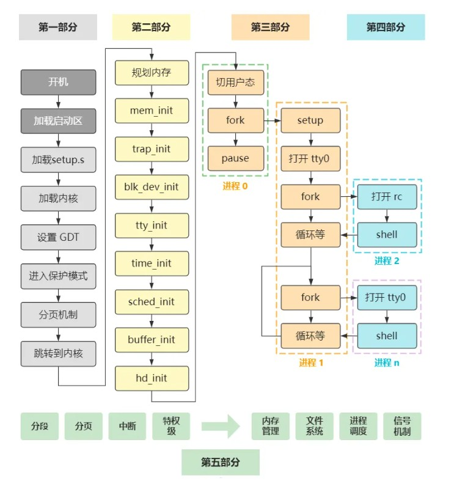
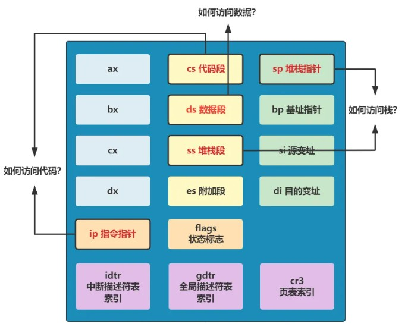

# Linux源码阅读笔记

https://github.com/dibingfa/flash-linux0.11-talk

学习上述Linux源码的阅读笔记，记录汇编、操作系统等不熟悉的知识点。



## 1. 寄存器基础知识



### 1.1 为什么许多赋值操作需要先赋给 `AX`？

`AX` 寄存器是 **x86 架构** 中的一个 16 位通用寄存器。在 x86 架构中，部分指令会要求源操作数或者目标操作数必须通过 `AX` 寄存器来处理。这是由于：

- **指令格式限制：** 某些指令只允许操作 `AX` 寄存器作为目标或源寄存器。例如，`mul` 和 `div` 指令只能操作 `AX` 作为默认操作数，除非涉及扩展操作（如 `DX:AX`）。

- **优化与效率：** 许多汇编指令是专门为 `AX` 寄存器优化的。由于 `AX` 被广泛使用，CPU 对其的访问通常是最快的。将值先加载到 `AX`，然后再传递给其他寄存器，能提高指令执行效率。

- **16 位与 8 位操作：** 在一些操作中，`AX` 寄存器可以访问低 8 位（`AL`）和高 8 位（`AH`）作为 8 位寄存器。这意味着，某些指令要求先将数据加载到 `AX` 中，然后分别操作其 8 位部分。例如：

  ```assembly
  mov ax, 0x1234
  mov al, 0x56  ; 修改 AX 寄存器的低 8 位
  ```

  这时，操作数通过 `AX` 的低位（`AL`）或高位（`AH`）进行处理。

- **段寄存器操作：** 某些指令要求在数据传输时，段寄存器的选择必须先通过 `AX`。例如，在进行段寄存器操作时，有时会需要先把段地址加载到 `AX`，再进行后续的处理。

  ```assembly
  mov ax, 0x10  ; 加载段地址
  mov ds, ax    ; 设置数据段寄存器
  ```

**总结：**

- `AX` 是一个非常重要的寄存器，主要用于算术运算、逻辑操作以及数据传输中，许多操作需要通过它来作为中间寄存器进行处理。
- 在许多操作中，尤其是涉及乘法、除法和一些特定的 16 位或 8 位操作时，`AX` 寄存器通常是操作的默认寄存器，这也是为什么很多时候需要通过它来赋值的原因。
- 对于一些特定的操作，CPU 内部的指令集和寄存器的限制决定了必须通过 `AX` 先进行赋值操作，然后才能将其值转移到其他寄存器中。


### 1.2 `cs`的寄存器并没有显式赋值，为什么就直接用来给其他寄存器赋值？

```assembly
mov ax, cs  ; 将当前代码段的地址加载到 ax
mov ds, ax  ; 将 ds 寄存器设置为与 cs 相同的段地址
```

`CS`（Code Segment）寄存器通常不需要显式赋值，它在程序启动时会默认指向当前代码段的地址。`CS` 寄存器在 x86 架构中是一个特殊的段寄存器，用来表示当前代码段的起始地址。

在程序执行过程中，`CS` 寄存器通常会自动由 CPU 管理。具体来说：

**启动时的默认值：**

- 当系统启动时，`CS` 默认指向启动代码所在的内存段。
- 对于引导加载程序（Bootloader）来说，通常 `CS` 会被初始化为代码段的基地址。

**在内核中或特定程序执行时：**

- 程序启动后，CPU 自动管理 `CS`，它会指向当前执行代码段的起始地址。除非有特定的跳转或段选择器更改，否则无需手动设置 `CS`。
- 即使 `CS` 的值没有显式赋值，它仍然会自动指向当前执行的代码段。

**结论：**

- `CS` 寄存器默认表示代码段的基址，它通常由操作系统或引导加载程序（Bootloader）在启动时设置，并且之后由 CPU 自动管理。
- 在大多数情况下，你无需显式地为 `CS` 赋值，因为它会自动指向当前执行的代码段。