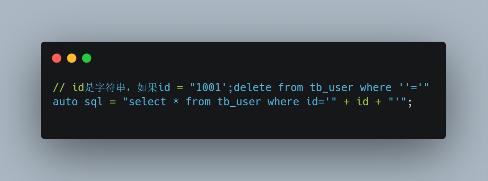
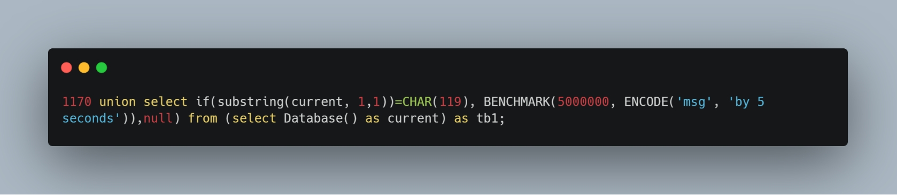
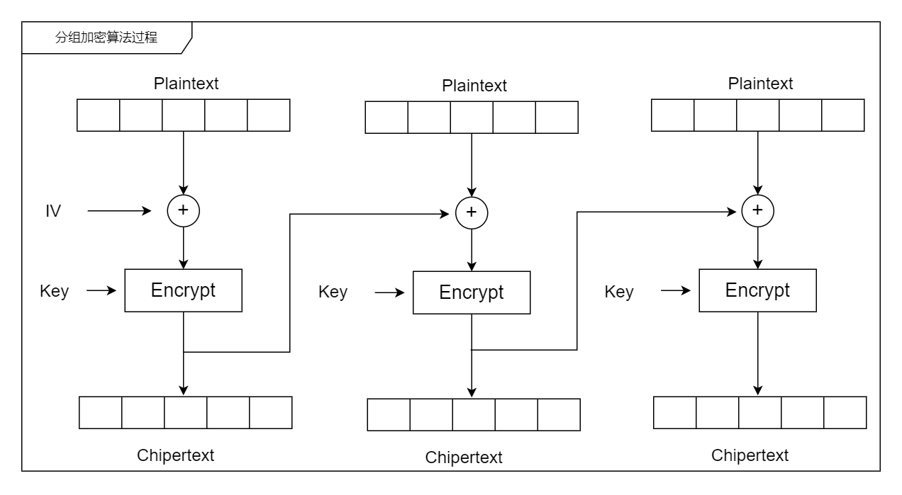
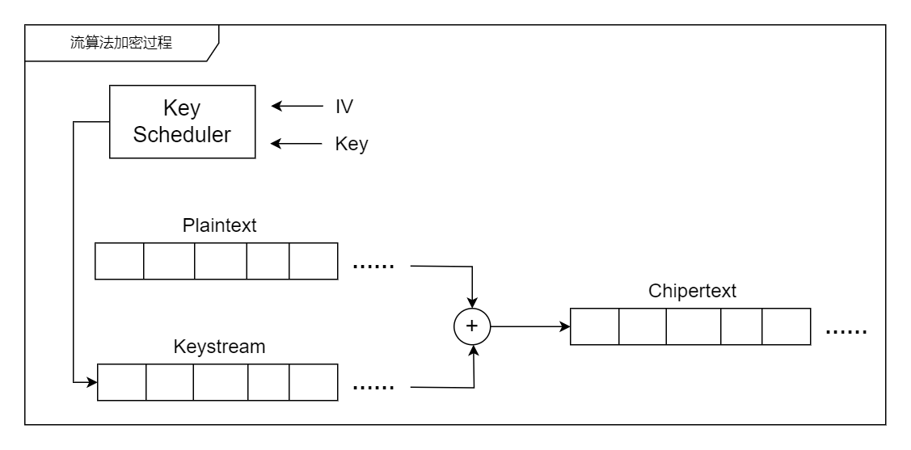

[TOC]

# 白帽子讲web安全 

总结《白帽子讲web安全 》这本书我认为的一些的重点内容。

## 1. 世界观安全 

### 1.1 Web安全简史

### 1.2 黑帽子、白帽子 

### 1.3 安全的本质

安全的本质就是**信任问题**。

### 1.4 安全三要素 

  互联网安全问题的核心问题，是数据安全的问题；比较类似操作系统的访问权限控 

  制，操作系统分为内核态和用户态 

- 机密性Confidentiality ： 要求保护数据内容不能泄露，加密是实现机密性的常见手段 

- 完整性Integrity ： 要求保护数据内容是完整、没有被篡改的，常见的保证一致性的技术手段是数字签名

- 可用性Avaliability ：要求保护资源是随需而得 

  

### 1.5 白帽子兵法 

- Secure By Default: ：是时刻牢记的总则； 
  -  白名单、黑名单：更多的使用白名单，白名单即信任问题；
  -  最小权限原则 ：只授予主体必要权限，而不要过度授权，这样能有效地减少系统、网络、 应用、数据库出错的机会；
  
- 纵深防御
  - 要在各个不同层面、不同方面实施安全方案，避免出现漏洞，不同安全方案之间需要相互配合，构成一个整体；
  - 要在正确的地方放做正确的事情，即：在解决根本问题的地方实施针对性的安全方案，它要求我们深入理解威胁的本质，从而做出正确的应对措施；
  
- 数据与代码分离：这一原则广泛适用于各种由于“注入”而引发安全问题的场景

- 不可预测性

  - 能有效地对抗基于篡改、伪造的攻击；
  - 实现往往需要用到加密算法、随机数算法、哈希算法等
  
    

## 2. 客户端脚本安全 

TODO：这一节没有重点关注，可以作为了解客户端攻击或者安全的一些事宜。

- 浏览器安全 

- 跨站脚本攻击XSS 

- 跨站点请求伪造CSRF 

- 点击劫持ClickJacking 

- HTML5安全 

## 3. 互联网公司安全运营 

- 互联网业务安全 

- 安全开发流程 
  
  - SDL、敏捷SDL 
  
  - 开发阶段 
    - 提供安全的函数 
    - 代码安全审计工具 
  
  - 测试阶段 
  
-  安全运营 
  - 把安全运营起来 
  - 漏洞修补流程 
  - 安全监控
  - 入侵检测 
  - 紧急响应流程

## 4. 服务端应用安全 

### 4.1 注入攻击

#### 4.1.1 SQL注入

- 盲注 Blind Injection

  - 利用web服务器错误回显调试SQL语句；
  - 利用id = xxx and 1=1或id = xxx and 1=2等判断id是否存在盲注可能，观察返回结果；

- 边信道工具 Timing Attack

  利用MYSQL的BENCHMARK函数（该函数用户测试函数性能的），利用它，可以让同一个函数执行若干次使得结果返回的时间比平时要长；通过判断时间长短的变化，可以判断出注入语句是否执行成功。

  这段payload判断数据库名的第一个字符是否为，即小写的w。如果判断结果为真，则会通过`BENCHMARK`函数造成较长延时；如果不为真，则该语句将很快执行完成。攻击者遍历所有字母，直到将整个数据库名全部验证完成为止。类似的函数获取到其他有用信息：`database(),system_user(),current_user(),last_insert_id()`;如果当前数据库用户具有写权限，那么攻击者还可以将信息写入本地磁盘中：`select xxx from table into outfile '/www/local/data'`

  

- 注入技巧

  - 常见攻击技巧：读写文件技巧：e.g. mysql使用load_file()读取系统文件，并通过into dumpfile()/outfile()写入本地文件;outfile适用于文本文件，dumpfile适用于二进制文件；
  - 命令执行：利用自定义函数的技巧来执行命令，P159
  - 攻击存储过程：除了利用存储过程直接攻击外（e.g. ms sql server的xp_cmdshell），存储过程本身也可能会存在注入漏洞（e.g. 未经处理的变量直接在存储过程内使用）
  - 编码问题：不同字符的编码集也可能会导致一些安全问题；在注入的历史上，曾经出现过“基于字符集”的注入攻击技巧
  - SQL Column Truncation：mysql配置sql_mode设置为default时，即没有开启STRICT_ALL_TABLES选项，mysql对于用于插入超长值只会提示warning，而不是error（如果是error则插入不成功），这可能会导致发生一些“截断”问题

- 如何正确防御SQL注入：

  从防御的角度来看，要做的事情有两件：

  1. 找到所有的SQL注入漏洞；
  2. 修补这些漏洞 注：SQL注入的防御并不是一件简单的事情，开发者常常会走入一些误区。比如只对用户输入做一些escape处理，这是不够的。（`e.g. select passwd from users where user=0x61646d697e; 0x61646d697e是16进制admin的编码`）

  以下是防御的一些技巧：
  
  - 使用预编译语句；防御SQL注入的最佳方式就是使用预编译语句，绑定变量；在sql语句中使用?表示变量，攻击者无法改变sql结构
  - 使用安全的存储过程对抗SQL注入
  - 检查数据类型（严格限制类型），在很大程度上可以对抗SQL注入
  - 使用安全函数（参考：`OWASP ESAPI`的实现，这个函数由安全专家实现，更值得信赖）
  - 从数据库自身的角度来说，应该使用最小权限原则，避免直接使用root等高权限账户直接连接数据库；如果多个不同的应用使用同一数据库，则也应该为每个应用分配不同的账户。web应用使用的数据库账户，不应该有创建自定义函数、操作本地文件的权限。

#### 4.1.2 XML注入

同时满足2大条件：

1. 用户能够控制数据的输入；

2. 程序拼凑了数据；

解决方案：

   在修补方案上与html类似，对用户输入数据中包含的“语言本身的保留字符”进行转义

#### 4.1.3 代码注入

`e.g. system()` 函数执行由用户输入的命令；

对抗这些注入时，需要禁用`eval(), system()`等可以执行命令的函数;

#### 4.1.4 CRLF注入

- HTTP-CRLF攻击注入
- CRLF日志注入

### 4.2 文件上传漏洞

文件上传漏洞是指用户上传了一个可执行的脚本文件，并通过此脚本文件获得了执行服务端命令的能力。这种攻击方式是最为直接和有效的，有时候几乎没有什么技术门槛。

- Apache文件解析问题

  e.g. Phpshell.php.rar.rar.rar->Apache文件解析是从后向前解析的，直到遇到一个Apache能够认识的文件类型为止。因为Apache不认识rar类型，所以会一直遍历到后缀.php，然后认为这是一个PHP类型的文件。

- IIS文件解析问题

  当文件名为`abc.asp;xx.jpg`时，IIS6会将此文件解析为`abc.asp`，文件名被截断了，从而导致脚本被执行。

  `e.g. http://www.target.com/path/xyz.asp;abc.jpg`会执行`xyz.asp`，而不会管`abc.jpg`。

- 绕过文件上传检查功能

  - 0x00截断

    `e.g. xxx.php[\0].JPG`，其中[\0]是16进制的0x00字符，`.JPG`绕过了应用的上传类型判断；但对于服务端来说，此文件因为0字节截断的关系，最终会变成`xxx.php`。

    0x00字符截断问题不止在上传文件漏洞中有所利用，因为这是一个被广泛用于字符串处理函数的保留字符，因此在各种不同的业务逻辑中都可能出现问题，需要引起足够的重视。

  - 文件类型检查
  
    文件前多少个特殊字节确定文件类型；但攻击通常会构建合法的文件头，从而绕过文件类型检查；真实的PHP等脚本代码附在合法的文件头之后，但此时，仍需要通过PHP来解释此图片文件才行。
  
- 设计安全的文件上传功能

  - 文件上传的目录设置为不可执行
  
    只要服务器不能解析该目录下的文件，即使攻击者上传了脚本文件，服务器本身也不会收到影响
    
  - 判断文件类型（结合后缀&类型检查），强烈建议使用白名单的方式
  
    对于图片的处理，可以使用压缩函数或resize函数，在处理图片的同时会破坏图片中可能包含的HTML代码。
  
  - 使用随机数改写文件名和文件路径
  
    文件上传如果要执行代码，需要用户能够访问到这个文件。在某些环境中，用户能上传，但不能访问。如果应用适应随机数改写了文件名和路径，将极大地增加攻击的成本。与此同时，像`shell.php.rar.rar`这种文件，或者是`crossdomain.xml`这种文件，都将因为文件名被改写而无法成功实施攻击。
  
  - 单独设置文件服务器的域名
  
    由于浏览器同源策略的关系，一系列客户端攻击将失效。比如上传`corssdomain.xml`、上传包含js的xss利用等问题将得到解决。但能够如此设置，还需要看具体的业务环境。
  
  
  

### 4.3 认证与会话管理

#### 4.3.1 认证与授权

认证的目的是为了认出用户是谁，而授权的目的是为了决定用户能做什么。认证实际上就是一个验证凭证的过程。如果只有一个凭证被用于认证，则称为“单因素认证”；多因素凭证强度要高于单因素认证，但在多因素认证会在用户体验上带来一些损失。

#### 4.3.2 密码那些事

- 密码设计，使用策略
  - 密码区分大小写
  - 密码长度至少6位，重要应用要求至少8位
  - 密码为大小写字母，数字，特殊字符中的2种以上的组合
  - 不要有连续性的字符，`e.g. 1234abcd`，这种字符顺着人的思路，所以很容易猜解
  - 尽量避免出现重复的字符，`e.g. 1111`
  - 不要使用用户公开的数据，或者与个人隐私相关的数据作为密码。不要使用QQ号、省份证号码、昵称、电话号码、生日、英文名、公司名等作为密码，这些资料可以从互联网上获得，并不是那么保密。
- 密码存储
  - 密码必须以不可逆的加密算法，或者单向散列函数算法，加密后保存在数据库中。2011年csdn的用户数据库被泄露，这些密码使用明文存储在数据库中。
  - 将明文密码经过哈希后（`e.g. MD5 or SHA-1`）再保存到数据库中，是目前业界比较普遍的做法；目前黑客们广泛使用的一种破解MD5后的密码的方法是彩虹表Rainbow Table.
    - 彩虹表的思路是搜集尽可能多的密码明文和明文对应的MD5值。这样只需要查询MD5值就能找到对应的明文。
    - 在计算哈希明文时，增加一个Salt，它可以增加明文的复杂度，并能使彩虹表一类的攻击失效：`MD5(username+password+salt)`，其中salt是一个随机字符串，配置在服务器中。

#### 4.3.3 session与认证

- 当用户登录完成后，在服务器会创建一个新的会话session，会话中保存用户的状态和相关信息。session一般存储于cookie中，cookie会随着HTTP请求头发送，且受到浏览器同源策略的保护。session一旦在生命期内被窃取，就等同于账户失窃，所以在设计安全方案时需要意识到这一点。
- 同一用户只允许保留一个session，多个session无效；session还需要设计有效时间；用户的IP，UserAgent等信息发生变化，当用户再次登陆时，就可以强制销毁当前的session，并要求用户重新登陆。

#### 4.4.4 单点登陆SSO：它希望用户登陆 一次就可以访问所有系统

- SSO的优点是风险集中化，就只需要保护好这一个点。SSO的缺点也同样很明显，因为风险集中了，所以单点一旦被攻破的话，后果会非常严重，影响的范围将涉及所有使用单点登陆的系统。
- 目前互联网上最为开放和流行的单点登陆系统是OpenID。

### 4.4 访问控制 (最小权限原则)

#### 4.4.1 权限控制

抽象来说，都是个体对某个主体需要实施某种操作，而系统对这种操作的限制就是权限控制。

#### 4.4.2 垂直权限管理

访问控制实际上是建立用户与权限之间的对应关系，现在应用广泛的一种方法就是基于角色的访问控制，简称RBAC（Role-Based Access Control）。用户--角色--权限

#### 4.4.3 水平权限管理

基于数据的访问控制，需要注意数据访问是否属于某个用户，不能发生越权访问问题。一个简单的数据级访问控制，可以考虑使用“用户组”的概念。e.g. linux用户组

#### 4.4.4 OAuth

在不提供用户名和密码的情况下，授权第三方应用访问Web资源的的安全协议。c/c+开源实现libOAuth。

OpenID和OAuth都致力于让 互联网变得更加开放。 OpenID解决认证问题， OAuth解决授权问题。

### 4.5 加密算法与随机数

#### 4.5.1 加密算法概述

- 分组加密

  

  - DES
  - 3-DES
  - AES

- 流加密

  

  - RC4
  - ORYX
  - SEAL

- 针对加密算法的攻击

  - 唯密文攻击

    攻击者有一些密文，它们是使用同一加密算法和同一密钥加密的。这种攻击是最难的。

  - 已知明文攻击

    攻击者除了能得到一些密文外，还能得到这些密文对应的明文。e.g. 针对流密码的一些攻击。

  - 选择明文攻击

    攻击者不仅能够得到一些密文和明文，还能选择用于加密的明文。

  - 选择密文攻击

    攻击者可以选择不同的密文来解密。e.g. Padding Oracle Attack

#### 4.5.2 Stream Cipher Attack

#### 4.5.3 WEP破解

#### 4.5.4 ECB模式的缺陷

#### 4.5.5 Padding Oracle Attack

#### 4.5.6 密钥管理

#### 4.5.7 伪随机数问题

### 4.6 Web框架安全

#### 4.6.1 在框架层面做安全更合理，不易漏掉

#### 4.6.2 框架自身的安全也是需要关注的

### 4.7 应用层拒绝服务攻击

#### 4.7.1 应用层DDOS

- CC攻击
- SYN Flood攻击

#### 4.7.2 资源耗尽攻击

- Slowloris攻击
- HTTP POST DOS
- Server Limit DOS

#### 4.7.3 一个正则引发的血案：ReDOS

#### 4.7.4 PHP安全

#### 4.7.5 Web Server配置安全

   

   

   

​    

