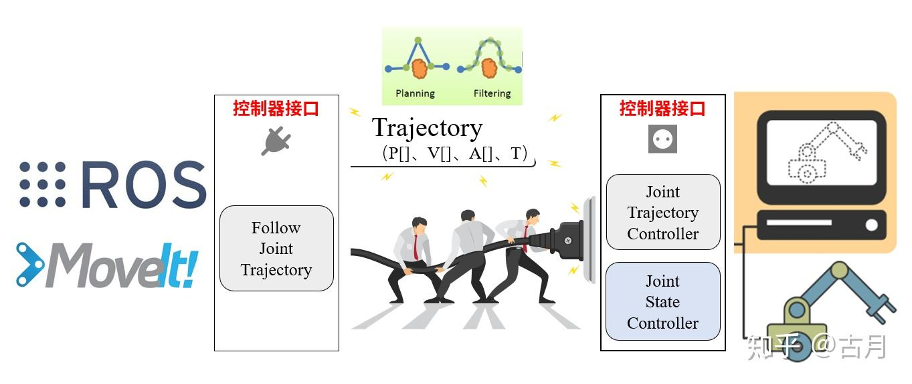
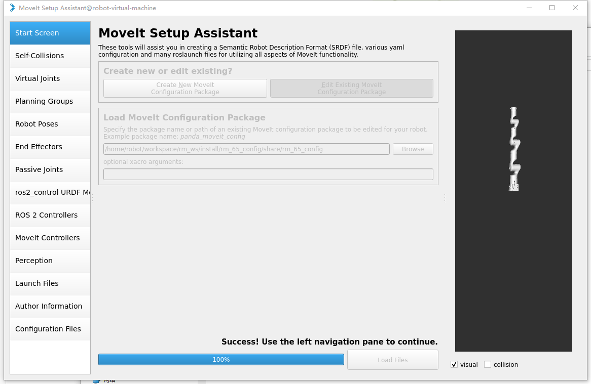
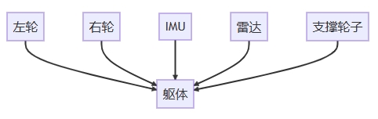
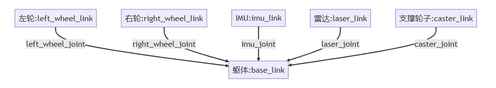
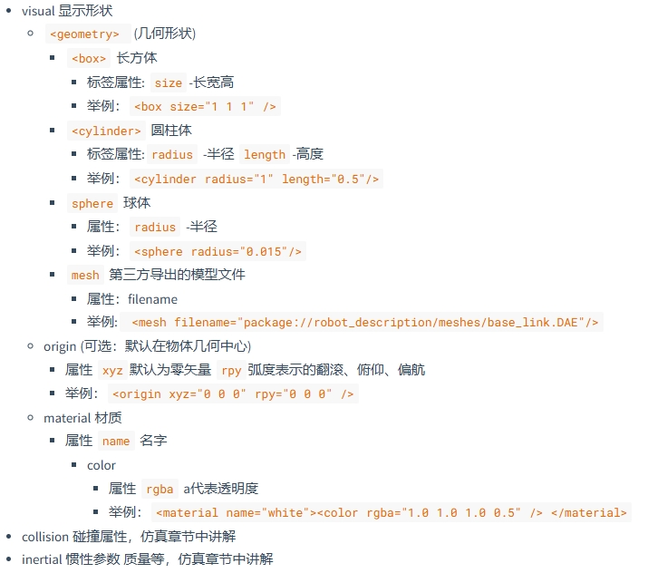
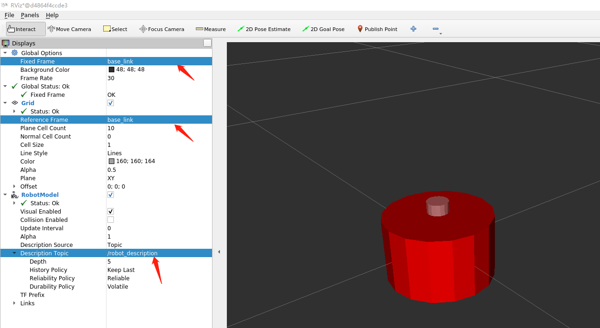
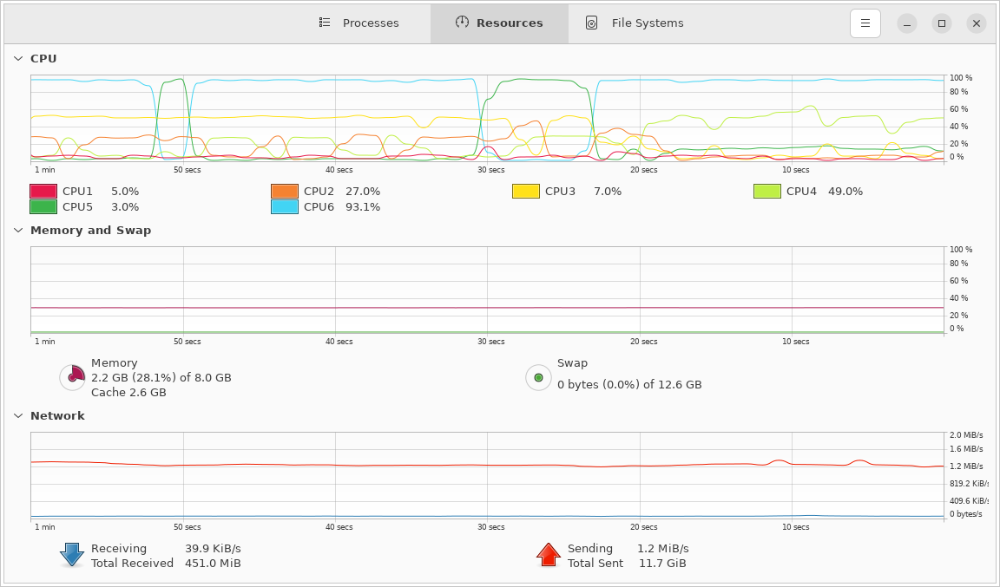
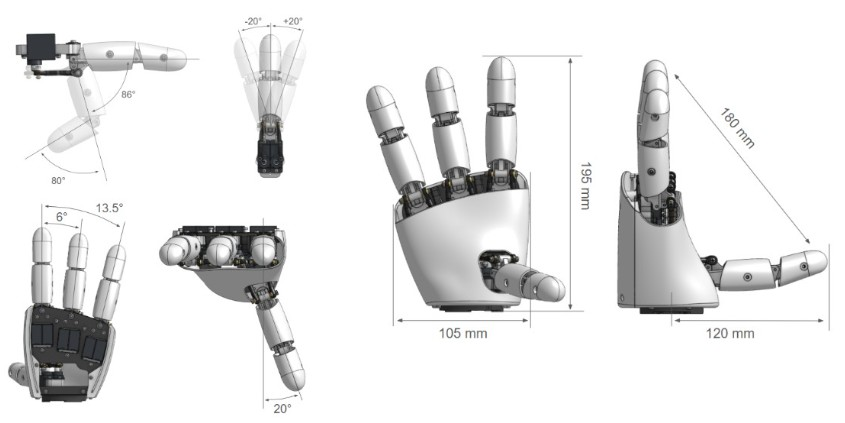

# 机器人环境部署方案

## 1. 环境部署

### 1.1 环境配置

- Jetson环境

  - 磁盘空间显示只有大约128g，剩下的空间未被分配问题（扩展分区）；

    ```sh
    # 安装cloud-guest-utils（growpart命令）
    sudo apt install gparted cloud-guest-utils
    
    sudo gparted
    sudo growpart /dev/nvme0n1 1
    sudo resize2fs /dev/nvme0n1p1
    ```

  - QT环境：目前预置了ros2和qt环境，只需要安装qtcreator环境即可；

    ```sh
    # 安装qtcreator
    sudo apt install qtcreator
    ```

- 升腾atlas

  

### 1.2 [在ubuntu22.04上安装realsense](https://github.com/IntelRealSense/realsense-ros?tab=readme-ov-file)

  **@Note：虚拟机的USB选项传输协议需要是3.1才可以，否则识别不到；**

  - [Step1: Install the ROS2 distribution](https://docs.ros.org/en/humble/Installation/Ubuntu-Install-Debs.html)
  
  - Step2: Install realsense-sdk
  
    - [arm64 jetson](https://github.com/IntelRealSense/librealsense/blob/master/doc/installation_jetson.md)
    
      ```sh
      # 1. Register the server's public key:
      sudo apt-key adv --keyserver keyserver.ubuntu.com --recv-key F6E65AC044F831AC80A06380C8B3A55A6F3EFCDE || sudo apt-key adv --keyserver hkp://keyserver.ubuntu.com:80 --recv-key F6E65AC044F831AC80A06380C8B3A55A6F3EFCDE
      
      # 2. Add the server to the list of repositories:
      sudo add-apt-repository "deb https://librealsense.intel.com/Debian/apt-repo $(lsb_release -cs) main" -u
      
      # 3. Install the SDK:
      sudo apt-get install librealsense2-utils
      sudo apt-get install librealsense2-dev
      ```
    
    - [x86 ubuntu](https://github.com/IntelRealSense/realsense-ros?tab=readme-ov-file)
    
      ```sh
      # 1.1 Register the server's public key:
      sudo mkdir -p /etc/apt/keyrings
      curl -sSf https://librealsense.intel.com/Debian/librealsense.pgp | sudo tee /etc/apt/keyrings/librealsense.pgp > /dev/null
      
      # 1.2 Add the server to the list of repositories:
      echo "deb [signed-by=/etc/apt/keyrings/librealsense.pgp] https://librealsense.intel.com/Debian/apt-repo `lsb_release -cs` main" | \
      sudo tee /etc/apt/sources.list.d/librealsense.list
      sudo apt-get update
      
      # 1.3 Install the libraries (see section below if upgrading packages):
      sudo apt-get install librealsense2-dkms
      sudo apt-get install librealsense2-utils
      
      # 1.4 Optionally install the developer and debug packages:
      sudo apt-get install librealsense2-dev
      sudo apt-get install librealsense2-dbg
      ```
  
  - Step3: Install Intel® RealSense™ ROS2 wrapper
  
    ```sh
    # 2.1 Install all realsense ROS packages by
    sudo apt install ros-<ROS_DISTRO>-librealsense2*
    # For example, for Humble distro
    sudo apt install ros-humble-librealsense2*
    ```

  

  - Step4: Start the camera node
  
    ```sh
    # 1. with ros2 run:
    ros2 run realsense2_camera realsense2_camera_node
    # or, with parameters, for example - temporal and spatial filters are enabled:
    ros2 run realsense2_camera realsense2_camera_node --ros-args -p enable_color:=false -p spatial_filter.enable:=true -p temporal_filter.enable:=true
    
    # 2. with ros2 launch:
    ros2 launch realsense2_camera rs_launch.py
    ros2 launch realsense2_camera rs_launch.py depth_module.depth_profile:=1280x720x30 pointcloud.enable:=true
    
    # depth相机
    ros2 launch realsense2_camera rs_launch.py depth_module.depth_profile:=1280x720x30
    
    # color相机
    ros2 launch realsense2_camera rs_launch.py rgb_camera.color_profile:=1280x720x30
    
    # RGBD topic
    ros2 launch realsense2_camera rs_launch.py enable_rgbd:=true enable_sync:=true align_depth.enable:=true enable_color:=true enable_depth:=true 
    ```
  
    
  
- 以QT程序集成ROS2环境，读取由ROS2节点 [realsense摄像头](https://github.com/IntelRealSense/realsense-ros?tab=readme-ov-file) 发布的数据为例；

  qtcreator程序示例：

  ```c++
  // 全局对象，放在cpp文件中
  MainWindow* gApp = nullptr;
  
  class MyRealsense : public rclcpp::Node
  {
  public:
    MyRealsense() : rclcpp::Node("MyRealsense")
    {
        // 主题可通过`ros2 topic list`进行查看
        subscription_ =
        this->create_subscription<sensor_msgs::msg::Image>("/camera/camera/color/image_raw", 10,
        [this](sensor_msgs::msg::Image::UniquePtr msg) {
          RCLCPP_INFO(this->get_logger(), "recv image, w: %d, h: %d", msg->width, msg->height);
          emit gApp->send_image(QImage(msg->data.data(), msg->width, msg->height, msg->step, QImage::Format_RGB888));
        });
    }
  
  private:
    rclcpp::Subscription<sensor_msgs::msg::Image>::SharedPtr subscription_;
  };
  
  class MainWindow : public QMainWindow
  {
  public:
      MainWindow(QWidget *parent = nullptr)
      {
          gApp = this;
          
          QObject::connect(this, &MainWindow::send_refresh_image,
                           this, &MainWindow::recv_refresh_image);
          
          std::thread([]() {
              rclcpp::spin(std::make_shared<MyRealsense>());
          }).detach();
  	}
      
      void send_image(QImage img) {
          emit this->send_refresh_image(std::move(img));
      }
      
  signals:
      void send_refresh_image(QImage img);
      
  private slots:
      void recv_refresh_image(QImage img) {
          ui->cameraImg->setPixmap(QPixmap::fromImage(img));
      	ui->cameraImg->setScaledContents(true);
      }
  }
  ```

  

  cmake设置：

  - ros2的依赖需要放入`ament_target_dependencies`中，且需要使用find_package查找包依赖；
  - 非ros2的依赖放入`target_link_libraries中`；

  ```cmake
  cmake_minimum_required(VERSION 3.5)
  
  project(test-ros-camera LANGUAGES CXX)
  
  set(CMAKE_INCLUDE_CURRENT_DIR ON)
  
  set(CMAKE_AUTOUIC ON)
  set(CMAKE_AUTOMOC ON)
  set(CMAKE_AUTORCC ON)
  
  set(CMAKE_CXX_STANDARD 17)
  set(CMAKE_CXX_STANDARD_REQUIRED ON)
  
  find_package(Qt5 COMPONENTS Widgets REQUIRED)
  
  # ros packages.
  find_package(rclcpp REQUIRED)
  find_package(std_msgs REQUIRED)
  find_package(sensor_msgs REQUIRED)
  find_package(ament_cmake REQUIRED)
  
  add_executable(test-ros-camera
    main.cpp
    mainwindow.cpp
    mainwindow.h
    mainwindow.ui
  )
  
  target_link_libraries(test-ros-camera
      Qt5::Widgets
  )
  
  # ros dependencies.
  ament_target_dependencies(test-ros-camera rclcpp std_msgs sensor_msgs)
  ```

  

- [因时灵巧手](https://github.com/MickyFlowers/inspire_hand/tree/main)

  灵巧手基于RS485控制，提供ROS1接口


### 1.3 安装奥比中光摄像头

[OrbbecSDK_ROS2](https://github.com/orbbec/OrbbecSDK_ROS2)

[OrbbecViewer可视化软件](https://github.com/orbbec/OrbbecSDK_v2/releases)

[Orbbec相机参数](https://www.orbbec.com.cn/index/Product/info.html?cate=38&id=63&bd_vid=10452749678130992463)

- 通过源码安装

  ```sh
  mkdir -p ~/ros2_ws/src
  
  cd ~/ros2_ws/src
  git clone https://github.com/orbbec/OrbbecSDK_ROS2.git
  
  # assume you have sourced ROS environment, same blow
  sudo apt install libgflags-dev nlohmann-json3-dev  \
  ros-$ROS_DISTRO-image-transport  ros-${ROS_DISTRO}-image-transport-plugins ros-${ROS_DISTRO}-compressed-image-transport \
  ros-$ROS_DISTRO-image-publisher ros-$ROS_DISTRO-camera-info-manager \
  ros-$ROS_DISTRO-diagnostic-updater ros-$ROS_DISTRO-diagnostic-msgs ros-$ROS_DISTRO-statistics-msgs \
  ros-$ROS_DISTRO-backward-ros libdw-dev
  
  cd  ~/ros2_ws/src/OrbbecSDK_ROS2/orbbec_camera/scripts
  sudo bash install_udev_rules.sh
  sudo udevadm control --reload-rules && sudo udevadm trigger
  ```

  

- 启动摄像头节点（Supported Devices章节下选择与相机型号匹配的启动脚本）

  ```sh
  # 这里我们测试使用的是330系列
  source ./install/setup.bash
  ros2 launch orbbec_camera gemini_330_series.launch.py # or other launch file, see below(Supported Devices) table
  
  # 设置深度彩色图对齐：**注意，默认就是对齐的。**
  ros2 launch orbbec_camera gemini_330_series.launch.py depth_registration:=true
  ```

  

- 


## 2. 仿真&模拟

### 2.1 gazebo

[工具使用说明介绍](https://blog.csdn.net/hai411741962/article/details/135551486)

[gazebo入门-古月居](https://zhuanlan.zhihu.com/p/54392010)

安装ros2之后，我们可以在`/opt/ros/humble/share/gazebo_plugins/worlds`下看到gazebo提供的仿真地图

比如我们打开仿真的小车，可以使用以下命令：

```sh
gazebo --verbose /opt/ros/humble/share/gazebo_plugins/worlds/gazebo_ros_diff_drive_demo.world
```

想要看看系统有没有跑起来，关键是看话题有没有发布/订阅：

```sh
ros2 topic list

# 如果看到以下话题就表示系统正常启动
...
/demo/cmd_demo
/demo/odom_demo
...
```

可以看到，其中有一个cmd_demo的话题，发布该话题就可以让gazebo中的小车模型动起来了：

```sh
ros2 topic pub /demo/cmd_demo geometry_msgs/Twist '{linear: {x: 1.0}}' -1
```

话题列表中还有一个odom_demo，可以实时反馈小车的里程计信息：


### 2.1 RM机械臂在rviz和gazebo中可视化

- 下载RM包：https://github.com/RealManRobot/ros2_rm_robot

  ```sh
  mkdir -p ~/ros2_ws/src
  cp -r ros2_rm_robot ~/ros2_ws/src
  cd ~/ros2_ws
  colcon build --packages-select rm_ros_interfaces
  source ./install/setup.bash
  colcon build
  ```

  

- 启动rviz2、gazebo

  ```sh
  # 这里以eco65b为例
  ros2 launch rm_gazebo gazebo_eco65_demo.launch.py
  ros2 launch rm_eco65_config gazebo_moveit_demo.launch.py
  
  # 查看节点，主题的关系
  ros2 run rqt_graph rqt_graph
  ```

  

- RM控制机械臂的核心逻辑

  参考：[moveit控制机械臂流程](https://www.zhihu.com/question/312762551/answer/902439214)

  ROS MoveIt! 控制真实机械臂的一般框架：

  1. 通过程序或界面设置机械臂运动目标

  2. MoveIt!完成运动规划并输出关节轨迹

  3. 通过socket接口和控制器连接，将关节轨迹发送给控制器

  4. 控制器进行插补运算，并周期发送给电机驱动器

  5. 驱动器完成闭环控制，让电机多、快、好、爽的跟随输入指令

  6. 控制器反馈实时状态到MoveIt!，Rviz动态显示当前状态

  **为什么需要对规划后的轨迹点进行插值？**

  MoveIt!规划得到的关节轨迹由一系列轨迹点组成，每两个点之间的时间间隔不定，基本是0.1~1秒之间，这个时间间隔对于底层控制来讲，是非常大的，很容易造成轨迹运动不圆滑、速度不均匀的现象，需要进一步细分到和控制周期匹配的间隔，也就是你可能常听说的“轨迹插补”，具体实现可以参考ros_control。

  

- [moveit官方教程](https://moveit.picknik.ai/main/index.html)

- 使用Setup Assistant

  ```sh
  # 安装
  apt install ros-humble-moveit-setup-assistant
  
  # 启动
  ros2 launch moveit_setup_assistant setup_assistant.launch.py
  
  # 通过该工具可以配置机械臂、末端夹爪等，RM的rm_moveit2_config就是通过该工具配置生成的
  # 相机感知都是可以通过这个工具进行配置的
  
  # rm的配置选择目录ros2_rm_robot-humble\rm_moveit2_config\rm_65_config，目前测试只能选择这个机械臂
  ```

  

- xxx


### 2.2 URDF建模

[URDF在vscode中显示&moveit](https://blog.csdn.net/joyopirate/article/details/129424607)

[URDF统一机器人建模语言](https://fishros.com/d2lros2/#/humble/chapt8/get_started/1.URDF统一机器人建模语言?id=_1-urdf统一机器人建模语言)

一般情况下，URDF由 `声明信息` 和 `两种关键组件` 共同组成。

- 声明信息

  声明信息包含两部分，第一部分是xml的声明信息，放在第一行 第二部分是机器人的声明，通过robot标签就可以声明一个机器人模型

  ```xml
  <?xml version="1.0"?>
  <robot name="fishbot">
       <link></link>
       <joint></joint>
    ......
  </robot>
  ```

  

- 2种关键组件(Joint&Link)

  机器人一般由五个部件组成：

  - 躯体

  - 左右轮子

  - 支撑轮

  - 雷达激光

  - IMU模块

    

  我们把左轮，右轮、支撑轮子，IMU和雷达部件称为机器人的Link。

  **而Link和Link之间的连接部分称之为Joint关节**

  接着我们给每个link和joint取个名字。

  

  所以我们就可以使用6个link和5个joint来描述这个机器人，接着我们分别对link和joint进行详细的介绍。

  

- Link介绍

  - 如何写

    ```xml
    <!-- base link -->
    <link name="base_link">
        <visual>
            <origin xyz="0 0 0.0" rpy="0 0 0"/>
            <geometry>
                <cylinder length="0.12" radius="0.10"/>
            </geometry>
        </visual>
    </link>
    ```

    

  - link标签定义

    

  

- Joint介绍

  joint为机器人关节，机器人关节用于连接两个机器人部件，主要写明父子关系

  - 父子之间的连接类型，包括是否固定的，可以旋转的等
  - 父部件名字：parent
  - 子部件名字：child
  - 父子之间相对位置：origin
  - 父子之间的旋转轴，绕哪个轴转：axis

  ```xml
  <joint name="laser_joint" type="continuous">
      <parent link="base_link" />
      <child link="laser_link" />
      <origin xyz="0 0 0.075" />
      <!-- 绕y轴旋转 -->
      <axis xyz="0 1 0" />
  </joint>
  ```

  Joint属性

  - name 关节的名称
  - type 关节的类型
    - **revolute: 旋转关节，绕单轴旋转,角度有上下限,比如舵机0-180**
    - **continuous: 旋转关节，可以绕单轴无限旋转,比如自行车的前后轮**
    - **fixed: 固定关节，不允许运动的特殊关节**
    - prismatic: 滑动关节，沿某一轴线移动的关节，有位置极限
    - planer: 平面关节，允许在xyz，rxryrz六个方向运动
    - floating: 浮动关节，允许进行平移、旋转运动

  

  在Rviz中显示机器人模型

  


```sh
ros2 launch fishbot_description display_rviz2.launch.py
```

### 2.3 xacro

[Xacro-wiki](https://github.com/ros/xacro/wiki)

[ROS2中常用的Xacro模板](https://fishros.com/d2lros2/#/humble/codebook/urdf/xacro?id=ros2中常用的xacro模板)


`xacro`的主要特点是它对宏的支持。

使用`xacro:macro`标记定义宏，并指定宏`name`和参数列表，即以空格分隔的名称列表。这些参数成为宏观局部属性。


`xacro`基础用法：

- 模板定义（`:=`设置默认值）：`<xacro:macro name="box_inertia" params="m:='0.01' w h d">`
- 导入模板文件：`<xacro:include filename="xacro_template.xacro" />`
- 使用模板：`<xacro:box_inertia m="1.0" w="0.809" d="0.5" h="0.1"/>`


`xacro_template.xacro`（通过下面的模板文件，可以获取基础的`xacro`模板定义的用法）：

```xml
<?xml version="1.0"?>
<robot xmlns:xacro="http://ros.org/wiki/xacro" xmlns:fishros="http://fishros.com">
  <!-- 长方体质量&惯性矩阵 -->
  <xacro:macro name="box_inertia" params="m w h d">
    <inertial>
      <origin xyz="0 0 0" rpy="${pi/2} 0 ${pi/2}"/>
      <mass value="${m}"/>
      <inertia ixx="${(m/12) * (h*h + d*d)}" ixy="0.0" ixz="0.0" iyy="${(m/12) * (w*w + d*d)}" iyz="0.0" izz="${(m/12) * (w*w + h*h)}"/>
    </inertial>
  </xacro:macro>

  <!-- 圆柱体质量&惯性矩阵 -->
  <xacro:macro name="cylinder_inertia" params="m r h">
    <inertial>
      <origin xyz="0 0 0" rpy="${pi/2} 0 0" />
      <mass value="${m}"/>
      <inertia ixx="${(m/12) * (3*r*r + h*h)}" ixy = "0" ixz = "0" iyy="${(m/12) * (3*r*r + h*h)}" iyz = "0" izz="${(m/2) * (r*r)}"/>
    </inertial>
  </xacro:macro>

  <!-- 球体质量&惯性矩阵 -->
  <xacro:macro name="sphere_inertia" params="m r">
    <inertial>
      <mass value="${m}"/>
      <inertia ixx="${(2/5) * m * (r*r)}" ixy="0.0" ixz="0.0" iyy="${(2/5) * m * (r*r)}" iyz="0.0" izz="${(2/5) * m * (r*r)}"/>
    </inertial>
  </xacro:macro>

  <!-- 球体显示形状&位置 -->
  <xacro:macro name="sphere_visual" params="r origin_r origin_p origin_y">
    <visual>
      <origin xyz="0 0 0" rpy="${origin_r} ${origin_p} ${origin_y}"/>
      <geometry>
        <sphere radius="${r}"/>
      </geometry>
      <material name="blue">
        <color rgba="0.0 0.0 0.8 1.0"/>
      </material>
    </visual>
  </xacro:macro>

  <!-- 球体碰撞属性 -->
  <xacro:macro name="sphere_collision" params="r origin_r origin_p origin_y">
    <collision>
      <origin xyz="0 0 0" rpy="${origin_r} ${origin_p} ${origin_y}"/>
      <geometry>
        <sphere radius="${r}"/>
      </geometry>
      <material name="green">
        <color rgba="0.0 0.8 0.0 1.0"/>
      </material>
    </collision>
  </xacro:macro>

  <!-- 长方体显示形状&位置 -->
  <xacro:macro name="box_visual" params="w d h origin_r origin_p origin_y">
    <visual>
      <origin xyz="0 0 0" rpy="${origin_r} ${origin_p} ${origin_y}"/>
      <geometry>
        <box size="${w} ${d} ${h}" />
      </geometry>
      <material name="blue">
        <color rgba="0.0 0.0 0.8 1.0"/>
      </material>
    </visual>
  </xacro:macro>

  <!-- 长方体碰撞属性 -->
  <xacro:macro name="box_collision" params="w d h origin_r origin_p origin_y">
    <collision>
      <origin xyz="0 0 0" rpy="${origin_r} ${origin_p} ${origin_y}"/>
      <geometry>
        <box size="${w} ${d} ${h}" />
      </geometry>
      <material name="green">
        <color rgba="0.0 0.8 0.0 1.0"/>
      </material>
    </collision>
  </xacro:macro>

  <!-- 圆柱体显示形状&位置 -->
  <xacro:macro name="cylinder_visual" params="r h origin_r origin_p origin_y">
    <visual>
      <origin xyz="0 0 0" rpy="${origin_r} ${origin_p} ${origin_y}"/>
      <geometry>
        <cylinder length="${h}" radius="${r}"/>
      </geometry>
      <material name="blue">
        <color rgba="0.0 0.0 0.8 1.0"/>
      </material>
    </visual>
  </xacro:macro>

  <!-- 圆柱体碰撞属性 -->
  <xacro:macro name="cylinder_collision" params="r h origin_r origin_p origin_y">
    <collision>
      <origin xyz="0 0 0" rpy="${origin_r} ${origin_p} ${origin_y}"/>
      <geometry>
        <cylinder length="${h}" radius="${r}"/>
      </geometry>
      <material name="blue">
        <color rgba="0.0 0.0 0.8 1.0"/>
      </material>
    </collision>
  </xacro:macro>

</robot>
```

创建一个正方体的base_link，并导入惯性矩阵：

```xml
<?xml version="1.0"?>
<robot name="fishbot" xmlns:xacro="http://ros.org/wiki/xacro">
  <xacro:include filename="xacro_template.xacro" />

  <link name="base_link">
    <xacro:box_visual w="0.809" d="0.5" h="0.1" origin_r="0" origin_p="0" origin_y="0"/>
    <xacro:box_collision w="0.809" d="0.5" h="0.1" origin_r="0" origin_p="0" origin_y="0"/>
    <xacro:box_inertia m="1.0" w="0.809" d="0.5" h="0.1"/>
  </link>

</robot>
```

使用`xacro`生成`urdf`文件（-o：指定输出到文件，否则输出到控制台）：`xacro input -o output`

```xml
<?xml version="1.0" ?>
<!-- =================================================================================== -->
<!-- |    This document was autogenerated by xacro from fishbot.urdf.xacro             | -->
<!-- |    EDITING THIS FILE BY HAND IS NOT RECOMMENDED                                 | -->
<!-- =================================================================================== -->
<robot name="fishbot" xmlns:fishros="http://fishros.com">
  <link name="base_link">
    <visual>
      <origin rpy="0 0 0" xyz="0 0 0"/>
      <geometry>
        <box size="0.809 0.5 0.1"/>
      </geometry>
      <material name="blue">
        <color rgba="0.0 0.0 0.8 1.0"/>
      </material>
    </visual>
    <collision>
      <origin rpy="0 0 0" xyz="0 0 0"/>
      <geometry>
        <box size="0.809 0.5 0.1"/>
      </geometry>
      <material name="green">
        <color rgba="0.0 0.8 0.0 1.0"/>
      </material>
    </collision>
    <inertial>
      <origin rpy="1.5707963267948966 0 1.5707963267948966" xyz="0 0 0"/>
      <mass value="1.0"/>
      <inertia ixx="0.021666666666666667" ixy="0.0" ixz="0.0" iyy="0.07537341666666666" iyz="0.0" izz="0.055373416666666675"/>
    </inertial>
  </link>
</robot>
```


在launch时，调用`xacro`生成`urdf`文件（**注意arguments和robot_description的区别**）

- arguments：指定`urdf`文件名；
- robot_description：使用`xacro`生成`urdf`的文件内容；

```python
import os
from launch import LaunchDescription
from launch.substitutions import LaunchConfiguration
from launch_ros.actions import Node
from launch_ros.substitutions import FindPackageShare
from launch.substitutions import Command, FindExecutable, LaunchConfiguration


def generate_launch_description():
    package_name = 'fishbot_description'
    urdf_name = "fishbot_base.urdf"

    #realman_xacro_file = os.path.join(get_package_share_directory(package_name), 'urdf', urdf_name)
    #robot_description = Command([FindExecutable(name='xacro'), ' ', realman_xacro_file])

    pkg_share = FindPackageShare(package=package_name).find(package_name) 
    xacro_urdf_name = os.path.join(pkg_share, f'urdf/{urdf_name}.xacro')
    urdf_model_path = os.path.join(pkg_share, f'urdf/{urdf_name}')
    
    #robot_description = Command([FindExecutable(name='xacro'), ' ', xacro_urdf_name, ' ', '-o ', urdf_model_path])
    robot_description = {
        'robot_description': Command(['xacro ', xacro_urdf_name])
    }

    robot_state_publisher_node = Node(
        package='robot_state_publisher',
        executable='robot_state_publisher',
        #arguments=[urdf_model_path],
        parameters=[robot_description],
    )

    #joint_state_publisher_node = Node(
    #    package='joint_state_publisher_gui',
    #    executable='joint_state_publisher_gui',
    #    name='joint_state_publisher_gui',
    #    arguments=[{'robot_description': robot_description}]
    #)
    
    joint_state_publisher_node = Node(
        package='joint_state_publisher',
        executable='joint_state_publisher',
        name='joint_state_publisher',
        #arguments=[urdf_model_path]
        parameters=[robot_description],
    )

    rviz2_node = Node(
        package='rviz2',
        executable='rviz2',
        name='rviz2',
        output='screen',
    )

    ld = LaunchDescription()
    ld.add_action(robot_state_publisher_node)
    ld.add_action(joint_state_publisher_node)
    ld.add_action(rviz2_node)

    return ld

```

### 2.4 [控制移动机器人轮子运动](https://fishros.com/d2lros2/#/humble/chapt8/get_started/4.通过JointStates控制RVIZ2关节?id=_84-控制移动机器人轮子运动)

本节我们来看看如何手动的发送`joint_states`来控制机器人轮子连续转动

在`fishbot_description`下创建rotate_wheel：`vim fishbot_description/fishbot_description/rotate_wheel.py`

```python
#!/usr/bin/env python3
import rclpy
from rclpy.node import Node
# 1.导入消息类型JointState
from sensor_msgs.msg import JointState

import threading
import time

class RotateWheelNode(Node):
    def __init__(self,name):
        super().__init__(name)
        self.get_logger().info(f"node {name} init..")
        # 创建并初始化发布者成员属性pub_joint_states_
        self.joint_states_publisher_ = self.create_publisher(JointState,"joint_states", 10) 
        # 初始化数据
        self._init_joint_states()
        self.pub_rate = self.create_rate(30)
        self.thread_ = threading.Thread(target=self._thread_pub)
        self.thread_.start()

    
    def _init_joint_states(self):
        # 初始左右轮子的速度
        self.joint_speeds = [0.0,0.0]
        self.joint_states = JointState()
        self.joint_states.header.stamp = self.get_clock().now().to_msg()
        self.joint_states.header.frame_id = ""
        # 关节名称
        self.joint_states.name = ['left_wheel_joint','right_wheel_joint']
        # 关节的位置
        self.joint_states.position = [0.0,0.0]
        # 关节速度
        self.joint_states.velocity = self.joint_speeds
        # 力 
        self.joint_states.effort = []

    def update_speed(self,speeds):
        self.joint_speeds = speeds

    def _thread_pub(self):
        last_update_time = time.time()
        while rclpy.ok():
            delta_time =  time.time()-last_update_time
            last_update_time = time.time()
            # 更新位置
            self.joint_states.position[0]  += delta_time*self.joint_states.velocity[0]
            self.joint_states.position[1]  += delta_time*self.joint_states.velocity[1]
            # 更新速度
            self.joint_states.velocity = self.joint_speeds
            # 更新 header
            self.joint_states.header.stamp = self.get_clock().now().to_msg()
            # 发布关节数据
            self.joint_states_publisher_.publish(self.joint_states)
            self.pub_rate.sleep()

def main(args=None):
    rclpy.init(args=args) # 初始化rclpy
    node = RotateWheelNode("rotate_fishbot_wheel")  # 新建一个节点
    node.update_speed([15.0,-15.0])
    rclpy.spin(node) # 保持节点运行，检测是否收到退出指令（Ctrl+C）
    rclpy.shutdown() # 关闭rclpy

```

编译并运行：

```sh
ros2 run fishbot_description rotate_wheel
```

### 2.5 模型在gazebo中仿真

[为机器人URDF模型注入物理属性](https://fishros.com/d2lros2/#/humble/chapt9/get_started/2.给两轮差速机器人添加物理参数?id=_2为机器人urdf模型注入物理属性)

机器人仿真就是用软件来模拟硬件的特性，那么我们必须要告诉仿真平台机器人各个关节的物理属性，比如：

- 有多重
- 有多大的惯性
- 重心在哪
- 碰撞边界在哪
- 关节的上下界限
- 其他的一些必要信息等等

```sh
# 检查urdf文件是否符合规范
check_urdf file

# 启动gazebo：libgazebo_ros_init插件是与ros通信
gazebo --verbose -s libgazebo_ros_init.so -s libgazebo_ros_factory.so

# 使用urdf文件
# $(ros2 pkg prefix fishbot_description)/share/fishbot_description/urdf/fishbot_base.urdf
ros2 run robot_state_publisher robot_state_publisher fishbot_base.urdf

# 使用robot_description参数，**必须是文件内容**
ros2 run robot_state_publisher robot_state_publisher --ros-args -p robot_description:="$(cat fishbot_base.urdf)"

# 等待几秒后加载模型
sleep 5 && ros2 run gazebo_ros spawn_entity.py -topic robot_description -entity fishbot
```

### 2.6 [Gazebo仿真插件之超声波](https://fishros.com/d2lros2/#/humble/chapt9/advanced/1.Gazebo仿真插件之超声波?id=_1gazebo仿真插件之超声波)

超声设置可以作为仿真环境中的方向性箭头，如果使用激光雷达（射线是原型）可能会分不清机器人的方向；


### 2.7 slam

安装`carotgrapher`

```sh
sudo apt install ros-humble-cartographer
sudo apt install ros-humble-cartographer-ros
```

查看是否安装成功

```sh
ros2 pkg list | grep cartographer
```

如果安装失败运行

```sh
sudo apt-get update
```

[ROS2地图加载与编辑](https://fishros.com/d2lros2/#/humble/chapt10/advanced/1.ROS2地图加载与编辑)：

如何查看pgm灰度图片？

在linux下可以使用eog命令查看

```sh
eog fishbot_map.pgm
```

windows下使用 [ImageJ](https://imagej.net/ij/download.html) 软件查看


### 2.8 SLAM&导航地图数据可视化

对用户和开发者而言，可视化界面可以简化难度，增加可理解性。

主要是2种SLAM地图，导航地图。

以下是3种方案设想：

- 参考Rviz的显示模式，开发相关UI，实现地图数据可视化；
- 考虑把Rviz的UI移植到我们的软件系统中，以下是一些参考链接;
  - [Custom_Qt5_Rviz2](https://github.com/MartiBolet/Custom_Qt5_Rviz2)；
  - [qt_gui_ros2](https://github.com/bandasaikrishna/qt_gui_ros2)
  - [官方可视化教程](https://github.com/ros-visualization/visualization_tutorials)
- 寻找开源实现方案；
  - [Ros_Qt5_Gui_App](https://github.com/chengyangkj/Ros_Qt5_Gui_App)：显示更新效率不高，且存在bug，GPL开源；
  - 


## 3. 监控系统

机器人软件监控信息显示，可能会涉及到多个板子的监控信息，故而数据上报可以通过ROS2节点方式，每个设备板子独立上报该信息，由显示单元获取并显示即可；

可能会使用涉及到一些开源库，用于搜集板子的cpu，mem，io，network等信息；

开源库参考：

- [libstatgrab](https://libstatgrab.org/)：GPL license；

- [sigar](https://github.com/hyperic/sigar/tree/master)：Apache-2.0 license，官网不能访问，仓库代码很久没维护了；

  ```c++
  # 1. src/os/linux/linux_sigar.c 添加以下头文件
  #include <sys/sysmacros.h>  // 包含 major 和 minor 宏
  
  # 2. 找不到rpc.h
  在cmake中添加/usr/include/tirpc
  ```
  


UI参考（`gnome-system-monitor`命令工具界面）：




## 4. 开源项目

### 4.1 [智元开源的AimRT](https://docs.aimrt.org/v0.10.0-rc2/tutorials/concepts/concepts.html)

机器人软件系统开源框架，c++20。

丰富的插件生态：支持gRPC、ROS2，MQTT等；

### 4.2 [ros1_bridge](https://github.com/ros2/ros1_bridge)
Bridge communication between ROS 1 and ROS 2

### 4.3 [Open-RMF](https://github.com/open-rmf/rmf_demos)

开放式机器人中间件框架（Open-RMF）实现了异构机器人车队之间的互操作性，同时管理共享资源的机器人流量，例如空间，建筑基础设施系统（电梯，门等）和同一设施内的其他自动化系统。Open-RMF还处理其参与者之间的任务分配和冲突解决（消除交通车道和其他资源的冲突）

### 4.4 [Ros_Qt5_Gui_App](https://github.com/chengyangkj/Ros_Qt5_Gui_App)

机器人地图、运动控制在Qt中显示。

### 4.5 [AmazingHand](https://github.com/pollen-robotics/AmazingHand)

开源灵巧手资料。

