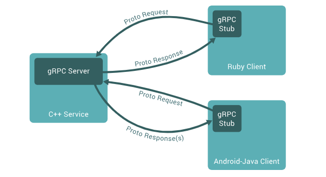
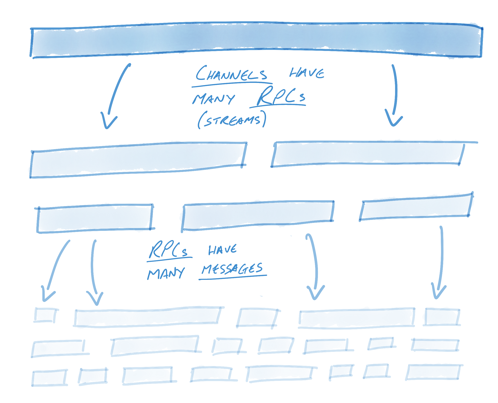
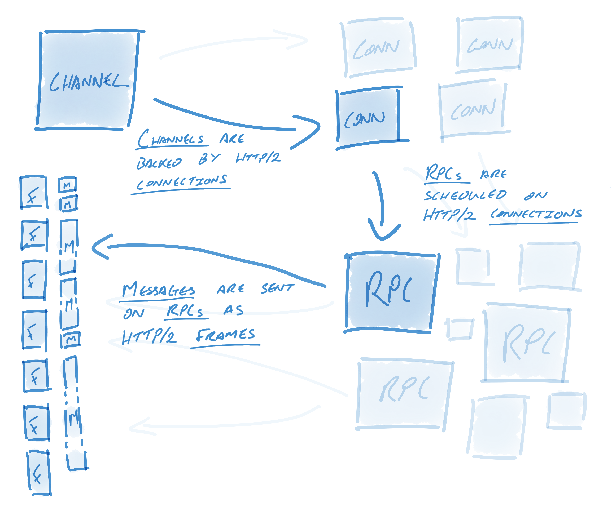
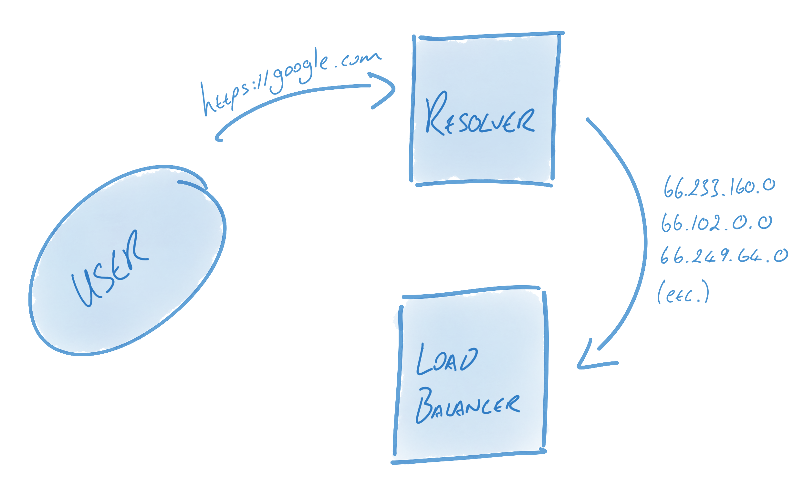
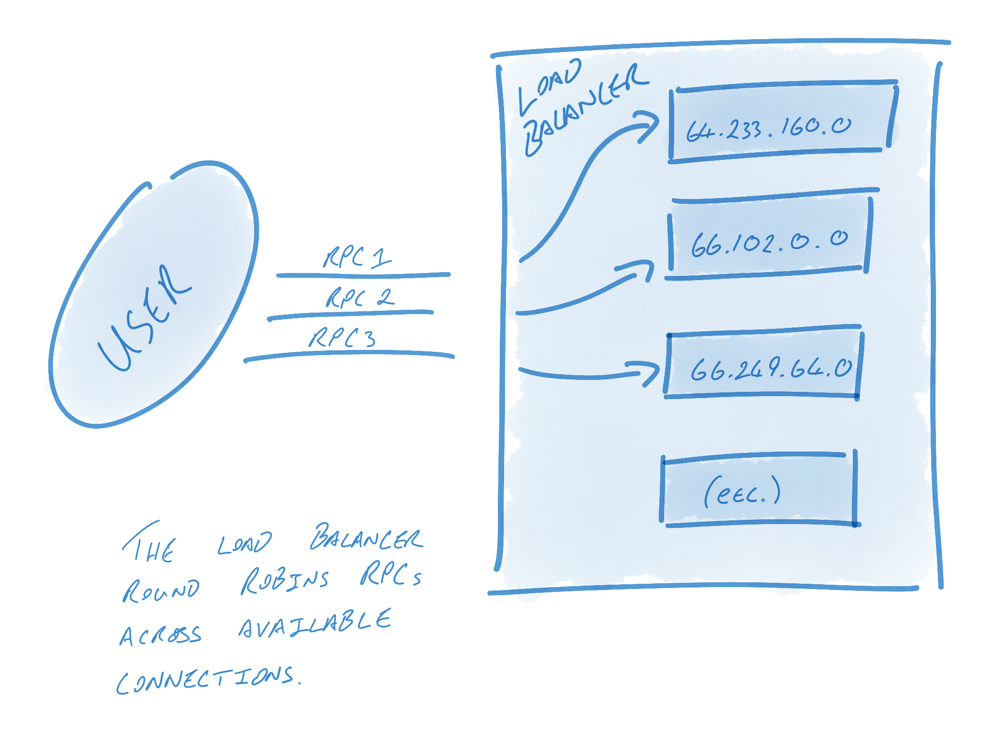

[TOC]


# RPC调研

针对RPC的使用场景，主要选取[gRPC]([grpc/grpc: The C based gRPC (C++, Python, Ruby, Objective-C, PHP, C#) (github.com)](https://github.com/grpc/grpc))，[thrift](https://github.com/apache/thrift)，[bRPC](https://github.com/apache/brpc)，[rest-rpc](https://github.com/qicosmos/rest_rpc)进行调研评估。

以下是我们选取RPC框架时的一些准则：

- 编码方案：兼容性、可扩展性
- 多语言支持：c++、java、python、js、lua等
- 跨平台（Windows、Linux等）
- 服务平滑（滚动）升级：客户端&服务器不同时升级时，接口的兼容性
- 稳定性、可靠性、安全性
- 使用便利性，容易上手
- 社区、文档
- IDL支持


接下来，我们看一下网络请求与本地函数调用的一些区别：

- 本地函数调用是可预测的，并且成功或失败仅取决于受你控制的参数。网络请求是不可预测的：请求或响应可能由于网络问题会丢失，或者远程计算机可能很慢或不可用，这些问题完全不在你的控制范围之内。网络问题很常见，因此必须有所准备，例如重试失败的请求。
- 本地函数调用要么返回结果，要么抛出异常，或者永远不返回（因为进入无限循环或进程崩溃）。网络请求有另一个可能的结果：由于超时，它返回时可能没有结果。在这种情况下，你根本不知道发生了什么：如果你没有得到来自远程服务的响应，你无法知道请求是否通过。
- 如果你重试失败的网络请求，可能会发生请求实际上已经完成，只是响应丢失的情况。在这种情况下，重试将导致该操作被执行多次，除非你在协议中建立数据去重机制（**幂等性**，即 idempotence）。本地函数调用时则没有这样的问题。 
- 每次调用本地函数时，通常需要大致相同的时间来执行。网络请求比函数调用要慢得多，而且其延迟也是非常可变的：好的时候它可能会在不到一毫秒的时间内完成，但是当网络拥塞或者远程服务超载时，可能需要几秒钟的时间才能完成相同的操作。
- 调用本地函数时，可以高效地将引用（指针）传递给本地内存中的对象。当你发出一个网络请求时，所有这些参数都需要被编码成可以通过网络发送的一系列字节。如果参数是像数字或字符串这样的基本类型倒是没关系，但是对于较大的对象很快就会出现问题。
- 客户端和服务可以用不同的编程语言实现，所以 RPC 框架必须将数据类型从一种语言翻译成另一种语言。这可能会变得很丑陋，因为不是所有的语言都具有相同的类型 —— 例如回想一下 JavaScript 的数字大于 2^53 的问题。用单一语言编写的单个进程中则不存在此问题。

所有这些因素意味着尝试使远程服务看起来像编程语言中的本地对象一样毫无意义，因为这是一个根本不同的事情。 


## 1 编码方案

参考：[数据密集型应用系统设计-第四章：编码与演化](https://github.com/Vonng/ddia/blob/master/ch4.md)

RPC使用消息（协议）传递来实现远程调用，因此RPC框架的消息编码方案至关重要。在调研RPC框架之前，我们首先来看看协议编码的解决方案。

### 1.1 json、xml、csv、msgpack

- json

  ```json
  {
      "userName": "Martin",
      "favoriteNumber": 1337,
      "interests": ["daydreaming", "hacking"]
  }
  ```

- xml

  ```xml
  <userName>Martin</userName>
  <favoriteNumber>1337</favoriteNumber>
  <interests>daydreaming</interests>
  <interests>hacking</interests>
  ```

- csv

  ```json
  userName,favoriteNumber,interests.0,interests.1
  Martin,1337,daydreaming,hacking
  ```

- msgpack：json二进制

  ```c++
  struct Person {
      string userName;
      int64 favoriteNumber;
      array<std::string> interests;
  
      MSGPACK_DEFINE(userName, favoriteNumber, interests);
  }
  ```

  

### 1.2 Protocol Buffer

- 数据类型

  - 基础类型：bytes，string，int8，uint8，int16，uint16，int32，uint32，int64，uint64，bool，double，float
  - 列表：repeated
  - map：内部实现map，非标准库

- pb示例

  ```json
  # 指定语法，默认采用proto2
  syntax = "proto3";
  
  # 选项
  option java_multiple_files = true;
  option java_package = "io.grpc.examples.helloworld";
  option java_outer_classname = "HelloWorldProto";
  option objc_class_prefix = "HLW";
  
  # 指定命名空间namespace
  package helloworld;
  
  // use service to define rpc interface.
  // The greeting service definition.
  service Greeter {
    // Sends a greeting
    rpc SayHello (HelloRequest) returns (HelloReply) {}
  
    rpc SayHelloStreamReply (HelloRequest) returns (stream HelloReply) {}
  }
  
  // The request message containing the user's name.
  message HelloRequest {
    string name = 1;
  }
  
  // The response message containing the greetings
  message HelloReply {
    string message = 1;
  }
  
  // 其他结构体定义示例
  message Demo
  {
      enum Color
      {
          UNDFINED = 0; // proto3要求必须从0开始定义枚举值
          RED = 1;
          GREEN = 2;
          BLUE = 3;
      }
  
      message Point2d
      {
          int32 x = 1;
          int32 y = 2;
      }
  
      message UserInfo
      {
          int32 id = 1;
          optional string name = 2;
          repeated string addrList = 3;
          map<int32, int64> moneyMap = 4;
          bytes headImg = 5;
          double dv = 6;
          float fv = 7;
          uint64 value = 8;
          Point2d pos = 9;
      }
  
      repeated UserInfo userList = 1;
  }
  ```

- 编译

  ```sh
  # 1.编译proto文件,（可查阅帮助，protoc --help）
  protoc.exe --cpp_out=DST_DIR -I=SRC_DIR helloworld.proto
  
  # 2.编译grpc文件
  protoc.exe --grpc_out=DST_DIR -I=SRC_DIR --plugin=protoc-gen-grpc="{plugin_dir}\grpc_cpp_plugin.exe" helloworld.proto
  ```

- **注意事项**

  - 参考：[field_presence](https://github.com/protocolbuffers/protobuf/blob/main/docs/field_presence.md)

  - proto3不再支持required声明，并且*官方建议使用缺省的声明方式*；
  - proto3中不允许显式声明默认值；
  - 字段默认的行为是optional，但和显式声明为optional还是存在些许差异（详见下表）；

  - optional字段序列化之后有has_xxx()接口；非optional则没有；

  - 关注显式声明与非显式声明对`numeric, enum, or string type`序列化的影响；

    | 行为   | 未显式声明                                                   | 显式声明                                                     |
    | ------ | ------------------------------------------------------------ | ------------------------------------------------------------ |
    | 默认值 | 1、默认值不会被序列化，即使显式设置了该字段的值为默认值；<br>2、默认值意味着该字段未被设置或已经被clear； | 如果显式设置了该字段的值（不管该值是否为默认值），都会被序列化 |
    | clear  | 设置为默认值                                                 | 设置为默认值，并清空标记                                     |

- 其他

  - pb的结构可以使用`MessageToJsonString`转为json数据。

    ```c++
    #include <google/protobuf/util/json_util.h>
    
    helloworld::Demo demo;
    auto user = demo.add_userlist();
    user->set_id(1);
    auto pos = user->mutable_pos();
    pos->set_x(1);
    pos->set_y(2);
    
    std::string json_str;
    google::protobuf::util::MessageToJsonString(demo, &json_str);
    ```


### 1.3 Thrift Protocol

- 数据类型（map to c++）

  - 基础类型：bool、byte/i8、i16、i32、i64、double、string、binary
  - list<type>：std::vector<type>
  - set<type>：std::set<type>
  - map<type1, type2>：std::map<type1, type2>
  - 不支持无符号类型

- 协议示例

  ```json
  namespace cpp example
  
  // 对每一种语言生成namespace
  // namespace * example
  
  enum Result
  {
      SUCCESS,      // 成功
      ERROR,        // 内部错误
  }
  
  struct ResultStr {
      1: optional Result code;
      2: optional string result;
  }
  
  struct TestExample
  {
      1: required Result code;
      2: optional string value;
      3: i32 foo;
      4: binary bin; // map type string，只是解析数据时存在差异，binary解析时调用readBinary
      5: i8 ch;
  }
  
  service HelloWorld {
    string sayHello(1: string name);
  
    // oneway方式：只发送请求，不接收回复，接口必须返回必须是void
    // 原始论文中描述的是async关键字，async有异步的意思，所以在后期版本对这个关键字做了修改
    // 不建议采用使用：通常并不能保证数据传输到对端，论文描述只保证数据到达transport层，通常还会产生拜占庭将军问题。
    oneway void bye(1: string msg);
  }
  ```

- 编译

  ```sh
  # 编译c++
  thrift -r --gen cpp service.thrift
  
  # 编译js
  thrift -r --gen js service.thrift
  
  # 其他
  thrift --help
  ```

  

- Field Requiredness

  | 字段修饰符       | 读取                                                         | 写入                                                         |
  | ---------------- | ------------------------------------------------------------ | ------------------------------------------------------------ |
  | required         | 如果未读取到该字段的值，解析会抛出异常；<br>**无isset属性，optional和默认的字段，都存在isset属性;** | 总是写入当前值（未设置则写入默认值）                         |
  | optional         | 如果未写入该值，则读取会跳过；                               | 写入时检查isset，如果设置则写入，否则不跳过                  |
  | 默认（无修饰符） | 如果未读取到该字段的值（或类型错误），则安全跳过；<br>1、读取该字段的值，isset设置为true；<br>2、不会读取到该字段，使用默认值，isset默认为false; | 总是写入当前值，不会检查isset：<br>1、设置了该字段；<br>2、未设置则写入默认值； |

  **总结：**

  - 对于字段定义，建议采用明确的*required*和*optional*修饰。
  - 新增字段必须使用*optional*修饰。
  - *required*字段不存在*isset*属性，另外2种修饰符方式则存在。

  - 所以使用thrift协议时，不应该依赖修饰符，建议使用*isset*来判断该字段是否被设置。

  - 对于默认的修饰符的行为，写入1和读取1，写入2和读取2是对应的。

  - 以上结论是在thrift-0.16.0版本下测试总结完成的，其他版本可能存在差异。

- 版本控制/兼容性

  协议会随着时间的推移而改变。如果现有消息类型不再满足您的需求（例如，您希望消息格式有一个额外的字段），但您仍然希望使用使用旧格式创建的代码， 在不破坏任何现有消息的情况下更新消息类型非常简单。请记住以下规则：

  - 不要更改任何现有字段的数字标记。
  - 添加的任何新字段都应该是可选的。这意味着任何使用“旧”消息格式的代码进行序列化，也可以通过新的消息格式序列化，因为它们不会缺少任何必需的元素。你应该设置这些元素的合理默认值，以便新代码可以正确与旧代码生成的消息进行交互。同样，新代码可以通过旧代码解析：旧二进制文件只需忽略解析新字段。但是，未知字段不会被丢弃，如果消息稍后被序列化，未知字段与它一起被序列化。因此，如果消息传递给新代码，新字段仍然是可用。
  - 对于非必填字段（non-required），只要不再使用标签号，就可以在更新的消息类型中删除（重命名字段可能更好。 相反，也许添加前缀“OBSOLETE_”，以便未来的用户 .thrift 不会意外重复使用该数字）。
  - 更改默认值通常是可以的，只是您要记住该默认值永远不会通过网络发送。因此，如果程序收到一条消息未设置特定字段，程序将看到默认值为它是在该程序的协议版本中定义的。它不会看到发件人代码中定义的默认值。

### 1.4 协议比较、总结

| 编码方案        | 优点                                                        | 缺点                                     |
| --------------- | ----------------------------------------------------------- | ---------------------------------------- |
| json            | 可读性高；编解码库支持好；扩展性好；                        | 空间占用大；编解码效率较低；不支持二进制 |
| xml             | 可读性较好；扩展性好；                                      | 空间占用大；编解码效率较低；不支持二进制 |
| csv             | 类似excel，编解码效率较高，按照行和列组织数据；扩展性较好； | 数据类型没有约束；不支持二进制           |
| msgpack         | json二进制编码方案；空间占用比json稍小；                    | 扩展性一般；支持的平台有限；可读性差     |
| thrift protocol | 编解码效率非常高；扩展性好；空间占用小；支持多种模式；      | 可读性差                                 |
| protocol buffer | 编解码效率非常高；扩展性好；空间占用小；                    | 可读性差                                 |

- 在传输数据量较大的需求场景下，Protocol Buffer 比 XML、JSON 更小（3到10倍）、更快（20到100倍）、使用 & 维护更简单；
- Protocol Buffer只有一种二进制编码方案，和thrift的TCompactProtocol基本一致；
- pb和thrift的编解码效率差异不大，它们都是稳定可靠的编解码方案。


## 2 gRPC调研

参考资料：

[grpc.io](https://grpc.io/)

[protocolbuffers](https://github.com/protocolbuffers/protobuf)

[http2.0优势](https://www.xiaolincoding.com/network/2_http/http2.html)

### 2.1 gRPC

gRPC 是什么？



**gRPC = Protocol Buffer + HTTP/2.0**

gRPC 是一个现代的开源远程过程调用 （RPC） 框架，可以在任何地方运行。它使客户端和服务器应用程序能够透明地通信，并使构建连接的系统变得更加容易。

**使用场景**

- 低延迟、高度可扩展的分布式系统。
- 开发与云服务器通信的移动客户端。
- 设计一个需要准确、高效且独立于语言的新协议。
- 分层设计以实现扩展，例如：身份验证、负载平衡、日志记录和监控等。

**HTTP/2.0优势**

- 完全兼容HTTP/1.1
- 头部压缩（动态编码&静态编码，减少Header传输）
- 二进制帧
- 并发传输（分帧）
- 服务器主动推送

### 2.2 gRPC设计准则
参考：https://grpc.io/blog/principles/

**设计原则&要求**

- 服务不是对象，消息不是引用（Services not Objects, Messages not References）

  Services not Objects（服务而非对象）：这是一种面向服务的设计思想，强调将注意力集中在提供的服务上，而不是关注具体的对象。

  Messages not References（消息而非引用）：这是一种基于消息传递的通信模式，与传统的对象引用不同。

  推广系统之间粗粒度消息交换的微服务设计理念，同时避免[分布式对象的陷阱](https://martinfowler.com/articles/distributed-objects-microservices.html)和[忽视网络的谬误](https://en.wikipedia.org/wiki/Fallacies_of_distributed_computing)。

- 覆盖范围和简单性（Coverage & Simplicity）

  该技术栈应该在每个流行的开发平台上可用，并且在平台上容易构建。而且应该在 CPU 和内存有限的设备上可用。

- 免费和开放（Free & Open）

  让所有基本功能免费供所有人使用。将所有项目作为开源工作发布，并配备许可证，应促进使用而不是阻碍采用。
  
- 互操作性和覆盖范围（Interoperability & Reach）：在不同系统、平台或网络之间实现有效的通信和数据交换的能力。

  通信协议必须能够在常见的互联网基础设施中传输并正常运作。(**HTTP/2.0**)

- 通用和高性能（General Purpose & Performant）

  一个有效的技术栈在设计时应该考虑适用于广泛的用例，并且在性能方面与特定用例的技术栈相比没有明显的损失。这样的技术栈应该具有通用性、灵活性和性能，在不同的应用场景中都能提供良好的效果。

- 分层设计（Layered）

  技术栈中的关键组件应能够独立演进。对于传输格式的修订不应对应用层绑定造成破坏。

  在一个技术堆栈中，不同的层或组件（如网络层、协议层和应用层）共同提供功能并实现通信。然而，随着技术的演进和引入新版本或更新，确保一个层次的变化不会对其他层次的功能产生负面影响是至关重要的。

- 与有效载荷无关（Payload Agnostic）

  不同服务需要使用不同的消息类型和编码（如：Protocol Buffer、JSON、XML和Thrift），因此协议和实现必须允许这种灵活性。同样，根据用例和有效载荷类型的不同，对有效载荷压缩的需求也会有所变化：协议应该允许插拔式压缩机制。

- 流式处理（Streaming）

  在存储系统中，流式处理（streaming）和流量控制（flow-control）被用于处理大规模数据集。

  除了存储系统，还有一些服务（如语音转文本或股票行情）也依赖于流式处理来表示时间相关的消息序列。

- 阻塞和非阻塞（Blocking & Non-Blocking）

  支持异步和同步处理客户端和服务器交换的消息序列。这对于在某些平台上扩展和处理流至关重要。

- 取消和超时（Cancellation & Timeout）

  由于某些操作代价高昂和处理时间长，取消操作对于服务器回收资源是很重要的，特别是当客户端操作已完成或不再需要时。

  通过因果链追踪工作操作，取消操作能够产生级联效应，确保相关操作的正确性。同时，客户端指定操作超时时间也允许服务根据客户端的需求来调整自身行为，来提供更好的用户体验。这些机制可以使操作和服务之间的交互更加可靠、高效和灵活。

- 跛行（Lameducking）

  服务器在关闭过程中应该被允许通过拒绝新的请求来优雅地关闭，同时继续处理已有的请求。

  当服务器需要关闭时，为了避免数据丢失或损坏，它需要先完成当前正在处理的请求。因此，服务器会继续处理已经接收到但还未完成的请求（即 "in-flight" 的请求），同时不再接受新的请求。

  这种方式可以确保服务器在关闭的过程中对于已经接收到的请求能够尽可能地进行处理，并且不会造成数据丢失或不一致性。对于新的请求，服务器会主动拒绝，而不是简单地忽略或关闭连接，这样客户端就能够及时获知服务器正在关闭的状态，避免进一步的请求发送和处理。

  通过优雅地拒绝新的请求并继续处理已有的请求，服务器能够完成它当前的工作，并向客户端传达关闭的意图。这种控制机制可以提供更好的用户体验，避免数据丢失，并使得服务器的关闭过程更加可靠和稳定。

- 流量控制（Flow Control）

  客户端和服务器之间的计算能力和网络容量通常不平衡。流量控制可以更好的管理缓冲区，并且限制来自过于活跃的对等方的流量，保护服务器免受DOS攻击。

- 可插拔（Pluggable）

  通信协议只是正常运行的 API 基础结构的一部分。大型分布式系统需要安全性、运行状况检查、负载平衡和故障转移、监视、跟踪、日志记录等。设计实现时应该提供扩展性入口，以允许插入这些特性，并在有需要时提供默认实现。

- 扩展作为 API（Extensions as APIs）

  在涉及不同服务之间需要协作的情况下，扩展应该优先使用API而不是协议扩展（protocol extensions），因为API更适合用于这种情况。这种类型的扩展可以包括健康检查、服务内省（服务能够自我检查和提供有关其自身功能、接口和元数据的能力）、负载监控和负载均衡分配。

- 元数据交换（Metadata Exchange）

  常见的横切关注点（如身份验证或跟踪）依赖于不属于服务声明接口的数据交换。部署依赖于它们以不同的速率将这些功能发展到服务公开的各个 API 的能力。（注：参考切面编程，非侵入式）

- 标准化状态码

  客户端对API调用返回的错误的处理通常是有限的。为了使错误处理决策更清晰，状态码的命名空间应该受到限制。如果需要更丰富的特定领域状态，可以使用元数据交换机制来提供。（注：参考HTTP状态码）

### 2.3 gRPC Concepts

参考：

https://grpc.io/blog/grpc-on-http2/

[核心概念、架构和生命周期 |gRPC](https://grpc.io/docs/what-is-grpc/core-concepts/)

- gRPC 语义

  gRPC 引入了三个新概念：*通道*、*远程过程调用* （RPC） 和*消息*。这三者之间的关系很简单：每个通道可能有许多 RPC，而每个 RPC 可能有许多消息。
  
  
  
  接下来再看看 gRPC 语义与 HTTP/2 的关系：
  
  
  
  通道是 gRPC 中的一个关键概念。HTTP/2 中的流在单个连接上启用多个并发对话；通道通过多个并发连接启用多个流来扩展此概念。从表面上看，通道为用户提供了一个简单的接口来发送消息；然而，在引擎盖下，大量的工程工作用于保持这些连接活跃、正常且可用。
  
- 名字解析器和负载均衡器

  为了保持连接处于活跃状态、正常且可用，gRPC 使用了许多组件，其中最重要的是*名字解析器*和*负载均衡器*。解析程序将域名转换为地址，然后将这些地址交给负载均衡器。负载均衡器负责从这些地址创建连接，并在连接之间对 RPC 进行负载均衡。

  

  

  例如，DNS 解析器可能会将某个主机名解析为 13 个 IP 地址，然后轮循机制平衡器可能会创建 13 个连接（每个地址一个连接），并在每个连接之间进行轮循RPC调用。更简单的平衡器可能只是创建与第一个地址的连接。或者，想要多个连接但知道主机名将仅解析为一个地址的用户可能会让其平衡器针对每个地址创建连接 10 次，以确保使用多个连接。

  解析器和负载均衡器可解决 gRPC 系统中的微小但至关重要的问题。这种设计是有意为之的：将问题空间减少到几个小的离散问题有助于用户构建自定义组件。这些组件可用于微调 gRPC，以满足每个系统的个性化需求。(Resolvers and load balancers solve small but crucial problems in a gRPC system. This design is intentional: reducing the problem space to a few small, discrete problems helps users build custom components. These components can be used to fine-tune gRPC to fit each system’s individual needs)

- 连接管理

  配置后（once config），gRPC 将使用连接池（由解析程序和平衡器定义）保持活跃、正常和可用。

  当连接失败时，负载均衡器将开始使用最后一个已知地址列表重新连接。同时，解析器将开始尝试重新解析主机名列表。这在许多情况下都很有用。例如，如果无法再访问代理，我们希望解析器更新地址列表，使其不包含该代理的地址。

  解析完成后，负载均衡器将收到新地址的通知。如果地址已更改，负载均衡器会将剔除不在新列表中的地址，或者创建与以前不存在的地址的连接。

- 识别失败的连接

  gRPC 连接管理的有效性取决于其识别故障连接的能力。（正常关闭vs非正常关闭）

  让我们考虑一个干净、易于观察的故障。当终结点有意终止连接时，可能会发生干净故障。例如，终结点可能已正常关闭，或者可能已超出计时器，提示终结点关闭连接。当连接干净地关闭时，TCP 语义就足够了：关闭连接会导致[fin handshake](http://www.tcpipguide.com/free/t_TCPConnectionTermination-2.htm)发生。这将结束 HTTP/2 连接，从而结束 gRPC 连接。gRPC 将立即开始重新连接（如上所述）。这非常干净，不需要额外的HTTP / 2或gRPC语义。

  不太干净的版本是端点在不通知客户端的情况下死亡或挂起的地方。在这种情况下，TCP 可能会重试长达 10 分钟，然后才会被视为连接失败。当然，未能识别到连接已死亡 10 分钟是不可接受的。gRPC 使用 HTTP/2 语义解决了这个问题：使用 KeepAlive 配置时，gRPC 将定期发送[HTTP/2 PING 帧](https://http2.github.io/http2-spec/#PING).这些帧绕过流控制，用于确定连接是否处于活动状态。如果 PING 响应未及时返回，gRPC 将认为连接失败，关闭连接，然后开始重新连接（如上所述）。

  通过这种方式，gRPC 使连接池保持健康，并使用 HTTP/2 定期确定连接的运行状况。所有这些行为对用户都是不透明的，并且消息重定向会自动发生。用户只需在看似始终健康的连接池上发送消息。

- 保持连接活跃（心跳协议PING）

  如上所述，KeepAlive 提供了一个有价值的好处：通过发送 HTTP/2 PING 来确定连接是否仍然有效，定期检查连接的运行状况。但是，它还有另一个同样有用的好处：向代理发出活动信号。

  通过 gRPC 定期在连接上发送 HTTP/2 PING 帧，可以创建非空闲连接的感知。

- 稳健、高性能

  HTTP/2 为长期实时通信流奠定了基础。gRPC 在此基础上构建了连接池、健康监测机制，并有效地使用了数据帧、多路复用以及 KeepAlive。

  开发人员必须选择满足当前和未来需求的协议。gRPC 可以很好地满足无论是为了高弹性、高性能、长短期通信、可定制性的服务构建，或者简单地知道协议将会扩展到非常大的流量上来，gRPC都能始终保持高效。

### 2.4 gRPC依赖库

```json
# grpc核心库
grpc.lib
grpc++_reflection.lib
grpc++.lib

# 数据压缩
zlib.lib
# 异步DNS解析库
cares.lib
# DNS解析的IP地址进行排序
address_sorting.lib
# 正则表达式库
re2.lib

# 日志库
gpr.lib

# protobuf库
libprotobufd.lib

# upb是c语言protobuf的实现，和c++的pb实现有着相似的性能
upb_json.lib
upb_textformat.lib
upb_reflection.lib
upb_collections.lib
upb_mini_table.lib
upb.lib
upb_fastdecode.lib
upb_utf8_range.lib
upb_extension_registry.lib
descriptor_upb_proto.lib

# absl_statusor是Google开源C++库abseil中的一个模板类，用于简化函数返回值的处理。它可以将函数的返回值包装成一个absl::Status对象，
# 这个对象可以表示函数成功或失败的状态，并且可以包含错误信息。如果函数执行成功，absl_statusor会将函数的返回值提取出来，
# 否则会返回一个包含错误信息的absl::Status对象。
# absl_statusor可以用于简化代码中的错误处理逻辑，减少代码的冗余度。它的使用方式类似于C++17中的std::optional，
# 但是它可以包含错误信息，而std::optional只能表示有或没有值这两种情况。
absl_statusor.lib
abseil_dll.lib

# openssl库
libssl.lib
libcrypto.lib
```

### 2.5 服务示例

- Server

  ```c++
  class GreeterServiceImpl final : public Greeter::Service {
    Status SayHello(ServerContext* context, const HelloRequest* request,
                    HelloReply* reply) override {
      std::string prefix("Hello ");
      reply->set_message(prefix + request->name());
      return Status::OK;
    }
  };
  
  void RunServer() {
    std::string server_address("0.0.0.0:50051");
    GreeterServiceImpl service;
  
    grpc::EnableDefaultHealthCheckService(true);
    grpc::reflection::InitProtoReflectionServerBuilderPlugin();
    ServerBuilder builder;
    // Listen on the given address without any authentication mechanism.
    builder.AddListeningPort(server_address, grpc::InsecureServerCredentials());
    // Register "service" as the instance through which we'll communicate with
    // clients. In this case it corresponds to an *synchronous* service.
    builder.RegisterService(&service);
    // Finally assemble the server.
    std::unique_ptr<Server> server(builder.BuildAndStart());
    std::cout << "Server listening on " << server_address << std::endl;
  
    // Wait for the server to shutdown. Note that some other thread must be
    // responsible for shutting down the server for this call to ever return.
    server->Wait();
  }
  ```
  
- Client：阻塞

  ```c++
  class GreeterClient {
   public:
    GreeterClient(std::shared_ptr<Channel> channel)
        : stub_(Greeter::NewStub(channel)) {}
  
    // Assembles the client's payload, sends it and presents the response back
    // from the server.
    std::string SayHello(const std::string& user) {
      // Data we are sending to the server.
      HelloRequest request;
      request.set_name(user);
  
      // Container for the data we expect from the server.
      HelloReply reply;
  
      // Context for the client. It could be used to convey extra information to
      // the server and/or tweak certain RPC behaviors.
      ClientContext context;
  
      // The actual RPC.
      Status status = stub_->SayHello(&context, request, &reply);
  
      std::string json;
      //google::protobuf::util::JsonPrintOptions options;
      //options.add_whitespace = true;
      google::protobuf::util::MessageToJsonString(reply, &json);
  
      std::cout << "reply: " << json << std::endl;
  
      // Act upon its status.
      if (status.ok()) {
        return reply.message();
      } else {
        std::cout << status.error_code() << ": " << status.error_message()
                  << std::endl;
        return "RPC failed";
      }
    }
  };
  
  int main()
  {
    GreeterClient greeter(
      grpc::CreateChannel("localhost:50051", grpc::InsecureChannelCredentials()));
  
    std::string reply = greeter.SayHello("world");
    std::cout << "Greeter received: " << reply << std::endl;
      
    return 0;
  }
  ```


## 3 Thrift调研

参考资料：

[Apache Thrift - C++](https://thrift.apache.org/tutorial/cpp.html)

[Apache Thrift - Interface Description Language (IDL)](https://thrift.apache.org/docs/idl)

[thrift/tutorial/tutorial.thrift · GitHub](https://github.com/apache/thrift/blob/master/tutorial/tutorial.thrift)

[Thrift: The Missing Guide (diwakergupta.github.io)](https://diwakergupta.github.io/thrift-missing-guide/)

[Home - THRIFT - Apache Software Foundation](https://cwiki.apache.org/confluence/display/thrift)

[thrift-20070401.pdf (apache.org)](https://thrift.apache.org/static/files/thrift-20070401.pdf)

### 3.1 Thrift

Thrift是什么？

跨语言的可扩展服务实现（Thrift: Scalable Cross-Language Services Implementation)

**Thrift = Protocol + Rpc**


### 3.2 设计思想

参考：[论文：thrift-20070401.pdf (apache.org)](https://thrift.apache.org/static/files/thrift-20070401.pdf)

- Network Stack

  ```
  +-------------------------------------------+
  | cGRE                                      |
  | Server                                    |
  | (single-threaded, event-driven etc)       |
  +-------------------------------------------+
  | cBLU                                      |
  | Processor                                 |
  | (compiler generated)                      |
  +-------------------------------------------+
  | cGRE                                      |
  | Protocol                                  |
  | (JSON, compact etc)                       |
  +-------------------------------------------+
  | cGRE                                      |
  | Transport                                 |
  | (raw TCP, HTTP etc)                       |
  +-------------------------------------------+
  ```

- 简单性

  Thrift 的设计目标之一是保持简单性。它采用了类似于 IDL（接口定义语言）的方式来定义数据结构和服务接口，使得开发人员可以简单明了地描述和定义数据模型和通信协议。

- 跨语言支持

  Thrift 提供了多种语言的编译器和运行时库，并且通过生成各种语言的代码，使得不同语言的系统能够无缝地进行通信和数据交换。这种跨语言的支持使得开发团队可以使用不同的编程语言开发各自的服务，同时能够进行高效的跨语言通信。

- 强大的序列化支持

  Thrift 提供了一种高效的二进制序列化格式，可以将数据对象转换成二进制格式进行传输和存储。这种序列化机制具有高性能、节省带宽和存储空间的优势，适用于大规模数据传输的场景。

- 可扩展性

  Thrift 支持在不破坏现有系统的情况下进行版本迭代和功能扩展。它使用了类似于面向对象的接口版本控制机制，通过为数据结构和服务接口定义版本号，可以在不同的版本之间进行兼容性处理。

- 多种传输协议和通信模式

  Thrift 不仅支持二进制序列化格式，还支持多种传输协议，包括基于 TCP 的传输、基于 HTTP 的传输等。

### 3.3 依赖库

```ini
# 以下是使用vcpkg在windows下安装thrift的库（这里使用debug库作为示例）

# libevent库
event_cored.lib
event_extrad.lib
eventd.lib

# openssl库 
libcrypto.lib
libssl.lib

# 压缩库
zlibd.lib

# thrift核心库

# 这是使用了 MDD（Multiple Dynamic Dispatch）编译选项进行编译的 Thrift 库。MDD 可以提供更高的性能和更小的内存占用，但也会导致生成的库文件较大。该库适用于在需要高性能和较小内存占用的情况下使用。
thriftmdd.lib
# 这是使用了 NBMDD（Non-Blocking Multiple Dynamic Dispatch）编译选项进行编译的 Thrift 库。NBMDD 是对 MDD 的改进，它在 MDD 的基础上增加了非阻塞（non-blocking）支持，可以在高并发场景下提供更好的性能。该库适用于需要高并发、非阻塞操作的情况下使用。
thriftnbmdd.lib
# thrift协议解析库
thriftzmdd.lib
```


### 3.4 工作模式

- 4种工作模式

  1. 单线程阻塞模式（**TSimpleServer**）
     - 在单进程模式下，Thrift服务以单线程的方式运行，每个连接都会在同一个进程中处理。这种模式适用于小规模的应用或者仅有少量并发连接的情况。

  2. 多线程阻塞模式（**TThreadedServer**）
     - 在多线程模式下，Thrift服务使用多个线程来处理并发连接。每个连接都会分配给一个独立的线程进行处理。这种模式适用于需要处理大量并发连接的情况，可以提高服务的并发性能。

  3. 非阻塞模式（**TNonblockingServer**）

     - 在非阻塞模式下，服务器使用少量的线程来处理多个客户端请求。服务器不会为每个客户端请求创建新的线程，而是使用非阻塞 I/O 和事件驱动机制来处理请求。这种模式可以实现高并发性能，适用于大量并发请求的场景。

     - 该模型的传输层协议只能采用TFramedTransport。

  4. 线程池服务器模型（**TThreadPoolServer**）

     - 线程池服务器模型是一种将线程池与非阻塞 I/O 结合的方式。它使用线程池中的线程来处理客户端请求，每个线程使用非阻塞 I/O 方式进行请求处理。这种模型通过复用线程以及非阻塞 I/O 的特性，可以同时处理多个并发请求，并提高系统的资源利用率。

     - 在线程池服务器模型中，服务器先建立一个监听套接字（TNonblockingServerSocket），然后在一个或多个线程中接收连接请求。一旦有连接建立，会将连接分配给线程池中的一个线程。该线程使用非阻塞 I/O 进行请求处理，当请求处理完成后，响应数据会通过非阻塞 I/O 发送给客户端。
     - 线程池服务器模型适用于高并发且请求处理时间较长的情况，它能够兼顾并发性能和资源利用率。但需要注意合理配置线程池大小，以避免线程过多导致资源消耗过大。

- **总结**
  
    - 单线程阻塞模式：适用于低并发、请求处理时间较短的场景。
    - 多线程阻塞模式：适用于中等并发、请求处理时间较短的场景。
    - 非阻塞模式：适用于高并发、请求处理时间较短的场景。
    - 线程池服务器模型：适用于高并发、请求处理时间较长的场景。

### 3.5 服务示例

```c++
#include <thrift/protocol/TBinaryProtocol.h>
#include <thrift/protocol/TJSONProtocol.h>

#include <thrift/server/TNonblockingServer.h>
#include <thrift/server/TSimpleServer.h>
#include <thrift/server/TThreadedServer.h>
#include <thrift/server/TThreadPoolServer.h>

#include <thrift/transport/THttpTransport.h>
#include <thrift/transport/TTransportUtils.h>
#include <thrift/transport/THttpServer.h>
#include <thrift/transport/TNonblockingServerSocket.h>

#include "HelloWorld.h"

using namespace std;
using namespace apache::thrift;
using namespace apache::thrift::protocol;
using namespace apache::thrift::transport;
using namespace apache::thrift::server;

using namespace example;

class HelloWorldHandler : public example::HelloWorldIf {
public:
    HelloWorldHandler() {}

    virtual void sayHello(
        std::string& _return, const std::string& name) override
    {
        std::cout << "recv: " << name << std::endl;
        _return = "world";
    }
};

class HelloWorldHandlerFactory : public example::HelloWorldIfFactory {
public:
    virtual HelloWorldIf* getHandler(
        const ::apache::thrift::TConnectionInfo& connInfo) override {
        return new HelloWorldHandler;
    }
    virtual void releaseHandler(HelloWorldIf* handler) override {
        delete handler;
    }
};

// 单线程工作模式
void start_simple_server(int32_t port)
{
    // This server only allows one connection at a time, but spawns no threads
    auto handler = std::make_shared<HelloWorldHandler>();
    auto processor = std::make_shared<HelloWorldProcessor>(handler);

    auto serverTransport = std::make_shared<TServerSocket>(port);

    auto transportFactory = std::make_shared<THttpServerTransportFactory>();
    auto protocolFactory = std::make_shared<TJSONProtocolFactory>();

    TSimpleServer server(processor, serverTransport,
                         transportFactory, protocolFactory);
    server.serve();
}

// 多线程阻塞模式
void start_thread_server(int32_t port, bool single_handler)
{
    auto serverTransport = std::make_shared<TServerSocket>(port);

    auto transportFactory = std::make_shared<THttpServerTransportFactory>();
    auto protocolFactory = std::make_shared<TJSONProtocolFactory>();

    // single_handler: 必须保证service接口是可重入的，不能拥有中间状态
    if (single_handler)
    {
        auto handler = std::make_shared<HelloWorldHandler>();
        auto processor = std::make_shared<HelloWorldProcessor>(handler);

        // 使用同一个handler对象
        TThreadedServer server(processor, serverTransport,
                               transportFactory, protocolFactory);
        server.serve();
    }
    else
    {
        auto factory = std::make_shared<HelloWorldHandlerFactory>();
        auto processorFactory = std::make_shared<HelloWorldProcessorFactory>(factory);

        // 使用不同的handler对象
        TThreadedServer server(processorFactory, serverTransport,
                               transportFactory, protocolFactory);
        server.serve();
    }
}

// 非阻塞模式
void start_noblocking_server(int32_t port)
{
    // 创建服务处理器
    auto factory = std::make_shared<HelloWorldHandlerFactory>();
    auto processorFactory = std::make_shared<HelloWorldProcessorFactory>(factory);

    // Thrift 的 TNonblockingServer 只支持 TFramedTransport 传输。
    // 这是因为 TNonblockingServer 使用帧（frame）作为消息的边界，
    // 而 TFramedTransport 提供了对帧传输的支持。

    // 创建传输层和协议层
    auto transportFactory = std::make_shared<TFramedTransportFactory>();
    //auto protocolFactory = std::make_shared<TCompactProtocolFactory>();
    auto protocolFactory = std::make_shared<TJSONProtocolFactory>();

    // 创建非阻塞服务器模型
    auto serverTransport = std::make_shared<TNonblockingServerSocket>(port);

    auto threadManager = ThreadManager::newSimpleThreadManager();
    threadManager->threadFactory(std::make_shared<ThreadFactory>());

    threadManager->start();

    // 不能设置transportFactory，否则会出现下面的异常
    // TNonblockingServer: client died: Frame size has negative value

    //TNonblockingServer server(processorFactory,
    //                          transportFactory, transportFactory,
    //                          protocolFactory, protocolFactory,
    //                          serverTransport, threadManager);

    TNonblockingServer server(processorFactory, protocolFactory,
                              serverTransport, threadManager);

    server.setNumIOThreads(4);
    server.serve();
}

// 线程池服务器模型
void start_threadpool_server(int32_t port)
{
    const int workerCount = 4;

    auto threadManager = ThreadManager::newSimpleThreadManager(workerCount);
    threadManager->threadFactory(std::make_shared<ThreadFactory>());
    threadManager->start();

    auto factory = std::make_shared<HelloWorldHandlerFactory>();
    auto processorFactory = std::make_shared<HelloWorldProcessorFactory>(factory);

    auto serverTransport = std::make_shared<TServerSocket>(port);

    auto transportFactory = std::make_shared<THttpServerTransportFactory>();
    auto protocolFactory = std::make_shared<TJSONProtocolFactory>();

    // This server allows "workerCount" connection at a time, and reuses threads
    TThreadPoolServer server(processorFactory, serverTransport,
                             transportFactory, protocolFactory, threadManager);
    server.serve();
}

// 客户端发起调用请求
void start_client(std::string host, int32_t port)
{
    auto sock = std::make_shared<TSocket>(host, port);

    //auto transport = std::make_shared<THttpClient>(sock);
    //auto protocol = std::make_shared<TJSONProtocol>(transport);

    // noblocking工作模式只能只能TFramedTransport作为传输方式
    auto transport = std::make_shared<TFramedTransport>(sock);
    auto protocol = std::make_shared<TJSONProtocol>(transport);
    //auto protocol = std::make_shared<TCompactProtocol>(transport);

    HelloWorldClient client(protocol);

    try
    {
        transport->open();

        std::string res;
        client.sayHello(res, "hello");

        std::cout << "res = " << res << std::endl;

        transport->close();
    }
    catch (TException& ex)
    {
        std::cerr << "ERROR: " << ex.what() << std::endl;
    }
    catch (...)
    {
        std::cerr << "Unknown ERROR" << std::endl;
    }
}

int main(int argc, char **argv)
{
    int32_t port = 9090;

    std::thread thd([port]()
    {
        //start_simple_server(port);
        //start_thread_server(port, false);
        //start_threadpool_server(port);
        start_noblocking_server(port);
    });

    start_client("localhost", port);

    thd.join();
    return 0;
}
```


## 4 bRPC

参考：[bRPC](https://github.com/apache/brpc)

brpc是用c++语言编写的工业级RPC框架，常用于搜索、存储、机器学习、广告、推荐等高性能系统。

由于不支持Windows平台和只支持c++，所以这里就只简单列举一下bRPC的优点。

- 有中文文档，阅读这些文档可以加深对RPC的理解。
- 支持服务内省（通过HTTP查询服务状态）
- 更友好的接口（官方说法）
- 使服务更加可靠（官方说法）
- 更好的延迟和吞吐（官方说法）


## 5 rest_rpc调研

参考：[rest_rpc](https://github.com/qicosmos/rest_rpc)

### 5.1 rest_rpc

rest_rpc是什么？

rest_rpc是一个高性能、易用、跨平台、header only的c++11 rpc库，它的目标是让tcp通信变得非常简单易用，即使不懂网络通信的人也可以直接使用它。

**rest_rpc = msgpack+asio**

### 5.2 功能特点

- 简单，易上手；
- 依赖少而且是header only的第三方依赖；
- 支持同步&异步模式（异步支持回调和future2种方式）；
- ~~速度快（据官方测试结果显示：比bRPC和gRPC都要快的多）；~~
- 缺点：缺少IDL；

### 5.3 依赖库

asio & msgpack，都是header only的第三方库，很容易引入。

### 5.4 服务示例

- server

  ```c++
  //服务端注册加法rpc服务
  
  struct dummy{
  	int add(rpc_conn conn, int a, int b) { return a + b; }
  };
  
  int main(){
  	rpc_server server(9000, std::thread::hardware_concurrency());
  
  	dummy d;
  	server.register_handler("add", &dummy::add, &d);
  	
  	server.run();
  }
  
  ```

- client

  ```c++
  //客户端调用加法的rpc服务
  int main(){
  	rpc_client client("127.0.0.1", 9000);
  	client.connect();
  
  	int result = client.call<int>("add", 1, 2);
  
  	client.run();
  }
  ```

  

## 6 总结对比

| RPC框架  |         编码方式          |         跨平台         | 支持语言                        | 优点                                                         | 缺点                                                         |
| :------: | :-----------------------: | :--------------------: | ------------------------------- | ------------------------------------------------------------ | ------------------------------------------------------------ |
|   gRPC   |      protocol buffer      |           是           | c++、java、python、js等         | 1、文档丰富；<br>2、功能丰富（Name解析、均衡负载、连接池管理、流量控制、调用取消与中止、自动识别失效连接）；<br>3、高可靠性、高扩展性、高安全性；<br>4、官方长期维护，质量有保证；<br>5、面向分布式系统微服务而设计，命名解析，负载均衡，流量控制等 | 1、缺少对c语言的支持；                                       |
|  thrift  |      thrift protocol      |           是           | c、c++、java、python、js、lua等 | 1、支持多种语言（比gRPC更丰富）;<br>2、支持多种传输方式；<br>3、支持多种协议；<br>4、支持4种工作方式，可供用户自由选择； | 1、只支持同步模式；（包装成异步请求比较容易）;<br>           |
|   bRPC   |  protobuf/thrift/json等   | 否（支持linux、macos） | c++                             | 1、中文文档，对开发者较为友好；<br>2、支持的协议也较为丰富； | 不支持windows平台                                            |
| rest_rpc | msgpack<br>（二进制json） |           是           | c++、java                       | 1、简洁，易上手，几乎无学习成本；<br>2、支持同步&异步模式；<br>3、可维护性好（代码量较少）； | 1、支持的语言有限；<br>2、框架安全性和稳定性有待验证；<br>3、缺少IDL； |

