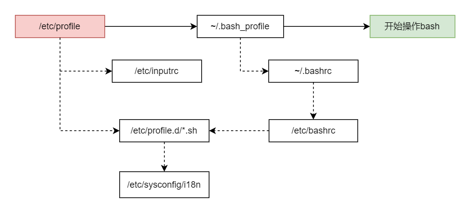

# sh知识点整理

- 环境变量

  ```sh
  # 1.用env查看环境变量与常见环境变量说明
  env
  
  # 2.几个重要的环境变量
  HOME: 代表用户的主目录
  SHELL: 它告诉我们目前这个环境使用的shell是哪个程序？linux默认的是/bin/bash
  PATH: 就是执行文件查找的路径，目录与目录中间以冒号':'分隔，由于文件的查找是依序由PATH的变量内的目录来查询，所以目录的顺序也是重要的。
  LANG: 这个很重要，就是语系数据，很多信息都会用到它。
  
  # 3.用set查看所有变量（含环境变量和自定义变量）
  
  # 4.export：自定义变量转成环境变量
  export var_name
  ```

  

- 影响显示结果的语系变量`locale`

  ```sh
  # 查看系统到底支持多少种语系
  locale -a
  
  # 查看本机的编码语系
  locale
  
  # 设置主要的语系变量LANG或LC_ALL
  
  # 整体系统默认的语系定义在哪里？(centos)
  cat /etc/sysconfig/i18n
  ```

  

- 变量的有效范围

  被`export`后的变量，我们可以称它为”环境变量“。环境变量可以被子进程所引用，但是其他的自定义变量内容就不会存在于子进程中。（**环境变量=全局变量；自定义变量=局部变量；**）

  

- 与文件系统及程序的限制关系 `ulimit`

  ```sh
  # 查看当前身份的所有限制数据数值
  ulimit -a
  
  # 设置打开的文件数量限制信息
  ulimit -n 1024
  
  # 其他设置请参考帮助信息
  ```


- 命令别名设置：`alias，unalias`

  ```sh
  # 列出所有别名
  alias
  
  # 设置别名
  alias ll='ls -alF'
  
  # 取消别名
  unalias ll
  ```

  

- bash的环境配置文件

  - `/etc/profile`：这是系统整体的设置，最好不要修改这个文件；

  - `~/.bash_profile或~/.bash_login或~/.profile`：属于用户个人设置，如果要修改自己的数据，就写入这里；

  - `/etc/sysconfig/i18n`: centos独有的？ubuntu（wsl）没有找到这个文件？

    


- 读入环境配置文件的命令：`source`

  由于/etc/profile与~/.bash_profile都是在取得login shell的时候才会读取的配置文件，所以如果你将自己的偏好设置写入上述的文件后，通常都是得注销再登陆后该设置才会生效。其实可以通过source命令直接使修改的配置文件生效。

  ```sh
  # 使修改过后的配置文件立即生效，而不是通过注销重新登陆
  source 配置文件名
  
  # 示例（下面2个命令效果是一样的）
  source ~/.bashrc
  . ~/.bashrc
  ```

  

- 通配符

  | 符号 | 意义                                                         |
  | :--: | ------------------------------------------------------------ |
  |  *   | 代表0个到无穷多个任意字符                                    |
  |  ?   | 代表一定有一个任意字符                                       |
  |  []  | 同样代表一定有一个在中括号内的字符（非任意字符）。例如[abcd]代表一定有一个字符，可能是a，b，c，d这四个的任意一个 |
  | [-]  | 如有减号在中括号内，代表在编码顺序内的所有字符。例如[0-9]代表0到9之间的所有数字，因为数字的语系编码是连续的 |
  | [^]  | 若中括号内的第一个字符为'^'，那表示反向选择。例如[\^abc]代表一定有一个字符，只要不是a，b，c的其他字符就接受 |

- 特殊字符（这里只记录我不太熟悉的）

  | 符号 | 内容                                            |
  | :--: | ----------------------------------------------- |
  | ( )  | 在中间为子shell的起始与结束                     |
  |  ``  | 两个符号的中间为可以先指定的命令，也可使用$()   |
  |  {}  | 在中间为命令块组合                              |
  | >,>> | 数据流重定向，输出导向，分别是 ”替换“ 与 ”累加“ |
  | <,<< | 数据流重定向，输入导向                          |


- 数据流重定向

  - **1>**:  以**覆盖**的方法将**正确**的数据输出到指定的文件或设备上；

  - **1>>**:  以**累加**的方法将**正确**的数据输出到指定的文件或设备上；

  - **2>**:  以**覆盖**的方法将**错误**的数据输出到指定的文件或设备上；

  - **2>>**:  以**累加**的方法将**错误**的数据输出到指定的文件或设备上；

  - **注意 ”1>>“ 和 "2>>" 中间没有空格**

  - `/dev/null`: 垃圾黑洞设备与特殊写法

    ```sh
    # 查找文件时，常常因为某些文件夹的权限不足，会输出错误信息，如何屏蔽呢？
    # 错误信息会输出到/dev/null中，不会在屏幕中显示
    find / -name lang.sh 2>/dev/null
    
    # 将命令的数据全部写入1.txt中
    find / -name lang.sh > 1.txt 2> 1.txt # 错误
    find / -name lang.sh > 1.txt 2>&1
    find / -name lang.sh &> 1.txt
    
    # 写入同一个文件的特殊语法如上所示，可以使用2>&1，也可以使用&>
    ```

    

- 命令执行的判断依据：`; 和 && 和 ||`

  - `cmd; cmd`：不考虑命令相关性的连续命令执行（`eg: sync; sync; shutdown -h now`）

  - `$?(命令回传码)与&&或||`：两个命令之间有相依性，而这个相依性主要判断的地方就在于前一个命令执行的结果是否正确。

    - `cmd1 && cmd2`：如`cmd1`执行完毕并且正确执行（$?=0），则开始执行`cmd2`；否则`cmd2`不执行；

    - `cmd1 || cmd2`：如`cmd1`执行完毕并且正确执行（$?=0），则开始`cmd2`不执行；否则`cmd2`执行；

    - 一般来说，假设判断式有三个，也就是：`cmd1 && cmd2 || cmd3`，而且顺序通常不会变，因为一般来说，`cmd2`与`cmd3`会放置肯定可以执行成功的命令。

      ```sh
      # 以ls测试/tmp/vbirding是否存在，如存在则显示“exist”，若不存在显示“not exist”
      ls /tmp/vbirding && echo "exist" || echo "not exist"
      
      # 不正确的写法，如果/tmp/vbirding存在，则会输出not exist和exist
      ls /tmp/vbirding || echo "not exist" && echo "exist"
      ```

      

- 参数代换：`xargs`

  - `xargs`可以读入`stdin`的数据，并且以空格或断行符进行分辨，将`stdin`的数据分隔成`arguments`。因为式以空格符作为分隔，所以如果有一些文件名或者其他意义的名词内含有空格符的时候，`xargs`可能就会误判了。
  
  - **很多命令不支持管道命令，因此我们可以通过 xargs 来提供该命令引用 standard input 之用**。
  
    ```sh
    # 查找指定目录下的sh脚本文件，并以ls -l列出详细属性
    find ./vbird-linux-script -name *.sh | ls -l
    # 结果竟然列出仅列出当前目录下的文件，这不是我们想要的。ls不是管道命令，因此不能接收管道参数
    
    # 正确的用法
    find ./vbird-linux-script -name *.sh | xargs ls -l
    ```
  
    

- 关于减号 - 的用途

  管道命令在 bash 的连续的处理程序中是相当重要的，在 log file 的分析当中也是相当重要的一环，所以请特别留意。另外在管道命令当中，经常会使用到前一个命令的 stdout 作为这次的 stdin，某些命令需要用到文件名（例如 tar）来进行处理时，该 stdin 与 stdout 可以利用减号 “-” 来替代，示例如下：

  ```sh
  # 将/home里面的文件打包，但打包的数据不是记录到文件，而是传送到stdout;
  # 经过管道后，将前一个命令的结果传输到后面的命令
  tar -cvf - /home | tar -xvf -
  ```

  