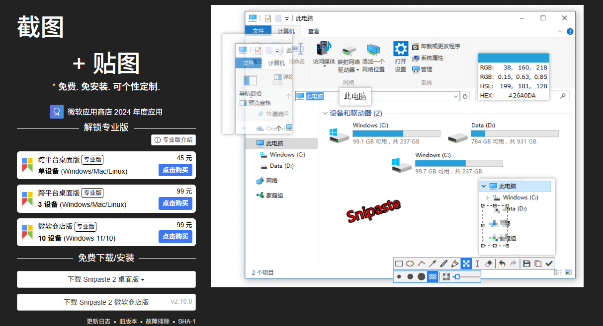
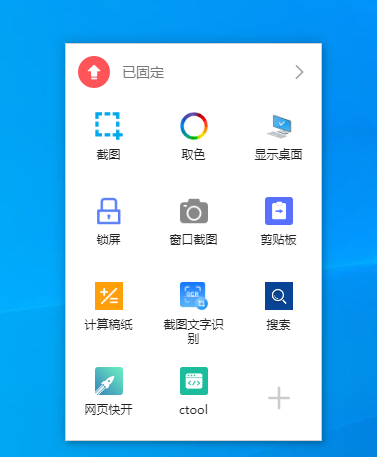

# 资源分享

## 1. 网站推荐

- [在线pdf工具（转换、编辑、签名等功能）](https://tools.pdf24.org/zh/)

- [果核剥壳](https://www.ghxi.com/)

- [微软ppt模板](https://www.officeplus.cn/PPT/template/)

- [创建并分享源代码的精美图片](https://carbon.now.sh/)

- 

## 2. 工具推荐

- [在线的免费图像处理工具](https://aiimageeditor.me/)

  在线的免费图像处理工具，提供多种 AI 功能，比如图片增强、去除水印、风格转换等十几种。

- [免费本地批量转换图像、音频和文档的工具](https://nextbconvert.com/)

  在线批量转换文件，基于 WebAssembly 技术，完全本地完成，还可以编辑图片。

- [146 个在线小工具](https://www.toolhelper.cn/)

  JSON，代码格式化，编解码（e.g. Base64），编码查询（e.g. ASCII,GB2312,Unicode），数字工具（e.g. 大小端转换，进制转换），文本工具，日期工具，加解密等。

- [图形计算器&显示器](https://www.desmos.com/calculator?lang=zh-CN)

  根据函数绘制图像，如：sinθ，cosθ等。

- [ImageJ](https://imagej.net/ij/download.html)

  图像处理器，支持多种图像格式（e.g. ROS2 slam仿真模拟的pgm灰度图，Linux下使用eog命令直接查看）。

- [PdMan](https://gitee.com/yonsum/PDMaas/attach_files)：**强烈推荐**

  数据库设计工具，通过模型设计显示表结构，相比`navicat`的优势在于：开源，可逆解数据库的SQL文件，模型的字段可显示/隐藏，表的关联关系可用线条表示（虽然在模型中显示为FK，但实际未生效），可按照文档方式一键导出所有表格，快速搭建数据库原型。

- [Barrier](https://github.com/debauchee/barrier)：一套键鼠就能控制多台主机，这个软件绝了！

  https://cloud.tencent.com/developer/article/2363124

- [deepwiki](https://deepwiki.com/)

  ref: https://www.toutiao.com/article/7497965068236325430/

  独角兽 AI 公司 Cognition AI（Cognition Labs）推出了一个开源项目——**DeepWiki**，旨在为 GitHub 上的公共代码仓库生成 AI 驱动的交互式文档，堪称「GitHub 仓库的免费百科全书」;

  用户可以通过官网直接访问，也可以将 GitHub 链接中的「github.com」替换为「deepwiki.com」;

- [snipaste](https://zh.snipaste.com/)：常用于截图留存比较差异等

  截图 + 贴图 免费. 免安装. 可个性定制.

  

- [uTools](https://www.u-tools.cn/index.html)

  uTools 是一种高效工作方式
  AI 时代的轻工具平台，一个入口，无限能力

  

- [pdf to video](https://pdftovideo.ai/zh-TW)

  免费将 PDF 文件转成一段讲解视频，配上动画和语音。

  

- 

## 3. Chrome插件

极简插件：https://chrome.zzzmh.cn/

chrome插件屋：https://chromewu.com/

- `octotree`： `github`代码结构显示，`github`目前已原生支持类似功能；
- `adblock`： 屏蔽广告插件；
- 腾讯翻译：网页对照翻译；